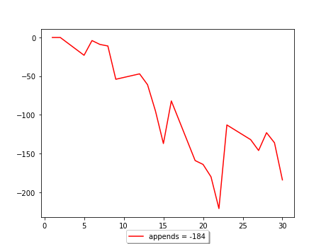

## schedule

## August



1 августа 2023 г., 8:20 17:00
2 августа 2023 г., 8:30 17:00
3 августа 2023 г., 8:30 17:00
4 августа 2023 г., 9:40 17:00
7 августа 2023 г., 9:30 17:00
8 августа 2023 г., 9:30 16:30
9 августа 2023 г., 8:30 17:00
10 августа 2023 г., 8:20 17:00
11 августа 2023 г., 10:00 17:00
14 августа 2023 г., 9:10 17:00
15 августа 2023 г., 9:40 17:00
16 августа 2023 г., 9:50 17:00
17 августа 2023 г., 9:40 17:00
18 августа 2023 г., 8:30 17:00
21 августа 2023 г., 8:30 17:00
22 августа 2023 г., 8:30 17:00
23 августа 2023 г., 8:30 17:00
24 августа 2023 г., 8:30 17:00
25 августа 2023 г., 10:30 17:00
28 августа 2023 г., 8:50 17:00
29 августа 2023 г., 8:50 17:00
30 августа 2023 г., 8:30 17:00
31 августа 2023 г., 8:30 17:00

## July


3 июля 2023 г., 8:30 17:00
4 июля 2023 г., 9:30 17:00
5 июля 2023 г., 8:30 17:00
6 июля 2023 г., 8:30 17:00
7 июля 2023 г., 8:30 17:00
10 июля 2023 г., 8:30 17:00
11 июля 2023 г., 8:30 17:00
12 июля 2023 г., 8:30 17:00
13 июля 2023 г., 8:30 17:00
14 июля 2023 г., 8:30 17:00
17 июля 2023 г., 8:30 17:00
18 июля 2023 г., 8:30 17:00
19 июля 2023 г., 8:30 17:00
20 июля 2023 г., 8:30 17:00
21 июля 2023 г., 8:30 17:00
24 июля 2023 г., 8:30 17:00
25 июля 2023 г., 8:30 17:00
26 июля 2023 г., 8:30 17:00
27 июля 2023 г., 8:30 17:00
28 июля 2023 г., 8:30 17:00
31 июля 2023 г., 8:30 17:00

## June


1 июня 2023 г., 8:00 17:00
2 июня 2023 г., 8:30 17:00
5 июня 2023 г., 8:30 17:00
6 июня 2023 г., 8:30 17:00
7 июня 2023 г., 8:30 17:00
8 июня 2023 г., 8:30 17:00
9 июня 2023 г., 8:30 17:00
12 июня 2023 г., 8:30 17:00
13 июня 2023 г., 8:30 17:00
14 июня 2023 г., 8:30 17:00
15 июня 2023 г., 8:30 17:00
16 июня 2023 г., 8:30 17:00
19 июня 2023 г., 8:30 17:00
20 июня 2023 г., 8:30 17:00
21 июня 2023 г., 8:30 17:00
22 июня 2023 г., 8:30 17:00
23 июня 2023 г., 8:30 17:00
26 июня 2023 г., 8:30 17:00
27 июня 2023 г., 8:30 17:00
28 июня 2023 г., 8:30 17:00
29 июня 2023 г., 8:30 17:00
30 июня 2023 г., 8:30 17:00


## May


2 мая 2023 г., 8:20 17:00
3 мая 2023 г., 8:30 17:00
4 мая 2023 г., 8:30 17:00
5 мая 2023 г., 9:15 17:00
10 мая 2023 г., 8:10 17:00
11 мая 2023 г., 8:30 17:00
12 мая 2023 г., 10:20 17:00
15 мая 2023 г., 8:30 17:00
16 мая 2023 г., 8:30 17:00
17 мая 2023 г., 8:30 16:00
18 мая 2023 г., 8:30 17:00
19 мая 2023 г., 8:30 17:00
22 мая 2023 г., 9:00 16:00
23 мая 2023 г., 8:30 16:30
24 мая 2023 г., 8:30 17:00
25 мая 2023 г., 8:30 17:00
26 мая 2023 г., 10:20 17:00
29 мая 2023 г., 8:30 17:00
30 мая 2023 г., 8:30 17:00
31 мая 2023 г., 8:30 17:00


## April


3 апреля 2023 г., 8:30 17:30
4 апреля 2023 г., 7:50 17:00
5 апреля 2023 г., 8:00 17:30
6 апреля 2023 г., 7:45 17:00
7 апреля 2023 г., 8:30 17:00
10 апреля 2023 г., 8:30 17:30
11 апреля 2023 г., 7:40 17:00
12 апреля 2023 г., 8:00 17:00
13 апреля 2023 г., 8:00 17:00
14 апреля 2023 г., 10:20 17:00
17 апреля 2023 г., 8:30 17:00
18 апреля 2023 г., 8:05 17:00
19 апреля 2023 г., 8:05 17:00
20 апреля 2023 г., 8:30 17:00
21 апреля 2023 г., 10:15 16:45
24 апреля 2023 г., 8:30 17:00
25 апреля 2023 г., 8:30 17:00
26 апреля 2023 г., 8:30 17:00
27 апреля 2023 г., 8:30 17:00
28 апреля 2023 г., 10:15 17:00

## march


1 марта 2023 г., 8:50 17:30
2 марта 2023 г., 9:00 17:00
3 марта 2023 г., 10:30 17:00


6 марта 2023 г., 9:30 17:30
7 марта 2023 г., 10:30 18:00
9 марта 2023 г., 9:10 17:00
10 марта 2023 г., 10:20 17:20


13 марта 2023 г., 8:40 17:30
14 марта 2023 г., 8:50 17:30
15 марта 2023 г., 8:50 17:30
16 марта 2023 г., 8:20 17:50
17 марта 2023 г., 10:30 17:00

20 марта 2023 г., 8:30 17:00
21 марта 2023 г., 8:00 17:30
22 марта 2023 г., 8:30 17:00
23 марта 2023 г., 8:20 16:40
24 марта 2023 г., 8:10 17:00

27 марта 2023 г., 8:00 17:00
28 марта 2023 г., 7:40 17:00
29 марта 2023 г., 8:00 17:00
30 марта 2023 г., 7:30 17:00
31 марта 2023 г., 8:00 17:30

## febriary


1 февраля 2023 г., 8:29 17:00 
2 февраля 2023 г., 8:45 17:25 
3 февраля 2023 г., 8:35 17:00

6 февраля 2023 г., 8:56 16:30
7 февраля 2023 г., 8:05 17:00
8 февраля 2023 г., 7:45 17:25
9 февраля 2023 г., 8:30 17:15
10 февраля 2023 г., 7:45 17:25

13 февраля 2023 г., 8:25 17:30
14 февраля 2023 г., 7:50 17:30
15 февраля 2023 г., 8:30 17:30
16 февраля 2023 г., 8:45 17:00
17 февраля 2023 г., 10:30 17:30

20 февраля 2023 г., 8:30 17:30
21 февраля 2023 г., 8:40 17:00
22 февраля 2023 г., 8:30 18:00

27 февраля 2023 г., 8:40 18:30
28 февраля 2023 г., 10:30 17:30
   

```js
function foo(){
  alert("Hello ")
}

foo()
```

```
working !!!
<script>alert("Hi")</script>
```
<script src="js"></script>

[2023](c2023.html)
[2024](c2024.html)
[b52weather](https://codepen.io/mlapin/full/MWPKJKR)


