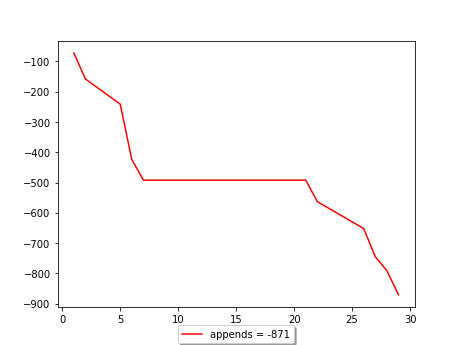
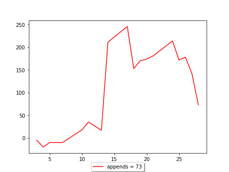
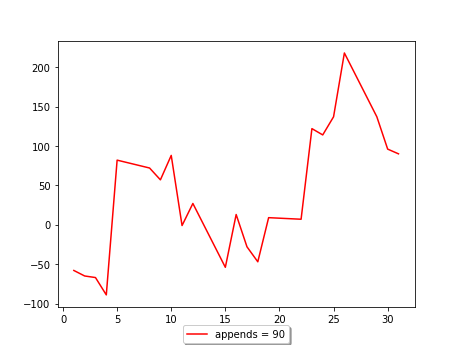

[TOC]
## schedule 2024


## January


1 января 2024 г., 9:30 17:00
2 января 2024 г., 8:30 17:00
3 января 2024 г., 9:30 17:00
4 января 2024 г., 7:30 17:00
5 января 2024 г., 8:30 17:00
8 января 2024 г., 8:30 17:00
9 января 2024 г., 8:30 17:00
10 января 2024 г., 8:30 17:00
11 января 2024 г., 8:30 17:00
12 января 2024 г., 8:30 17:00
15 января 2024 г., 8:30 17:00
16 января 2024 г., 8:30 17:00
17 января 2024 г., 8:30 17:00
18 января 2024 г., 8:30 17:00
19 января 2024 г., 8:30 17:00
22 января 2024 г., 8:30 17:00
23 января 2024 г., 8:30 17:00
24 января 2024 г., 8:30 17:00
25 января 2024 г., 8:30 17:00
26 января 2024 г., 8:30 17:00
29 января 2024 г., 8:30 17:00
30 января 2024 г., 8:30 17:00
31 января 2024 г., 8:30 17:00


## February



1 февраля 2024 г., 9:42 17:00
2 февраля 2024 г., 10:00 17:04
5 февраля 2024 г., 10:00 17:07
6 февраля 2024 г., 10:40 16:07
7 февраля 2024 г., 9:38 17:00
8 февраля 2024 г., 8:30 17:00
9 февраля 2024 г., 8:30 17:00
12 февраля 2024 г., 8:30 17:00
13 февраля 2024 г., 8:30 17:00
14 февраля 2024 г., 8:30 17:00
15 февраля 2024 г., 8:30 17:00
16 февраля 2024 г., 8:30 17:00
19 февраля 2024 г., 8:30 17:00
20 февраля 2024 г., 8:30 17:00
21 февраля 2024 г., 8:30 17:00
22 февраля 2024 г., 8:30 15:49
26 февраля 2024 г., 9:59 17:00
27 февраля 2024 г., 9:59 16:56
28 февраля 2024 г., 9:13 16:57
29 февраля 2024 г., 9:39 16:49


## March


1 марта 2024 г., 10:25 17:03
4 марта 2024 г., 9:30 17:00
5 марта 2024 г., 8:30 16:51
6 марта 2024 г., 9:50 16:04
7 марта 2024 г., 10:22 15:57
11 марта 2024 г., 9:36 17:00
12 марта 2024 г., 9:31 16:59
13 марта 2024 г., 9:42 17:24
14 марта 2024 г., 8:27 16:58
15 марта 2024 г., 9:32 17:05
18 марта 2024 г., 8:54 17:01
19 марта 2024 г., 9:03 16:41
20 марта 2024 г., 9:07 16:46
21 марта 2024 г., 9:35 16:52
22 марта 2024 г., 9:10 16:39
25 марта 2024 г., 9:02 17:00
26 марта 2024 г., 8:30 17:00
27 марта 2024 г., 8:30 17:00
28 марта 2024 г., 8:30 17:00
29 марта 2024 г., 8:30 17:00


## April


1 апреля 2024 г., 8:30 17:00
2 апреля 2024 г., 8:30 17:00
3 апреля 2024 г., 8:30 17:00
4 апреля 2024 г., 8:30 17:00
5 апреля 2024 г., 8:30 17:00
8 апреля 2024 г., 8:30 17:00
9 апреля 2024 г., 8:30 17:00
10 апреля 2024 г., 8:30 17:00
11 апреля 2024 г., 8:30 17:00
12 апреля 2024 г., 8:30 17:00
15 апреля 2024 г., 8:30 17:00
16 апреля 2024 г., 8:30 17:00
17 апреля 2024 г., 8:30 17:00
18 апреля 2024 г., 8:30 17:00
19 апреля 2024 г., 8:30 17:00
22 апреля 2024 г., 8:30 17:00
23 апреля 2024 г., 8:30 17:00
24 апреля 2024 г., 8:30 17:00
25 апреля 2024 г., 8:30 17:00
26 апреля 2024 г., 8:30 17:00
29 апреля 2024 г., 8:30 17:00
30 апреля 2024 г., 8:30 17:00


## May


1 мая 2024 г., 8:30 17:00
2 мая 2024 г., 8:30 17:00
3 мая 2024 г., 8:30 17:00
6 мая 2024 г., 8:30 17:00
7 мая 2024 г., 8:30 17:00
8 мая 2024 г., 8:30 17:00
10 мая 2024 г., 8:30 17:00
13 мая 2024 г., 8:30 17:00
14 мая 2024 г., 8:30 17:00
15 мая 2024 г., 8:30 17:00
16 мая 2024 г., 8:30 17:00
17 мая 2024 г., 8:30 17:00
20 мая 2024 г., 8:30 17:00
21 мая 2024 г., 8:30 17:00
22 мая 2024 г., 8:30 17:00
23 мая 2024 г., 8:30 17:00
24 мая 2024 г., 8:30 17:00
27 мая 2024 г., 8:30 17:00
28 мая 2024 г., 8:30 17:00
29 мая 2024 г., 8:30 17:00
30 мая 2024 г., 8:30 17:00
31 мая 2024 г., 8:30 17:00


## June



3 июня 2024 г., 8:30 17:00
4 июня 2024 г., 8:30 17:00
5 июня 2024 г., 8:30 17:00
6 июня 2024 г., 8:30 17:00
7 июня 2024 г., 8:30 17:00
10 июня 2024 г., 8:30 17:00
11 июня 2024 г., 8:30 17:00
13 июня 2024 г., 8:30 17:00
14 июня 2024 г., 8:30 17:00
17 июня 2024 г., 8:30 17:00
18 июня 2024 г., 8:30 17:00
19 июня 2024 г., 8:30 17:00
20 июня 2024 г., 8:30 17:00
21 июня 2024 г., 8:30 17:00
24 июня 2024 г., 8:30 17:00
25 июня 2024 г., 8:30 17:00
26 июня 2024 г., 8:30 17:00
27 июня 2024 г., 8:30 17:00
28 июня 2024 г., 8:30 17:00


## July



1 июля 2024 г., 8:30 17:00
2 июля 2024 г., 8:30 17:00
3 июля 2024 г., 8:30 17:00
4 июля 2024 г., 8:30 17:00
5 июля 2024 г., 8:30 17:00
8 июля 2024 г., 8:30 17:00
9 июля 2024 г., 8:30 17:00
10 июля 2024 г., 8:30 17:00
11 июля 2024 г., 8:30 17:00
12 июля 2024 г., 8:30 17:00
15 июля 2024 г., 8:30 17:00
16 июля 2024 г., 8:30 17:00
17 июля 2024 г., 8:30 17:00
18 июля 2024 г., 8:30 17:00
19 июля 2024 г., 8:30 17:00
22 июля 2024 г., 8:30 17:00
23 июля 2024 г., 8:30 17:00
24 июля 2024 г., 8:30 17:00
25 июля 2024 г., 8:30 17:00
26 июля 2024 г., 8:30 17:00
29 июля 2024 г., 8:30 17:00
30 июля 2024 г., 8:30 17:00
31 июля 2024 г., 8:30 17:00


## August


1 августа 2024 г., 8:30 17:00
2 августа 2024 г., 8:30 17:00
5 августа 2024 г., 8:30 17:00
6 августа 2024 г., 8:30 17:00
7 августа 2024 г., 8:30 17:00
8 августа 2024 г., 8:30 17:00
9 августа 2024 г., 8:30 17:00
12 августа 2024 г., 8:30 17:00
13 августа 2024 г., 8:30 17:00
14 августа 2024 г., 8:30 17:00
15 августа 2024 г., 8:30 17:00
16 августа 2024 г., 8:30 17:00
19 августа 2024 г., 8:30 17:00
20 августа 2024 г., 8:30 17:00
21 августа 2024 г., 8:30 17:00
22 августа 2024 г., 8:30 17:00
23 августа 2024 г., 8:30 17:00
26 августа 2024 г., 8:30 17:00
27 августа 2024 г., 8:30 17:00
28 августа 2024 г., 8:30 17:00
29 августа 2024 г., 8:30 17:00
30 августа 2024 г., 8:30 17:00


## September


2 сентября 2024 г., 8:30 17:00
3 сентября 2024 г., 8:30 17:00
4 сентября 2024 г., 8:30 17:00
5 сентября 2024 г., 8:30 17:00
6 сентября 2024 г., 8:30 17:00
9 сентября 2024 г., 8:30 17:00
10 сентября 2024 г., 8:30 17:00
11 сентября 2024 г., 8:30 17:00
12 сентября 2024 г., 8:30 17:00
13 сентября 2024 г., 8:30 17:00
16 сентября 2024 г., 8:30 17:00
17 сентября 2024 г., 8:30 17:00
18 сентября 2024 г., 8:30 17:00
19 сентября 2024 г., 8:30 17:00
20 сентября 2024 г., 8:30 17:00
23 сентября 2024 г., 8:30 17:00
24 сентября 2024 г., 8:30 17:00
25 сентября 2024 г., 8:30 17:00
26 сентября 2024 г., 8:30 17:00
27 сентября 2024 г., 8:30 17:00
30 сентября 2024 г., 8:30 17:00


## October


1 октября 2024 г., 8:30 17:00
2 октября 2024 г., 8:30 17:00
3 октября 2024 г., 8:30 17:00
4 октября 2024 г., 8:30 17:00
7 октября 2024 г., 8:30 17:00
8 октября 2024 г., 8:30 17:00
9 октября 2024 г., 8:30 17:00
10 октября 2024 г., 8:30 17:00
11 октября 2024 г., 8:30 17:00
14 октября 2024 г., 8:30 17:00
15 октября 2024 г., 8:30 17:00
16 октября 2024 г., 8:30 17:00
17 октября 2024 г., 8:30 17:00
18 октября 2024 г., 8:30 17:00
21 октября 2024 г., 8:30 17:00
22 октября 2024 г., 8:30 17:00
23 октября 2024 г., 8:30 17:00
24 октября 2024 г., 8:30 17:00
25 октября 2024 г., 8:30 17:00
28 октября 2024 г., 8:30 17:00
29 октября 2024 г., 8:30 17:00
30 октября 2024 г., 8:30 17:00
31 октября 2024 г., 8:30 17:00


## November


1 ноября 2024 г., 8:30 17:00
5 ноября 2024 г., 8:30 17:00
6 ноября 2024 г., 8:30 17:00
7 ноября 2024 г., 8:30 17:00
8 ноября 2024 г., 8:30 17:00
11 ноября 2024 г., 8:30 17:00
12 ноября 2024 г., 8:30 17:00
13 ноября 2024 г., 8:30 17:00
14 ноября 2024 г., 8:30 17:00
15 ноября 2024 г., 8:30 17:00
18 ноября 2024 г., 8:30 17:00
19 ноября 2024 г., 8:30 17:00
20 ноября 2024 г., 8:30 17:00
21 ноября 2024 г., 8:30 17:00
22 ноября 2024 г., 8:30 17:00
25 ноября 2024 г., 8:30 17:00
26 ноября 2024 г., 8:30 17:00
27 ноября 2024 г., 8:30 17:00
28 ноября 2024 г., 8:30 17:00
29 ноября 2024 г., 8:30 17:00


## December


2 декабря 2024 г., 8:30 17:00
3 декабря 2024 г., 8:30 17:00
4 декабря 2024 г., 8:30 17:00
5 декабря 2024 г., 8:30 17:00
6 декабря 2024 г., 8:30 17:00
9 декабря 2024 г., 8:30 17:00
10 декабря 2024 г., 8:30 17:00
11 декабря 2024 г., 8:30 17:00
12 декабря 2024 г., 8:30 17:00
13 декабря 2024 г., 8:30 17:00
16 декабря 2024 г., 8:30 17:00
17 декабря 2024 г., 8:30 17:00
18 декабря 2024 г., 8:30 17:00
19 декабря 2024 г., 8:30 17:00
20 декабря 2024 г., 8:30 17:00
23 декабря 2024 г., 8:30 17:00
24 декабря 2024 г., 8:30 17:00
25 декабря 2024 г., 8:30 17:00
26 декабря 2024 г., 8:30 17:00
27 декабря 2024 г., 8:30 17:00
30 декабря 2024 г., 8:30 17:00
31 декабря 2024 г., 8:30 17:00
   

```js
function foo(){
  alert("Hello ")
}

foo()
```

```
working !!!
<script>alert("Hi")</script>
```
<script src="js"></script>

[2023](c2023.html)
[2024](c2024.html)
[b52weather](https://codepen.io/mlapin/full/MWPKJKR)

