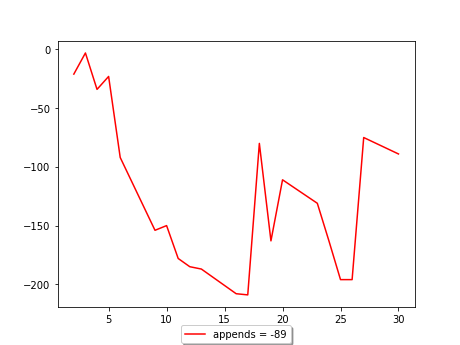

[TOC]
## schedule 2024


## January


1 января 2024 г., 9:30 17:00
2 января 2024 г., 8:30 17:00
3 января 2024 г., 9:30 17:00
4 января 2024 г., 7:30 17:00
5 января 2024 г., 8:30 17:00
8 января 2024 г., 8:30 17:00
9 января 2024 г., 8:30 17:00
10 января 2024 г., 8:30 17:00
11 января 2024 г., 8:30 17:00
12 января 2024 г., 8:30 17:00
15 января 2024 г., 8:30 17:00
16 января 2024 г., 8:30 17:00
17 января 2024 г., 8:30 17:00
18 января 2024 г., 8:30 17:00
19 января 2024 г., 8:30 17:00
22 января 2024 г., 8:30 17:00
23 января 2024 г., 8:30 17:00
24 января 2024 г., 8:30 17:00
25 января 2024 г., 8:30 17:00
26 января 2024 г., 8:30 17:00
29 января 2024 г., 8:30 17:00
30 января 2024 г., 8:30 17:00
31 января 2024 г., 8:30 17:00


## February


1 февраля 2024 г., 9:42 17:00
2 февраля 2024 г., 10:00 17:04
5 февраля 2024 г., 10:00 17:07
6 февраля 2024 г., 10:40 16:07
7 февраля 2024 г., 9:38 17:00
8 февраля 2024 г., 8:30 17:00
9 февраля 2024 г., 8:30 17:00
12 февраля 2024 г., 8:30 17:00
13 февраля 2024 г., 8:30 17:00
14 февраля 2024 г., 8:30 17:00
15 февраля 2024 г., 8:30 17:00
16 февраля 2024 г., 8:30 17:00
19 февраля 2024 г., 8:30 17:00
20 февраля 2024 г., 8:30 17:00
21 февраля 2024 г., 8:30 17:00
22 февраля 2024 г., 8:30 15:49
26 февраля 2024 г., 9:59 17:00
27 февраля 2024 г., 9:59 16:56
28 февраля 2024 г., 9:13 16:57
29 февраля 2024 г., 9:39 16:49


## March


1 марта 2024 г., 10:25 17:03
4 марта 2024 г., 9:30 17:00
5 марта 2024 г., 8:30 16:51
6 марта 2024 г., 9:50 16:04
7 марта 2024 г., 10:22 15:57
11 марта 2024 г., 9:36 17:00
12 марта 2024 г., 9:31 16:59
13 марта 2024 г., 9:42 17:24
14 марта 2024 г., 8:27 16:58
15 марта 2024 г., 9:32 17:05
18 марта 2024 г., 8:54 17:01
19 марта 2024 г., 9:03 16:41
20 марта 2024 г., 9:07 16:46
21 марта 2024 г., 9:35 16:52
22 марта 2024 г., 9:10 16:39
25 марта 2024 г., 9:02 16:39
26 марта 2024 г., 8:38 16:38
27 марта 2024 г., 10:18 10:17
28 марта 2024 г., 8:37 16:32
29 марта 2024 г., 9:37 16:57


## April


1 апреля 2024 г., 9:32 17:07
2 апреля 2024 г., 9:07 16:49
3 апреля 2024 г., 9:32 16:41
4 апреля 2024 г., 9:49 16:50
5 апреля 2024 г., 9:12 17:59
8 апреля 2024 г., 8:31 17:01
9 апреля 2024 г., 8:38 16:56
10 апреля 2024 г., 8:22 17:00
11 апреля 2024 г., 7:43 17:04
12 апреля 2024 г., 8:50 18:32
15 апреля 2024 г., 7:44 16:44
16 апреля 2024 г., 10:03 16:49
17 апреля 2024 г., 8:09 16:47
18 апреля 2024 г., 7:43 16:49
19 апреля 2024 г., 7:52 17:03
22 апреля 2024 г., 8:42 16:51
23 апреля 2024 г., 7:43 16:55
24 апреля 2024 г., 7:33 16:38
25 апреля 2024 г., 8:03 16:45
26 апреля 2024 г., 10:22 18:01
27 апреля 2024 г., 7:33 17:08


## May


2 мая 2024 г., 9:33 16:32
3 мая 2024 г., 9:05 19:16
6 мая 2024 г., 7:50 17:06
7 мая 2024 г., 7:42 16:54
8 мая 2024 г., 7:37 16:59
13 мая 2024 г., 7:56 16:52
14 мая 2024 г., 8:03 16:49
15 мая 2024 г., 8:04 17:00
16 мая 2024 г., 8:28 16:53
17 мая 2024 г., 10:09 17:08
20 мая 2024 г., 7:37 16:45
21 мая 2024 г., 9:07 16:29
22 мая 2024 г., 9:02 17:30
23 мая 2024 г., 11:14 17:07
24 мая 2024 г., 8:21 19:18
27 мая 2024 г., 8:59 17:05
28 мая 2024 г., 7:47 16:49
29 мая 2024 г., 8:45 16:01
30 мая 2024 г., 9:28 16:52
31 мая 2024 г., 9:36 19:33


## June


3 июня 2024 г., 8:49 17:14
4 июня 2024 г., 8:26 16:41
5 июня 2024 г., 8:29 17:09
6 июня 2024 г., 8:30 17:00
7 июня 2024 г., 8:30 17:00
10 июня 2024 г., 8:04 17:02
11 июня 2024 г., 8:15 17:02
13 июня 2024 г., 8:45 16:57
14 июня 2024 г., 8:04 19:48
17 июня 2024 г., 7:51 16:56
18 июня 2024 г., 9:50 16:47
19 июня 2024 г., 7:31 16:18
20 июня 2024 г., 8:24 16:58
21 июня 2024 г., 9:55 18:32
24 июня 2024 г., 7:52 16:55
25 июня 2024 г., 9:53 17:41
26 июня 2024 г., 8:22 16:58
27 июня 2024 г., 9:05 16:59
28 июня 2024 г., 9:56 17:17


## July


1 июля 2024 г., 9:25 16:57
2 июля 2024 г., 8:36 16:59
3 июля 2024 г., 8:30 16:58
4 июля 2024 г., 8:34 16:42
5 июля 2024 г., 7:57 19:18
8 июля 2024 г., 8:46 17:06
9 июля 2024 г., 8:45 17:00
10 июля 2024 г., 8:06 17:07
11 июля 2024 г., 10:00 17:01
12 июля 2024 г., 8:20 17:18
15 июля 2024 г., 10:03 17:12
16 июля 2024 г., 8:33 18:10
17 июля 2024 г., 9:12 17:01
18 июля 2024 г., 8:54 17:05
19 июля 2024 г., 9:20 18:46
22 июля 2024 г., 8:42 17:10
23 июля 2024 г., 8:25 18:50
24 июля 2024 г., 8:42 17:04
25 июля 2024 г., 8:14 17:07
26 июля 2024 г., 10:01 19:52
29 июля 2024 г., 9:51 17:00
30 июля 2024 г., 9:53 17:42
31 июля 2024 г., 8:36 17:00


## August


1 августа 2024 г., 8:30 17:00
2 августа 2024 г., 8:30 17:00
5 августа 2024 г., 8:54 17:01
6 августа 2024 г., 8:10 16:59
7 августа 2024 г., 8:36 17:01
8 августа 2024 г., 8:36 17:04
9 августа 2024 г., 9:59 17:46
12 августа 2024 г., 8:31 17:08
13 августа 2024 г., 8:35 16:51
14 августа 2024 г., 8:56 16:52
15 августа 2024 г., 8:42 16:30
16 августа 2024 г., 10:00 19:25
19 августа 2024 г., 9:48 17:01
20 августа 2024 г., 8:26 16:51
21 августа 2024 г., 8:43 16:57
22 августа 2024 г., 9:04 16:53
23 августа 2024 г., 9:04 19:22
26 августа 2024 г., 8:34 16:45
27 августа 2024 г., 8:39 16:55
28 августа 2024 г., 8:06 16:59
29 августа 2024 г., 8:38 16:55
30 августа 2024 г., 10:02 17:44


## September



2 сентября 2024 г., 8:55 17:04
3 сентября 2024 г., 8:15 17:03
4 сентября 2024 г., 9:01 17:00
5 сентября 2024 г., 8:18 16:59
6 сентября 2024 г., 9:53 17:14
9 сентября 2024 г., 9:32 17:00
10 сентября 2024 г., 8:24 16:58
11 сентября 2024 г., 8:47 16:49
12 сентября 2024 г., 8:35 16:58
13 сентября 2024 г., 8:34 17:02
16 сентября 2024 г., 8:50 16:59
17 сентября 2024 г., 8:37 17:06
18 сентября 2024 г., 8:21 19:00
19 сентября 2024 г., 9:52 16:59
20 сентября 2024 г., 8:44 18:06
23 сентября 2024 г., 8:41 16:51
24 сентября 2024 г., 8:44 16:42
25 сентября 2024 г., 9:01 16:58
26 сентября 2024 г., 8:30 17:00
27 сентября 2024 г., 8:35 19:06
30 сентября 2024 г., 8:37 16:53


## October


1 октября 2024 г., 8:57 16:51
2 октября 2024 г., 8:31 16:58
3 октября 2024 г., 8:54 16:56
4 октября 2024 г., 9:12 18:33
7 октября 2024 г., 8:30 17:00
8 октября 2024 г., 8:30 17:00
9 октября 2024 г., 8:30 17:00
10 октября 2024 г., 8:30 17:00
11 октября 2024 г., 8:30 17:00
14 октября 2024 г., 8:30 17:00
15 октября 2024 г., 8:30 17:00
16 октября 2024 г., 8:30 17:00
17 октября 2024 г., 8:30 17:00
18 октября 2024 г., 8:30 17:00
21 октября 2024 г., 8:34 16:48
22 октября 2024 г., 9:03 17:01
23 октября 2024 г., 9:15 16:49
24 октября 2024 г., 8:56 16:27
25 октября 2024 г., 9:03 19:09
28 октября 2024 г., 9:01 16:45
29 октября 2024 г., 8:37 16:06
30 октября 2024 г., 8:56 16:43
31 октября 2024 г., 8:31 16:44


## November


1 ноября 2024 г., 9:26 16:34
5 ноября 2024 г., 8:36 16:44
6 ноября 2024 г., 8:45 16:48
7 ноября 2024 г., 8:45 16:47
8 ноября 2024 г., 8:30 17:00
11 ноября 2024 г., 8:47 16:43
12 ноября 2024 г., 9:36 16:50
13 ноября 2024 г., 8:39 16:42
14 ноября 2024 г., 8:31 16:43
15 ноября 2024 г., 8:30 17:00
18 ноября 2024 г., 8:52 16:46
19 ноября 2024 г., 8:46 17:00
20 ноября 2024 г., 8:30 17:00
21 ноября 2024 г., 8:30 17:00
22 ноября 2024 г., 9:06 17:01
25 ноября 2024 г., 8:30 16:47
26 ноября 2024 г., 8:29 16:45
27 ноября 2024 г., 8:13 17:01
28 ноября 2024 г., 9:14 16:43
29 ноября 2024 г., 8:38 18:39


## December


2 декабря 2024 г., 8:38 17:00
3 декабря 2024 г., 8:31 16:43
4 декабря 2024 г., 8:40 16:45
5 декабря 2024 г., 8:21 16:43
6 декабря 2024 г., 9:18 18:59
9 декабря 2024 г., 8:45 16:43
10 декабря 2024 г., 8:29 16:45
11 декабря 2024 г., 8:46 16:44
12 декабря 2024 г., 8:30 16:46
13 декабря 2024 г., 8:37 16:07
16 декабря 2024 г., 8:17 16:43
17 декабря 2024 г., 8:39 16:37
18 декабря 2024 г., 7:57 16:36
19 декабря 2024 г., 8:15 16:41
20 декабря 2024 г., 9:09 18:36
23 декабря 2024 г., 8:42 16:34
24 декабря 2024 г., 8:14 16:48
25 декабря 2024 г., 9:43 16:37
26 декабря 2024 г., 8:55 13:24
27 декабря 2024 г., 8:30 17:00
30 декабря 2024 г., 8:30 17:00
31 декабря 2024 г., 8:30 17:00
   

```js
function foo(){
  alert("Hello ")
}

foo()
```

```
working !!!
<script>alert("Hi")</script>
```
<script src="js"></script>

[2023](c2023.html)
[2024](c2024.html)
[b52weather](https://codepen.io/mlapin/full/MWPKJKR)