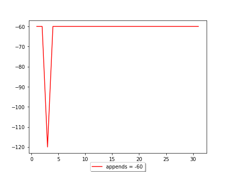

## schedule


## febriary



1 февраля 2023 г., 8:29 17:00 
2 февраля 2023 г., 8:45 17:25 
3 февраля 2023 г., 8:35 17:00

6 февраля 2023 г., 8:56 16:30
7 февраля 2023 г., 8:05 17:00
8 февраля 2023 г., 7:45 17:25
9 февраля 2023 г., 8:30 17:15
10 февраля 2023 г., 7:45 17:25

13 февраля 2023 г., 8:25 17:00
14 февраля 2023 г., 8:30 17:00
15 февраля 2023 г., 8:30 17:00
16 февраля 2023 г., 8:30 17:00
17 февраля 2023 г., 8:30 17:00

20 февраля 2023 г., 8:30 17:00
21 февраля 2023 г., 8:30 17:00
22 февраля 2023 г., 8:30 17:00
23 февраля 2023 г., 8:30 17:00
24 февраля 2023 г., 8:30 17:00

27 февраля 2023 г., 8:30 17:00
28 февраля 2023 г., 8:30 17:00
   

```js
function foo(){
alert("Hello ")
}
foo()
```

```
working !!!
<script>alert("Hi")</script>
```
<script src="js"></script>