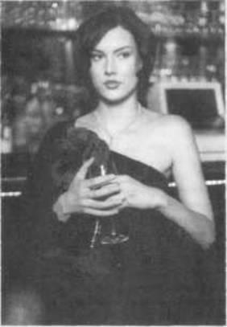
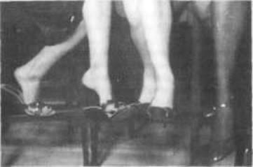
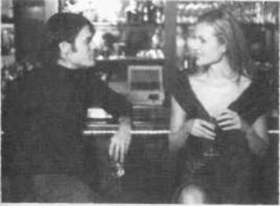
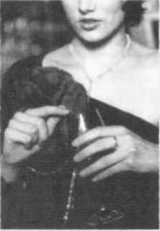
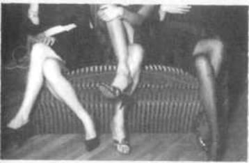

[<u>www.koob.ru</u>](http://www.koob.ru/)

**Лейл Лаундес**

**С.С.С. (Скрытые сексуальные сигналы)**

_«Лаундес Л. С.С.С. (Скрытые сексуальные сигналы)»: Добрая книга; 2003_

_ISBN 598124013X_

_Оригинал: Leil Lowndes, “U.S.S. (Undercover Sex Signals)”_

**Аннотация**

_Если женщина хочет вас, она сама расскажет об этом, не проронив ни единого слова, а просто подавая вам скрытые сексуальные сигналы (С. С. С.). Научившись правильно реагировать на эти сигналы, вы никогда больше не получите отказа. Перестаньте спрашивать себя: «Кто нравится мне?» — спросите: «Кому нравлюсь я?». Начните играть по правилам, принятым в мире женщин. Все, что вам необходимо сделать, — это определить, кто из окружающих вас женщин симпатизирует вам и не прочь познакомиться, а затем правильно разыграть партию между вами и вашей новой подругой. Лейл Лаундес расскажет вам о безотказных приемах, которые помогут вам стать виртуозом в общении с противоположным полом._

_Книга посвящается тем 96,7% мужчин, которые не умеют знакомиться с девушками, несмотря на очевидные и недвусмысленные (для девушек!) намеки._

_Вот книга, которая поможет вам неизменно добиваться успеха._

**Часть первая**

**НИКТО И НИКОГДА ВАМ БОЛЬШЕ НЕ ОТКАЖЕТ!**

Познакомьтесь с Сэнди, Эшли и Джейд, тремя из четырех моих подруг, которые согласились продемонстрировать вам 26 основных скрытых сексуальных сигналов. Почему все они согласились пожертвовать своим драгоценным временем и выступить в качестве моделей, позируя для этой книги? «Ну, — сказала Эшли, — мне надоело, что ко мне постоянно пристают мужчины, с которыми я не желаю даже разговаривать, и я всегда поражалась, почему мужчины, которые мне нравились и с которыми я хотела бы познакомиться, в упор не замечали моих настойчивых сигналов, знаков и кокетливых жестов! Если это поможет им наконец понять, когда стоит подходить к девушке, чтобы познакомиться, а когда нет, — я сделаю для этого все возможное».

«Да, — продолжила Джейд, — пусть иногда наши намеки слишком тонкие, но с помощью невербальных знаков и жестов мы всегда даем понять любому джентльмену, хотим мы познакомиться с ним или нет».

«Вы совершенно правы», — закончила Сэнди.

**1. ПОЧЕМУ СТОИТ ИЗУЧАТЬ С.С.С.**

Вы — неопытный новичок в любовных играх и начинаете заикаться, разговаривая с любой особой противоположного пола? Или вы зрелый мужчина со сложившимся характером, манерами, деньгами, положением в обществе, шармом — в общем, обладаете всем необходимым, чтобы привлечь любую женщину? Как бы то ни было, в одном я уверена: если вы не принадлежите к тем немногочисленным мужчинам, которые хорошо разбираются в женщинах и понимают язык их жестов, вы упускаете массу возможностей. Не рассчитывайте, что красотка, сидящая напротив вас за стойкой бара, подмигнет вам или поманит вас к себе пальчиком. Она подает понравившимся ей мужчинам более топкие и едва заметные сигналы, на которые, согласно исследованиям, обращает внимание только один мужчина из тридцати [1]. Их называют скрытыми сексуальными сигналами, и, если вы не попадетесь на ее приманку и не отреагируете на эти сигналы немедленно, девушка отправится на поиски более сообразительной «жертвы».

Забудем ненадолго о сексе и сексуальности (не волнуйтесь, я очень скоро вернусь к этому вопросу), давайте поговорим об отношениях. Каковы ваши шансы на поддержание хороших отношений с женщиной, если в подавляющем большинстве случаев вы не способны понять, что она чувствует и на что намекает? Вспомните, как одна из ваших подружек постоянно обижалась на вас и ходила, надув губы, а вы никак не могли понять почему? Берегитесь! Это также опасно, как ходить с расстегнутой ширинкой: это значит, что вы не понимаете ее, не понимаете ее намеков. («Он не понимает очевидных вещей!» — скажет она; «Но почему, черт возьми, она не сказала мне об этом прямо?» — скажете вы.) И если вы не станете более утонченным и чувствительным, она, цокая каблучками, пройдет мимо вас, направляясь к «чертям собачьим».

Джентльмены, каким был самый лучший комплимент из всех, которыми вас когдалибо награждали женщины? Вас называли замечательным? Остроумным? Симпатичным? Или это был выдох в финале бурной ночи любви: «Ты — самый лучший!» (Я же обещала вам, что вернусь к вопросу о сексе.) Для меня лучшим комплиментом от мужчины всегда было такое признание: «Лейл, ты рассуждаешь, как мужчина». Например, мне никогда не нравились все эти пустые романтические бредни вроде "соединиться со своим внутренним "я" или «поговорить с ребенком, сокрытым в душе каждого». Я недолюбливаю докторов наук и писателей (хотя сама отношусь и к тем, и к другим), которые притворяются, что знают все на свете. Каждый раз, читая советы, касающиеся секса, я восклицаю: «Кто бы говорил!» Если в конце книги я не нахожу ссылок на монографии или публикации в серьезных научных изданиях, подтверждающих мнение автора, я становлюсь подозрительной, как мой школьный учитель геометрии, узнавший, что все, кто сидел на последнем ряду на выпускном экзамене, получили пятерки. Поэтому, как и вы, глядя на рекламу книги, обещающей, что «…если женщина хочет вас, она сама расскажет вам об этом, не проронив ни единого слова, — просто бессознательно подавая вам скрытые сексуальные сигналы…», я хочу знать: 1) кто эта женщина? 2) что это за сигналы? 3) сколько их? и 4) что каждый из них означает.

Итак, джентльмены, вооружитесь калькуляторами. Эта книга обеспечит вас всей необходимой информацией, касающейся вышеперечисленных вопросов; кроме того, вы узнаете еще много интересного. Эта книга раскрывает женские тайны и рассказывает о них языком мужчин. Это четкое, последовательное и подкрепленное результатами последних научных изысканий практическое пособие для ясного понимания намерений представительниц прекрасного пола. В школе, изучая русский язык, вы разучиваете тридцать три буквы алфавита, и, как только вы их выучили, можете прочитать на русском все, что угодно. Прочитав книгу «С.С.С.», вы узнаете двадцать шесть — по количеству букв в английском алфавите — сигналов, и, изучив эти типичные шаблоны поведения, очень скоро сможете читать в душе женщины с такой же легкостью, как текст в учебнике для третьего класса (это ничуть не сложнее).

Помните, как в детстве, когда вы с ужасом сидели у дверей приемной стоматолога, ожидая своей очереди в эту «камеру пыток», заботливая медсестра, чтобы предотвратить назревающую у вас истерику, совала вам в руки детскую книжку с головоломками: «Найдика, что неправильно на этой картинке?» Я помню. Там всегда оказывались дватри несуразных объекта — флаги, развевающиеся в противоположных направлениях, или машина с тремя колесами. Подпись под картинкой бросала вызов нашей детской наблюдательности: «Сколько предметов на этой картинке нарисовано неверно?» Итак, мы собираемся поиграть в другую, эротическую разновидность этой игры. Мои подруги согласились продемонстрировать некоторые из тех жестов и движений, которые они совершают, когда замечают мужчину, от которого хотели бы не только простого общения. Вам нужно определить, что верно на этих картинках: иначе говоря, выяснить, которая из девушек симпатизирует вам, не прочь познакомиться поближе и попытаться завязать дружбу, а которая смотрит на вас как на пустое место. Глядя на фотографии, попытайтесь определить, что эти девушки думают о вас, — просто читайте «язык тела», смотрите на их позы и жесты. Потом — и только потом — читайте комментарии под фотографиями.

Предположим, вы заходите в ночной клуб. Слева за столиком вы замечаете двух молоденьких девушек, которые, хихикая, показывают на вас пальцем. Справа, на диване, две более зрелые и искушенные женщины шепчутся между собой, оценивая вас. О чем, по вашему мнению, они говорят?

_**С.С.С. №1: ЖЕНСКАЯ БОЛТОВНЯ**_****

Глядя на двух женщин, которые шепчутся о вас, вы можете подумать, что они говорят примерно следующее: «Посмотри на эту ошибку природы, на это ничтожество, которое стоит у входа. Даже помойная кошка близко к нему не подойдет, если только он не пропитает свои джинсы валерьянкой». Нет, нет, нет. Когда вы видите двух женщин, шепчущихся глядя на вас, — перед вами один из старейших С.С.С. в истории человечества. Везде — от непролазных джунглей Амазонки до светских салонов Европы —девушки будут шептаться между собой, заметив парня. Молодые девушки, такие, как Таня (слева) и Сэнди (справа), возможно, будут при этом хихикать, прижимаясь друг к другу и показывая на вас пальцем.

Более зрелые и искушенные женщины, напротив, скорее, попытаются скрыть тот факт, что вы стали объектом их внимания и предметом их разговора. Но Эшли (слева) и Джейд (справа) определенно не прочь познакомиться с вами поближе. Почему можно быть в этом уверенным? Помимо того, что девушки обсуждают вас, они демонстрируют вам два классических жеста С.С.С., которые мы обсудим чуть позже. Можете угадать, что это за жесты?

Если вы не знаете, сообщаю: девушки всегда делятся друг с другом интимными секретами. К несчастью, многие мужчины становятся настоящими параноиками, если видят, что две женщины шепчутся о чемто, глядя на них. Обычно мужчины ожидают самого худшего и не решаются подойти к хихикающей парочке и познакомиться. Это большая ошибка. Если две женщины перешептываются, глядя на вас, это означает, что вы им определенно нравитесь. Печально, но они не понимают, что вид двух хихикающих девушек может напугать даже самого храброго мужчину и остудить его пыл. К счастью, с возрастом женщины обычно избавляются от этой привычки глупо хихикать при виде мужчины, но они попрежнему продолжают шептаться, когда замечают того, кто им нравится.

**2. КАК ПОНЯТЬ, ЧТО В ВОЗДУХЕ ЗАПАХЛО СЕКСОМ**

Давайте проанализируем некоторые из С.С.С. на двух предыдущих фотографиях. На первой Таня и Сэнди ведут себя как девочки подросткового возраста (или еще младше), заметившие «действительно симпатичного мальчика». Обычно девочки сбиваются в кучку и касаются друг друга, вполголоса обсуждая мальчика по двум причинам. Не только потому, что прикосновения помогают им чувствовать себя комфортно, но и потому, что они начинают понимать: большинству мужчин нравится смотреть на ласкающих друг друга женщин.

Когда женщины становятся более зрелыми, они попрежнему продолжают шептаться, замечая привлекательного мужчину, — именно так, как это делают Джейд и Эшли. Но вместо того, чтобы хихикать, касаясь друг друга, они начинают соперничать и бороться за ваше внимание, словно чтото животное просыпается в их существе. Джейд (справа) копирует классический жест обольщения, а Эшли (слева) пытается завоевать ваше расположение соблазнительной улыбкой.

Но это еще не все. Эшли поигрывает украшениями — это верный признак нервозности или избытка сексуальной энергии. Нет необходимости прибегать к психоанализу, чтобы понять символизм этого жеста: женщина поглаживает один из предметов, пристально глядя мужчине в глаза. Еще один совет: обращайте особое внимание на то, каким пальцем (или пальцами) женщина поигрывает своими украшениями или предметами туалета. Средний палец — наиболее чувствительный, следующим по степени чувствительности является безымянный. Когда делалась эта фотография, Эшли поигрывала жемчугом на шее, пропустив цепочку бус между средним и безымянным пальцами, поочередно накручивая бусы то па один, то на другой палец.

Если вы не обращаете внимания на подсознательные соблазняющие жесты женщин, вам и в голову не придет, что вы понравились Джейд; в конце концов, она даже не улыбается. Но на самом деле она трижды подает вам знак. Обратите внимание на ее идеальную осанку — заметив вас, она тотчас же выпрямляет спину, чтобы ее грудь была видна и имела более привлекательные очертания. Кроме того, она совершенно сознательно поправляет прическу, стремясь выглядеть более привлекательной. Когда вы станете настоящим знатоком скрытых сексуальных сигналов, мужчиной, посвященным в С.С.С., вы к тому же заметите, что она не просто поправляет волосы, как обычно делают женщины, но особым образом: ее ладонь открыта и обращена к вам. Этот жест в сочетании с другими ее сигналами — приглашение подойти и познакомиться с ней.

Обращайте внимание на комбинации из нескольких С.С.С.

Теперь — плохие новости. Заметив вас, долю секунды женщина смотрит на вас; ее мозг перевозбужден и начинает работать в турборежиме. Выдержите экзамен. Ваши манеры, любое ваше движение, то, как вы общаетесь с другими людьми, находящимися в помещении, — все это становится информацией, данными, которые вводятся в холодный, расчетливый и безжалостно прагматичный мозг женщины и немедленно обрабатываются. (Ну, по крайней мере, вам не придется долго ждать оценки — женщина продемонстрирует ее всем своим видом, и сделает это почти мгновенно.)

Каждый из нас в большей или меньшей степени владеет искусством понимать людей. Если воспользоваться десятибалльной шкалой, мастерство женщины можно оценить в среднем на восемь или девять баллов; мужчинам же обычно нельзя дать больше двух. Возможно, если вы принадлежите к числу тех немногих мужчин (один из тридцати), которые способны понимать невербальные сигналы женщин, мои слова окажутся банальной проповедью. К сожалению, большинство мужчин, когда смотрят на понравившихся им женщин, напоминают комаров в колонии нудистов. Они понимают, что надо делать, но не знают, с чего начать. Только по этой причине в начале своей книги я собираюсь изложить самый простой учебный материал, который может показаться вам очевидным. Далее мы постепенно будем переходить ко все более и более сложным приемам — пока вы не выучите весь алфавит из 26 основных женских невербальных сигналов. Завеса тайны падет перед вами, и вы больше не будете чувствовать себя не в своей тарелке, делая первый шаг навстречу женщине. Вам будут неведомы сомнения, «захочет ли она со мной разговаривать или пошлет меня подальше».

Вскоре вы узнаете, почему женщины начинают играть во все эти сложные и запутанные игры, когда речь идет о свиданиях и сексе. Мы поговорим о скрытых сексуальных сигналах — преднамеренные они или инстинктивные — и даже о том, как распознать подобные сигналы и жесты в собственном поведении. Прочитав эту книгу, вы станете экспертом по невербальному общению, знатоком, понимающим женское сердце, способным ясно различать С.С.С. в женском поведении, как кусочки сахара среди горьких таблеток. Кроме того, вы будете точно знать, что делать в ответ на каждый из таких жестов. Только представьте, вы сможете приходить на вечеринку или в ночной клуб и говорить себе: «Ага! Блондинка за стойкой бара подает мне сигнал № 20, а та, рыженькая, только что выдала мне старый как мир № 13».

Когда женщина демонстрирует вам старый как мир № 13, она предполагает: вы знаете, что она определенно вами интересуется. Печальная истина заключается в том, что никто и никогда не говорил вам: если женщина, пристально глядя вам в глаза, откидывает волосы, обнажая шею, перед вами С.С.С. № 13, называемый «Обнажение шеи», инстинктивный сигнал, означающий «я подчиняюсь». (Этот жест знают даже собаки.) А вы думаете, что ей просто жарко.

Но не отчаивайтесь. Когда вы перевернете последнюю страницу этой книги и спрячете ее в самом дальнем уголке своей кладовки так, чтобы даже экстрасенс не отыскал ее (настоятельно рекомендую сделать это ввиду того, что в самом ближайшем будущем вам следует ожидать наплыва посетительниц), вы сможете ясно видеть и понимать настроения встречающихся на вашем пути женщин быстрее, чем Эвелин Вуд[1](#sdfootnote1sym) замечает запрещающие знаки на дороге.

Но это еще не все, джентльмены. В небольших выделенных фрагментах текста вы найдете бесценную информацию, необходимую для понимания механизмов функционирования женского мозга. Считайте их путевыми знаками для успешной навигации в мире женщин, не забывайте обращаться к ним, и вскоре сможете стать сертифицированным специалистом в этой области.

Теперь, чтобы вы не подумали, что я преувеличиваю могущество этой книги, должна вам сказать, что книга «С.С.С.» не обещает за одну ночь сделать из застенчивого заморыша, весящего сорок пять килограммов, чемпиона по бодибилдингу и любимца прекрасного пола. Но вы можете быть уверены, что больше никогда не получите отказа от женщин, с которыми попытаетесь завязать знакомство.

В этом пособии вы не встретите возвышенных размышлений о природе любви и пустой болтовни о психологии межличностных взаимоотношений. Я не собираюсь выдвигать этот труд на соискание Пулитцеровской премии. Эта книга написана простым и понятным языком. Все выводы и рекомендации здесь основываются на объективных беспристрастных исследованиях социологов, биологов, антропологов и психологов, а также на моих личных наблюдениях и многочисленных откровениях женщин, которыми они делились со мной на протяжении многих лет моей работы. Если во время чтения вам покажутся недостаточно убедительными некоторые положения, прошу вас обратиться к ссылкам на источники, перечисленные в конце книги, — вы убедитесь, что все мои выводы подкреплены результатами серьезных научных исследований.

Имейте в виду, что большинство этих работ написаны так называемым научным языком, изза чего на прочтение некоторых предложений приходится порой тратить по десять минут и более. Я излагаю положения этих научных монографий простым языком (слишком простым, по мнению некоторых).

Но, независимо от того, решили ли вы копать глубже, штудируя первоисточники, или удовлетворены их упрощенным толкованием, можете быть уверены: то, что вы читаете, подлинно, подтверждено исследованиями и одобрено официальной наукой. Даже самый дотошный педант не сможет найти ни капли фантазии в этом кладезе мудрости.

**Эта книга не относится к примитивным руководствам по популярной психологии**

Эта книга не относится к тем многочисленным пособиям и брошюрам по популярной психологии, называемым в просторечии K.I.S.S. (Keep it simple stupid — «Будь проще, дурачок»), рассказывающим о языке жестов, которые заявляют, что каждое телодвижение само по себе имеет некий универсальный трансцендентальный смысл. Мужчины должны особенно остерегаться чрезмерного увлечения поисками скрытого подтекста в каждом жесте окружающих: далеко не всякий жест может неопровержимо свидетельствовать о связываемых с ним эмоциях. Чтение языка тела и понимание скрытых сексуальных сигналов можно сравнить с чтением текста по буквам. Отдельные буквы редко чтолибо означают сами по себе, но вместе складываются в слова и предложения, выражающие определенный смысл. Сами по себе отдельные жесты женщины нельзя считать достоверным указанием на определенные ее переживания. Но в сочетании друг с другом (психологи называют такие сочетания gesture clusters — сочетания жестов, связки телодвижений) они могут быть очень многозначительными и способны выявить самые сокровенные чувства женщины. Действительно, слова женщины могут быть лживыми. Но лишь редкие особы, специально обученные искусству обмана, способны лгать на языке своего тела.

Подобно буквам алфавита, которые редко обладают самостоятельным смыслом, каждый из двадцати шести С.С.С., которые мы изучим, сам по себе не может быть убедительным доказательством намерений женщины. Сам факт, что женщина поглаживает одной рукой другую, глядя на вас, или поигрывает туфелькой во время разговора, еще не означает, что она вотвот откинется на спину в порыве страсти и скажет: «Возьми меня». Это может означать, что у нее чешется рука или что она стерла ноги. Если же она делает и то, и другое, а затем поправляет прическу или облизывает губы, вы уже можете делать далеко идущие выводы. Как дети учат алфавит от А до Я прежде, чем смогут написать «У Васи и Маши была собака по имени Шарик», так и я настоятельно рекомендую вам изучить все двадцать шесть С.С.С., прежде чем вы начнете анализировать, может ли случиться роман между Васей и Машей в конкретной ситуации.

Выше мы обсуждали сочетания жестов, изображенных на фотографиях 2 и 3\. Далее мы сосредоточимся на изучении основных С.С.С. и посвятим некоторое время сигналам второстепенным. В конце вас ждет экзамен на звание посвященного в С.С.С. мужчины.

**3. ТЯЖЕЛА МУЖСКАЯ ДОЛЯ**

Нынче нелегко быть мужчиной, особенно когда речь идет об отношениях с женщинами. Согласна: вы, мужчины, намного сильнее нас, когда нужно забить мяч в ворота, уложить противника на татами, выпить на спор ящик пива и даже — когда вы находитесь в хорошей форме — порвать на мелкие кусочки попавшийся под руку телефонный справочник. Но, я уверена — и вам тоже придется это признать, — если вам случается заниматься другим видом спорта, который, скорее, относится к боевым искусствам и называется межличностными взаимоотношениями, то в поединке «в полный контакт» вы оказываетесь в нокауте в первом же раунде.

Вот как обычный парень проводит обычный вечер в обычном баре. Он готов был поклясться, что красотка с рыжими волосами за столиком в углу только что наградила его соблазнительной улыбкой аля Джулия Роберте и столь откровенным пристальным взглядом, который заставил бы покраснеть даже Ларри Флинта. Тем не менее час спустя он сидел дома на кухне и пялился в холодильник, размышляя, можно ли доесть китайскую лапшу трехнедельной давности, и удивлялся, почему она отшила его, когда он повелся на се столь очевидное приглашение.

Кусая губы от досады, он вспоминает разговор с Лизой, подружкой своего приятеля, который случился на прошлой неделе. Она рассказывала, как разочарована была ее подруга Алиса, та сногсшибательная блондинка из Калифорнии, когда он «не обращал внимания на ее недвусмысленные взгляды и попытки заигрывания».

«На ее чтооо? — удивился он. — Недвусмысленно было только одно…» Он предусмотрительно не стал заканчивать предложение и многозначительно кашлянул.

Теперь он понимал, что именно Лиза и мисс Калифорния считали недвусмысленными намеками, которых он не заметил. «Какой же я тупой», — пробормотал он, выбрасывая протухшие шедевры китайской кулинарии в мусорный бак.

Прежде чем вы начнете вспоминать об аналогичном горьком опыте из своей жизни, усвойте, что женщины пользуются огромным преимуществом перед вами, мужчинами, когда речь идет о тонких, едва уловимых сексуальных сигналах и жестах. Это преимущество, или фора, как говорят спортсмены, огромна — по меньшей мере десять лет. Любой спортсмен и любой болельщик знают, как важен этот десятилетний разрыв. Мальчик, который в 17 лет еще ни разу не ударил но мячу, вряд ли станет профессиональным футболистом. А маленькие девочки начинают учиться играть во взрослые игры еще в песочнице.

Когда вы и ваши приятели — соседские мальчишки — крепили мужскую дружбу, пытаясь связать хвосты дворовым кошкам, ваши малолетние сестрички налаживали доверительные отношения, обсуждая мальчиков. Они скрупулезно анализировали каждое их слово. Они пытались понять, что на самом деле мальчик хотел сказать им, когда говорил: «Пожалуйста, положи мне еще картофельного пюре». Они разбирали каждый слог, каждую интонацию, каждый жест, пытаясь понять их значение. Когда они приходили к какомунибудь заключению, они возвращались к обсуждению снова и снова, пытаясь вспомнить прежде ускользавшие от их внимания детали. Для женщин это естественно. Это у них в крови.

**Двадцать четыре часа в сутки она настроена на радиостанцию, которую вы даже не слышите**

Я не шучу. Нейрохирурги знают, что в мозгу женщин есть особые группы нейронов, благодаря которым женщины 24 часа в сутки остаются настроенными на одну и ту же передающую станцию — ОЧТД («О чем ты думаешь?»). Даже в условиях серьезных помех они понимают каждое слово. Они все слышат даже тогда, когда вы молчите и считаете, что «закончили вещание» и «покинули эфир». Они обсуждают друг с другом ваши мысли и чувства, даже те, о существовании которых вы и не подозреваете!

Мужчины не обращают внимания на подобные вещи и не учитывают эти особенности женской психологии — и своей собственной. Разумеется, вы, мужчины, — рациональные существа. Это значит, что, если вы похожи на большинство мужчин, у вас мужской рассудок, мужской тип мышления — аналитический, ориентированный на постановку задач и принятие решений. Вы не любите неопределенности понятий, расплывчатости формулировок и избегаете обсуждения таких туманных предметов, как взаимоотношения между людьми. Вы привыкли характеризовать людей измеряемыми величинами (например, результативностью передач на футбольном поле или объемом груди).

Юристы всегда были олицетворением прагматизма. Они знали обо всех этих штучках про Венеру и Марс задолго до того, как Джон Грей придумал свою изящную аналогию, описывающую прямо противоположные особенности поведения мужчин и женщин, как будто эти существа живут на разных планетах. Уважаемые адвокаты могут сколько угодно бороться за равные права и равную оплату труда для представителей обоих полов (если им достаточно заплатят за это); но когда речь идет об их интересах, они меняют свое отношение к дискриминации по половому признаку на противоположное. В одном из пособий для адвокатов по проблемам отбора присяжных два профессора права подчеркивают важную роль помощника адвоката в этом процессе — женщины, разумеется, — задача которой заключается единственно в том, чтобы наблюдать за языком жестов и телодвижениями кандидатов в присяжные [2].

Почему это должна быть именно женщина? Потому что, если в зале суда адвокат защищает, например, офицера полиции в деле о вменяемой тому неоправданной жестокости при задержании, адвокат не хочет иметь в жюри присяжных бомбу замедленного действия. Естественно, что этому орлу юриспруденции нужна собакаищейка с хорошим чутьем, способная издалека улавливать малейшие оттенки настроения кандидатов в присяжные.

Так каким же трем условиям должен удовлетворять кандидат, в обязанности которого будет входить чтение и анализ невербальных сигналов и других скрытых знаков в поведении оппонентов?

Первое условие: быть женщиной.

Второе условие: быть женщиной.

Третье условие: быть женщиной.

Иными словами, мужчин просят не обращаться.

**4. КАК ПРОВЕРИТЬ, ЧТО ЖЕНЩИНЫ И В САМОМ ДЕЛЕ ВЫСЛЕЖИВАЮТ ВАС**

ЕСЛИ вы хорошо пахнете, у вас хорошая осанка и хорошее настроение, женщины обязательно будут обращать на вас внимание. Если быть абсолютно точным, можно предположить, что женщина, которую вы добиваетесь, не обязательно посмотрит в вашу сторону. Но неумолимая статистика свидетельствует, что, если только вы не являетесь умственно или физически совершенно ущербным индивидом, три или четыре женщины в любом общественном месте обязательно положат на вас глаз. На вечеринке или в баре любая женщина обращает внимание на каждого мужчину, появляющегося в дверях. Если она не сбрасывает его со счетов немедленно, то начинает подавать ему очевидные приглашающие к знакомству сигналы. Дружелюбный владелец китайского ресторана в соседнем квартале говорил мне, что в вечернее время он продает еду на вынос в основном одиноким мужчинам. Что это означает? Это означает, что мужчины не обращают внимания на сигналы женщин — позорная ситуация, которую мы начнем исправлять немедленно.

Меня часто спрашивают, почему женщины более сведущи в понимании невербальных сигналов, чем мужчины. Повторю еще раз: матьприрода заложила в женщин 90 процентов всех родительских инстинктов. Представьте себе, что мать не умеет читать язык тела. Если она будет полагаться лишь на произнесенное слово, голодному ребенку придется очень долго ждать очередной еды и смены пеленок.

Эти способности оказываются весьма полезными, когда женщине самой чтонибудь нужно. В предшествующих социальноэкономических формациях маленьких мальчиков с детства учили охотиться и силой брать то, чего они хотят: приносить домой медведя на ужин или, в недавнем прошлом, успешно заключенный контракт, чтобы за ужин заплатить. Маленьких девочек с детства учили — и сейчас учат — пользоваться различными хитростями и уловками, чтобы получить то, что им нужно. «…О, папочка, мне так нравится этот новый велосипед!» И конечно же, застать папочку в подходящем расположении духа было важным моментом в тщательно рассчитанной схеме, которая должна была закончиться успешным приобретением велосипеда. По мере того как маленькие девочки взрослели, ставки в игре все росли и росли, а навыки становились все более и более совершенными. Девочка, когдато мечтавшая о велосипеде, вырастает и теперь хочет норковую шубу, и далеко не всегда состоит с «папочкой» [2](#sdfootnote2sym) в родственных отношениях. А «папочка» и остальные мужчины в ее жизни поражаются этой способности замечать и интерпретировать неуловимые сигналы и жесты окружающих.

**Самое главное отличительное качество мужчин — это вовсе не их прямота**

Я уверена, вы уже заметили, что, в отличие от вас, у женщины есть бюст. (Если вы этого еще не заметили, значит, читать эту книгу вам еще рано. Верните ее в магазин, получите назад свои деньги и купите себе очки.) Кроме того, женщины — непревзойденные мастера в повседневном общении: они легко могут заставить вас почувствовать себя ничтожеством, если вы забудете поздравить их с днем рождения или если не сможете внятно изложить уважительную причину своего позднего прихода домой в три часа ночи. К несчастью, женщины более чувствительны ко всем тонкостям и нюансам взаимоотношений. Вы никогда не поймете, почему ваша подружка называет вас «бесчувственным болваном» за то, что на вечеринке вы впали в ностальгию и два часа подряд общались с вашим старым приятелем, которого не видели сто лет, вспоминая о дворовых футбольных баталиях.

Не вините женщин — им уже ничем не поможешь. У них не все в порядке с головой — и это буквально так. Невропатологи поставили себе на службу передовые технологии, такие, как магнитно-резонансная интроскопия и позитронноэмиссионная томография, чтобы понаблюдать за работой мужского и женского мозга. Они следили за процессами, происходящими в сером веществе мозга в то самое время, когда мужчины и женщины думали, получали сигналы и сами подавали их, когда они переживали, чтото вспоминали и забывали. (Запомните эти объяснения, чтобы повторить их своей подруге, когда в следующий раз забудете поздравить ее с днем рождения.)

После многих десятилетий предположений, теоретических построений и раздумий о том, отличаются ли мужчины от женщин чемнибудь кроме гениталий ученые наконец нашли ответ — барабанная дробь — ДА! Поэтому, когда мальчикитинейджеры говорят своим подружкам: «Слушай, мы с тобой просто настроены на волны разной длины», они правы. Окончательный вывод: мужчины и женщины думают и общаются совершенно поразному. Вот вам первая информация к размышлению:

Имейте в виду, что, когда дело доходит до словесных баталий, женщины обладают существенными преимуществами над мужчинами, и причины этих преимуществ кроются в устройстве их мозга. Если ваша подруга хочет «коечто обсудить», не попадайтесь на эту уловку, будьте бдительны! Постарайтесь отложить дискуссию и получить время для обдумывания предмета разговора. Да, обязательно вставьте слово «извини», когда просите отложить разговор. Женщины любят, когда перед ними извиняются.

Женщины понимают и истолковывают все совершенно иначе, чем мужчины. Вы можете произнести нечто вполне благопристойное и, с вашей точки зрения, вполне приятное женскому уху —и немедленно получить коктейль в лицо. Или, например, вы уверены, что женщина влюбилась в вас по уши, — и в этот самый момент она неожиданно бросает вас. Вы уже привыкли настороженно воспринимать слова «Ты отличный парень», потому что за ними обычно следует разрыв отношений?

Вы справедливо возмущаетесь: «Если она хочет прекратить наши отношения, почему бы ей просто не сказать мне, что я ей отвратителен, что она не может находиться рядом со мной, дышать со мной одним воздухом, и хочет, чтобы я никогда больше не попадался ей на глаза?»

Ответ очевиден — во всяком случае, очевиден для любой женщины. Она не хочет задевать ваши чувства. Это означает, что вы не проявили себя отъявленным негодяем и не заслужили традиционного скандала, сопровождающего разрыв, и что она будет чувствовать себя виноватой, сообщая вам, что вы уже стали ее прошлым. Вместо этого она говорит: «Ты отличный парень».

Затем, неделю спустя, когда вы разбиты и находитесь в глубокой депрессии, следует ее признание: «Ты слишком хорош для меня». Затем она выжидает еще неделю, после чего наступает окончательный разрыв. Вам кажется, будто тяжелая гильотина, словно в замедленном воспроизведении, опускается на вашу голову, — таков финал одного из самых старых и самых распространенных в истории человечества сценариев развития отношений. Женщина искренне верит в то, что медленно разрывать ваше сердце на части более гуманно, чем просто сказать: «Ты мне отвратителен, и меня от тебя тошнит. Исчезни из моей жизни!»

Кстати, не повторяйте ту же ошибку. Когда придет время расставаться, ведите себя так, как обычно во время разрыва ведут себя мужчины — уходите быстро, ясно сообщив о своих намерениях. И кроме того, никогда не рассказывайте вашей следующей подруге о предыдущих. Как бы вы ни критиковали свою бывшую подругу, новая будет думать, что вы все еще скучаете по ней. Женщина хочет чувствовать, что, когда вы вместе, каждым нейроном вашего мозга, каждой клеточкой вашего тела вы принадлежите только ей.

Тем не менее сегодня женщины стали более контактны и решительны во всем, что касается новых знакомств и новых отношений, чем когдалибо прежде в истории человечества. Джентльмены, если вы оглядитесь вокруг, то увидите, что застали время прилива: в современном обществе героиней стала сексапильная, решительная и самостоятельная женщина. Об этом свидетельствует постоянно возрастающий вал кинофильмов, телепрограмм, книг, и, в конце концов, это просто социологический факт — и вам надо оседлать эту волну. Легко входя в контакт с вами, такие женщины — а сегодня их становится все больше и больше — хорошо знают, чего хотят, и достаточно смелы и решительны, чтобы добиваться этого.

Но это еще не все. Современные женщины быстрее устают от своих партнеровмужчин и более склонны первыми разрывать отношения. Они легко могут бросить вас со словами: «Большое спасибо за все». В ходе недавнего исследования, проведенного телекомпанией CNN совместно с журналом Time выяснилось, что женщины чаще, чем мужчины, отвергают брак или длительные близкие отношения, ожидая встречи с Идеальным Мужчиной [3].

Позвольте мне коечто пояснить. В XXI веке соблазнительница не будет, заметив вас, указывать на вас пальцем и говорить:

«Эй, ты! Дада, ты, парень. Я хочу тебя. Пойдем со мной». Но у нее уже достаточно смелости, чтобы посылать вам невербальные сигналы и знаки — множество сигналов, — смысл которых столь же ясен ей, сколь туманен для вас.

Итак, джентльмены, сначала — хорошие новости: если вы играете в эти игры правильно, вы оба — вы и ваша подруга — отлично проведете время, а когда между вами все будет кончено — все кончено. Никаких проблем, никаких слез, никаких осложнений и никаких вопросов: «Почему ты так боишься взаимных обязательств?» Если вы отточите свои навыки до совершенства, то сможете какоето время встречаться, заниматься любовью, а потом спокойно сказать «Ариведерчи» и попрежнему остаться в глазах вашей подруги джентльменом с высокими моральными устоями.

А вот плохие новости: вам придется выучить язык невербального общения — новый язык, который я называю скрытыми сексуальными сигналами (для краткости — С.С.С.). Вы должны научиться замечать и дешифровывать такие сигналы, иначе придется оставаться в числе тех несчастных мужчин, которые по вечерам в одиночестве покупают в китайских ресторанах еду на вынос.

И последнее предупреждение, джентльмены. Вы можете испытать непреодолимое искушение пролистать эту книгу, перескакивая от одной фотографии к другой, но в таком случае вы не получите полного представления о предмете. Вы будете пользоваться большим успехом у женщин, если сможете понимать их невербальные сигналы и жесты в широком социальном контексте и научитесь правильно реагировать на каждый из них. В этой книге вы найдете нечто большее, чем просто анализ и объяснение невербального языка, которыми пользуются женщины. Я расскажу вам о безотказно работающих приемах (ну, почти безотказно), которые помогут вам стать виртуозом в общении с противоположным полом, настоящим мастером межличностных коммуникаций, если можно так выразиться. Я открою вам, как завоевывать женские сердца, как стать любимцем женщин, «настоящим мужчиной», и никогда не выглядеть бесчувственным идиотом. Вы узнаете, какие ошибки чаще всего делает большинство «настоящих мужчин», чтобы выглядеть болванами, и как должен поступать любой, кого женщины считают «бесчувственным идиотом», чтобы превратиться в их глазах в «настоящего мужчину».

Некоторые безнравственные люди считают, что «в любви, как и на войне, все средства хороши» — т.е. что любая ложь и уловки, помогающие завоевать сердце женщины и затащить ее в свою постель, будут «честной игрой». Скорее всего, это сомнительная победа, но она позволит вам снова побыть в одиночестве и заставить собрать все силы и все лучшее, что у вас есть, для новой победы. (Что касается нравственных принципов, то хочу быть уверена: после завершения работы над этой книгой я смогу спать спокойно, не опасаясь, что снабдила вас неэтичными средствами, с помощью которых вы сможете заставить вашу прекрасную даму капитулировать.) Я исхожу из того, что вы хотите встречаться с женщинами, с которыми смогли бы построить серьезные, значимые отношения, а не просто составить пару для спаривания: соблазнить, заставить страдать, а потом бросить. Именно в этом духе я, как под присягой, клянусь говорить вам «правду, одну только правду, и ничего, кроме правды», причем такую правду, которую я никогда и никому не раскрывала прежде.

Я отвечу на все ваши вопросы, которые вы до смерти хотели бы задать женщинам, например: «Что возбуждает женщин и что может их разочаровать?», «Почему многим женщинам так нравятся „плохие парни“?», «С чего лучше всего начать знакомство и разговор?», «Почему женщины всегда уходят в туалет вчетвером?» Вы усвоите суть дела.

Возможно, сейчас вы хотите спросить меня: «Почему вы хранили все эти тайны прежде и готовы открыть их именно сейчас?» По двум причинам. Вопервых, как бы наивно это ни звучало, я искренне хочу помочь людям. Книга «Скрытые сексуальные сигналы» определенно поможет любому мужчине добиться успеха в ухаживании за женщинами, — успеха, которого мы, женщины, так же сильно желаем.

Вовторых, мой издатель предложил мне приличную сумму Денег, чтобы я предала своих сестер, рассказав всему миру об их хитростях и уловках. За такие деньги я готова настучать даже на свою 86летнюю бабушку, у которой есть скверная привычка таскать пакетики с сахаром из местной закусочной.

Наслаждайтесь этой книгой, следуйте ее советам, и очень скоро ваше имя появится в дневнике каждой красавицы вашего города!

**5. ТОЛЬКО ОДИН МУЖЧИНА ИЗ ТРИДЦАТИ ПОНИМАЕТ СИГНАЛЫ ЖЕНЩИН**

Одна их самых частых жалоб, которую я слышу от своих подруг, такова: «Он, наверное, „голубой“. Мои намеки были настолько прозрачны — я буквально напрашивалась на знакомство. Неужели он не понимал, что я интересуюсь им?» Многие из этих женщин, которых я хорошо знала или вместе с которыми работала, были настолько красивы и уверены в себе, что считали: каждый одинокий мужчина, который не реагировал на их призывные сигналы, либо гомосексуалист, либо слепой, либо безумно влюблен в другую женщину, либо опасается жестокой мести ревнивой подружки. Единственное, во что мои подруги отказывались поверить, — что мужчины просто не замечали их сигналов и жестов.

Десятилетиями наблюдая за поведением людей и изучая психологию межличностных взаимоотношений, я стала большим поклонником доктора Тимоти Перпера, одного из наиболее авторитетных исследователей ритуалов ухаживания в гетеросексуальных диадических парах самцов и самок вида Homo sapiens,

Его лаборатория? Бары и ночные клубы.

Объекты изучения? Ни о чем не подозревающие мужчины и женщины, приходившие туда с единственной целью — познакомиться друг с другом.

С невероятной одержимостью, достойной маньякаученого, изучающего брачные игры хомячков, доктор Перпер провел 9000 ужасных часов, сидя за стойкой бара и наблюдая за поведением отдельных женщин и пар, при этом лихорадочно делая заметки на салфетках. Эти залитые пивом скрижали и легли в основу его докторской диссертации. (Круто, правда?) Впоследствии работа доктора Перпера стала одним из самых уважаемых исследований, которые легли в основу современной теории межличностных отношений.

Вот его выводы (мужчины, читайте внимательно):

Женщины наделяют почти каждое свое действие символическим смыслом. Дистанция между собеседниками, тема разговора, продолжительность контакта глаз, выбор конкретного места для беседы — всему этому приписывался определенный смысл и значение, все трактовалось женщинами как проявление симпатии или антипатии. Женщины воспринимали все происходящее символически: каждым своим действием они выражали свои чувства и отношение к мужчине [4].

Перевод: «Женщины постоянно посылают окружающим мужчинам скрытые сексуальные сигналы».

Доктор Перпер продолжает:

Однако мы не можем констатировать, что женщинам удается наладить успешные коммуникации с мужчинами посредством этих символических жестов. Отчасти это зависит от того, задумывается ли мужчина над значением отдельных жестов и поступков женщины. Очевидно, между мужчинами и женщинами лежит зияющая пропасть взаимного непонимания значения этих жестов и знаков… Опытный наблюдатель, однако, без особых трудностей может разгадать намерения женщины, даже если этого не осознает ее собеседникмужчина" [5].

Перевод: «Мужчины просто ничего не понимают».

«Ага, — возможно, думаете вы, — и это, хотите сказать, неопровержимо доказывает, что девочки пытаются заигрывать со мной, а я слеп, как крот». Вы сами об этом спросили. Именно это я и имею в виду. Если ваши способности находятся на уровне обычного среднестатистического мужчины, вы не способны отличить «Иди скорее ко мне» от «Убирайся».

Далее доктор Перпер подтвердил свои выводы, опрашивая своих подопытных, когда они покидали заведение, поодиночке или парами. Одним из вопросов, который он включил в свой опросник, был следующий: «Как вы думаете, нравитесь ли вы женщине, с которой разговаривали (или вместе с которой сейчас уходите отсюда)?» Практически все опрошенные мужчины отвечали примерно следующим образом: «Ну, это… в общем, я не знаю…» —ответ не слишком умный, зато вполне искренний. Каждые 30 мужчин из 31 не обратили внимания на те сигналы, которые посылали им женщины [6].

**6. ПОЧЕМУ ЖЕНЩИНЫ НЕ МОГУТ ОБЩАТЬСЯ КАК МУЖЧИНЫ**

Именно этим вопросом задавался Генри Хиггинс в «Моей прекрасной леди», когда называл женщин «несносными, расчетливыми, возбуждающими, сводящими с ума и приводящими в ярость». Не стоит удивляться, что вы не понимаете представительниц прекрасного пола. Практически от сотворения мира мужчиныфилософы, мужчиныпсихологи и простые парни приходили в полное замешательство и вели себя как очутившиеся в заколдованном лесу, размышляя над тем, что движет женщинами.

Одна из причин, по которой мужчины никак не могут понять женщин, заключается в том, что женский мозг непрерывно и тщательно анализирует всю поступающую извне информацию, И вовсе не из праздного любопытства. С того момента, как вы открыли рот, вы проходите пробы на роль любовника и постоянного партнера. Поэтому будьте бдительны! Не пытайтесь опираться на собственный эмоциональный опыт—опыта вашей партнерши вам будет более чем достаточно!

Исследователи уже давно изучили брачное поведение самок кроликов, хомяков и некоторых видов рыб и пришли к единодушному согласию в понимании механизмов этого поведения. Никаких неразрешенных проблем не осталось. Но когда они уже решили, что разгадали секрет поведения самок вида Homo sapiens, все теории разбились вдребезги, потому что их преследовали тысячи и тысячи исключений. Философы от Аристотеля до Заратустры ломали головы, размышляя о странных сигналах, которые подают женщины тем, кого находят сексуально привлекательными. То же делали ученые от Архимеда до Витрувия[3](#sdfootnote3sym), поэты от Одена[4](#sdfootnote4sym) до Йейтса[5](#sdfootnote5sym), и религиозные лидеры от Эмишей[6](#sdfootnote6sym) до патриархов дзэнбуддизма. Одна из суперзвезд научного мира, Зигмунд Фрейд, перед смертью сделал одно важное заявление относительно любви. Он заявил (вы готовы?): «Мы действительно очень мало знаем о природе любви». (Это — самое научное из всех научных утверждений, какие я когдалибо слышала. А чего еще можно было ожидать от Фрейда? Он даже не знал, была ли его сигара просто сигарой или сексуальным символом.)

Но вопросы о природе любви не были похоронены вместе с Фрейдом. Поставить перед учеными неразрешенную проблему — все равно, что поместить перед слоном сумку с арахисом. Любой начнет их щелкать, выбирая орехи с надломанной скорлупой или вообще без нее. Естественно, ученые начали с того, с чего начинают все и всегда: с самого очевидного. Они без труда анализировали физиологические реакции человека, когда он чувствовал усталость, злость, жажду, голод и т. д. Но они попрежнему ничего не понимают о природе «того странного феномена, что называется любовью».

В середине XX века целое поколение американцев внимательно прислушивалось к речам выдающегося ученого, антрополога, исследователя, писателя и преподавателя Маргарет Мид. Будучи руководителем отделения антропологии Американского музея истории естествознания, она часто обращалась к опыту других культур, чтобы помочь своим соотечественникам лучше понять особенности поведения животного по имени «человек». Поэтому вполне естественно, что каждый слушатель был уверен в правоте ее слов, когда, рассказывая о тех бессмысленных поступках, которые мужчины и женщины по всему миру совершают во имя любви, она утверждала: все сексуальные сигналы, все невербальные знаки и жесты появляются в поведении человека в результате научения и являются следствием воспитания. Она говорила: «Мы с уверенностью можем сказать, что все характерные черты личности и индивидуальные особенности, которые принято называть мужскими и женскими, столь же слабо связаны с определенным полом, как и одежда, манеры, форма прически, которые конкретное общество в конкретный исторический период времени связывает с определенным полом» [7].

**«Куку!» Играем в прятки. (Игра для маленьких детей, и не только)**

К несчастью для теории Маргарет Мид, ее тезисам противоречили слишком многие исключения. Очевидно, что никто никогда не учил девушек Таити «играть в прятки», скрываясь за ветвями бамбука, чтобы соблазнять мужчин в тропических лесах. И мы абсолютно уверены в том, что ни одна мать в Северной Америке не учит современных американских девушек «играть в прятки» с незнакомыми мужчинами в ресторанах, кокетливо прикрывая свое лицо меню. С детства они знают, что прикрыть свое лицо — значит создать у незнакомца волнующие ожидания в предвкушении нового знакомства.

К сожалению, большинство мужчин неверно интерпретируют этот женский жест. Если, например, вы входите в зал ресторана и видите женщину, которая смотрит на вас, прикрыв часть лица меню, как это делает Эшли, что вы подумаете о ее намерениях? «Ты, дада — ты, подойди ко мне, я хочу с тобой познакомиться» или «Дайка я спрячусь за этим меню, чтобы ты не подошел и не врезал мне»?

Эшли подает вам классический скрытый сексуальный сигнал, воспроизводит классический соблазняющий жест, знак, приглашая вас поиграть в старую детскую игру под названием «куку». Играть в эту игру ее научил папа, когда она еще лежала в колыбели. Он закрывал свое лицо ладонями; и чем дольше маленькая девочка не могла видеть его лица, тем сильнее был ее восторг, когда папа выглядывал изза раскрытых ладоней и говорил «куку!».

_**С.С.С. №2: КУКУ!**_****

На этой фотографии Эшли, очевидно, заметила мужчину, с которым хотела бы познакомиться и пообщаться. Женщины любят заигрывать с мужчинами, используя этот жест, вероятно, потому, что еще и колыбели играли в эти игры со своими отцами. Папочка прикрывал глаза ладонями, а потом, когда он снова выглядывал со словами «куку!», дочка хихикала и визжала от восторга. Чем дольше были закрыты глаза, тем сильнее становилось напряжение и увлекательнее делалась игра, когда озорные глаза папочки снова глядели на нее. Большие девочки во все времена играли в «куку!», используя веера или маски на балахмаскарадах.

Итак, джентльмены, получив этот сигнал в качестве приглашения к знакомству, должны ли вы немедленно направиться к пославшей этот сигнал женщине кратчайшим путем? Вовсе нет. Она еще не позвала вас. Подходить к ней немедленно было бы преждевременным. Она просто оказала вам внимание и пригласила поиграть с ней в ее игры. Что вам делать, если девушка в баре посмотрела на вас поверх меню, как Эшли?

Помните, что женщины играют в игры, связанные с ухаживанием, иначе, чем мужчины. Им нравятся взгляды, которые вы украдкой бросаете на них через заполненную людьми комнату, им нравится «играть в прятки», им нравится возникающее между вами легкое напряжение, интрига, намеки на взаимный интерес, И вы должны научиться играть в эти игры так, как это нравится девушкам — если, конечно, вы вообще хотите заигрывать с девушками.

Если Эшли хочет начать играть в эти невербальные игры, вы добьетесь гораздо большего успеха в отношениях с ней, если замедлите темп развития событий и составите ей в этой игре достойную пару. Как и в постели, ей нужна несколько более длительная предварительная игра, чем вам, прежде чем вы перейдете непосредственно к знакомству. Она дала вам возможность помочь ей почувствовать себя восточной красавицей, помахивающей украшенным перьями веером, поднимающей и опускающей его, чтобы вызвать интерес мужчины. Если ваша предварительная игра пойдет хорошо, она обязательно захочет перейти к следующему этапу отношений. Если нет, она потеряет к вам интерес.

Ваш ответный «мужской» жест всегда должен соответствовать призывному сигналу женщины своей интенсивностью и стилем. Подайте ответный знак, подыграйте женщине, которая вам понравилась, — будь это дочь священника, заигрывающая с вами во время воскресной проповеди, или девчонка из публичного дома, на лице которой написано «я спала одна всего один раз в жизни».

**Как подыграть женщине в предварительной любовной игре, сидя в противоположном конце комнаты**

Вот как нужно играть в игру, которую затеяла Эшли. Когда она подарит вам легкую застенчивую улыбку, вы должны сделать то же самое. Затем вместо того, чтобы немедленно подойти к ней, возьмите меню (или газету) и на минутудругую притворитесь, что вы целиком поглощены его изучением. Теперь настало время снова «заметить» Эшли. На этот раз наклоните меню немного вперед, чтобы посмотреть на нее. Смотрите на нее в упор, не отводя глаз до тех пор, пока она не засмущается и не опустит глаза. (Не беспокойтесь, ей это нравится.) Если вы ей приглянулись, она поднимет глаза и снова посмотрит в вашу сторону — теперь вы должны слегка улыбнуться и снова опустить глаза в меню.

Повторите эту последовательность действий несколько раз и обратите внимание, как ее улыбка постепенно становится все шире и шире — так вы готовите почву для последующего общения. Теперь вполне уместно угостить даму коктейлем или преподнести ей бокал вина, при этом официант или бармен вместо того, чтобы прямо указать на того, кто заказал для дамы напиток, должны сказать ей: «Это просил вам передать ваш поклонник». Она знает, кто этот поклонник!

Банально? Возможно. Слишком старомодно? Вам решать. Но вам придется в это поверить — для мужчины, посвященного в С.С.С., этот прием прекрасно работает и не дает осечек. Доктор Перпер выразился лучше: «Если ваша предварительная игра вплоть до непосредственного знакомства удалась, женщина обязательно захочет продолжить знакомство. Если нет, она потеряет к вам интерес». Перевод: «Научитесь играть в ее игры или упустите даму».

**7. КАК С ПОМОЩЬЮ С.С.С. ОПРЕДЕЛИТЬ, НРАВИТЕСЬ ЛИ ВЫ ЖЕНЩИНЕ**

Предположим, неподалеку от себя вы заметили девушку, сидящую за одним из столиков или за стойкой бара, которая ведет себя так, будто вы для нее — пустое место. Вы анализируете ее поведение и не обнаруживаете ровным счетом никаких исходящих от нее сексуальных сигналов. Неужели у вас нет ни одного шанса и эта игра уже проиграна?

Вовсе нет. Сейчас самое время самому забросить наживку в виде собственного жеста С.С.С., чтобы посмотреть, клюнет ли на него дама. Улыбка — всегда хорошая приманка, но большинство мужчин оказываются сбитыми с толку, как гуси, попавшие на газон с искусственным покрытием, когда женщина не улыбается им в ответ. Они истолковывают это как «Отказ» с большой буквы "О". Зализывая свои раны, они удивляются, почему некоторые парни, в отличие от них, пользуются успехом у женщин. Это вдвойне странно, потому что многие из этих счастливчиков вовсе не такие симпатичные, а некоторые обладают вздорным характером. Но, похоже, они никогда не получают от женщин от ворот поворот. Они встречают их с распростертыми объятиями. В чем же дело?

Все очень просто. Удачливый мужчина никогда не встретит отказа, потому что первым проверяет чувства женщины и последовательно, шаг за шагом, соблюдает тот порядок обмена невербальными сигналами и знаками, который, как неоднократно наблюдали доктор Перпер и я, безотказно работает с женщинами. Некоторые из них кажутся надуманными или чересчур хитроумными (так и есть), но эта последовательность действий определенно работает наилучшим образом, когда вы пытаетесь познакомиться с девушкой, — это доказано наукой.

Главную роль играет ваше местоположение и поза. Когда, находясь на вечеринке, в гостях или в парке, вы первым заметили женщину, с которой хотели бы познакомиться, займите такое положение, чтобы попасть в поле ее зрения. Расположитесь так, чтобы женщина могла видеть вас в полный рост, с головы до пят: тогда она сможет заметить вас и, когда вы и в самом деле подойдете к ней, не сочтет это угрозой. Затем пристально, но дружелюбно и спокойно посмотрите на нее. В конце концов женщина почувствует ваш взгляд и поднимет глаза. Пока все идет хорошо. Теперь слегка кивните ей почтительно и улыбнитесь. Она отведет взгляд в сторону. Так она запрограммирована. Будьте готовы к этому. Это не значит, что женщина вами не заинтересовалась! Она просто посылает вам самый распространенный С.С.С., известный человечеству, который я называю «застенчивая гейша».

**Самый распространенный С.С.С., который мужчины считают отказом**

В этот самый момент мужчины, незнакомые с С.С.С., почти всегда совершают ужасную ошибку. Когда мужчина смотрит на женщину, она почти всегда отводит глаза в сторону. Так поступают женщины в глухих африканских джунглях. Так поступают дамы в самых изысканных парижских салонах. Так поступают женщины в придорожных закусочных. Так поступают женщины во всех уголках мира — это часть ритуала ухаживания. Даже самые неискушенные женщины в примитивных культурах в ответ на обращенный к ним мужской взгляд закрывают ладонями глаза или рот и хихикают. Даже в современной западной культуре самое большее, чего может ожидать от женщины мужчина в ответ на свой прямой взгляд, — это едва уловимое движение губ и скупая, тщательно скрываемая улыбка, пока женщина отводит глаза.

_**С.С.С. №3: ЗАСТЕНЧИВАЯ ГЕЙША**_****

Эшли отводит глаза в сторону, желая выглядеть застенчивой и благопристойной. Но будьте уверены, она рада завязать с вами знакомство. Почему можно быть в этом уверенным? Потому что она смотрит вниз и в сторону. (Если бы вы ее не интересовали, линия ее взгляда осталась бы на прежнем уровне или она смотрела бы вверх и в сторону.) Как вы должны себя вести, когда она строит вам глазки, пользуясь приемом «застенчивой гейши»? Продолжайте смотреть в ее сторону; если в течение 45 секунд она снова поднимет глаза и посмотрит на вас, значит, вы только что получили подтверждение ее интереса к вам.

Контакт глаз — ключ к формированию сексуального влечения. Во взгляде женщины всегда можно прочитать ее подлинные чувства. Мужчина, посвященный в С.С.С., знающий, как читать по глазам женщины, никогда не будет бояться нарваться на отказ.

Когда вы улыбаетесь незнакомке, практически любая женщина застенчиво (или дальновидно?) отведет глаза. Но то, как она это сделает, скажет вам все об ее отношении к вам. Если она посмотрит вниз и немного в сторону, разглядывая пол, значит, вы ей нравитесь. Это тот самый взгляд «застенчивой гейши», который мы обсуждаем. Доктор Перпер опытным путем установил, что, если после этого женщина поднимет глаза и посмотрит в вашу сторону в течение 45 секунд, она действительно хочет, чтобы вы подошли к ней, и ждет этого. Но имейте в виду: когда вы подойдете к ней, она вряд ли будет открыто проявлять свое расположение к вам. Некоторые женщины считают, что покажутся мужчине более привлекательными, если будут выглядеть «холодными и недоступными». Но если дама подала вам сигнал взглядом «застенчивой гейши», вы можете быть уверены, что ей очень приятно ваше внимание.

Давайте обсудим некоторые другие реакции, которые можно ожидать от женщины после того, как вы ей улыбнулись. Предположим, она отвела глаза в сторону и ее взгляд блуждает по стенам. Это значит, что она еще не уверена в том, стоит ли с вами разговаривать, и в данный момент ее внутреннее жюри присяжных удалилось на совещание. Прежде чем присяжные признают вас виновным (или невиновным) в том, что вы отвлекли ее внимание от других парней, вам рекомендуется подождать, улыбнуться ей снова или сделать несколько впечатляющих движений.

Третий сценарий развития событий вас вряд ли устроит. Если девушка поднимает глаза вверх, к потолку, и в сторону, это значит, что вы, вероятно, ее не интересуете или она увлечена кемто другим, а возможно и то, и другое. Забудьте об этой женщине и переходите к следующей.

Даже если вы получили первый или второй вариант ответа, не входите в непосредственный контакт немедленно. Пришло время улыбнуться даме еще раз. Скорее всего, она отреагирует на вашу вторую улыбку так же, как реагировала на первую.

Для безошибочного ответа на вопросы вроде «Нравлюсь ли я ей?» и «Стоит ли мне подойти к ней, чтобы познакомиться?» изучайте движения ее глаз. И помните: дело не в том, отведет ли она взгляд в сторону или нет. Дело в том, как она это сделает — опустит глаза вниз, отведет их в сторону или поднимет вверх.

Теперь самое время подойти ближе и познакомиться. Вы должны приблизиться к даме, по возможности так, чтобы вас можно было видеть в полный рост, и остановиться рядом с ней, на удобном для разговора расстоянии, но не слишком близко. Причина, по которой ей следует видеть вас в полный рост, такова: это поможет ей почувствовать себя более расслабленно прежде, чем вы начнете разговаривать. Если вы сразу направитесь навстречу женщине встречным курсом, в лоб, вполне возможно, что такое сближение подсознательно будет расцениваться как агрессия. Но это наилучший тактический способ сблизиться с женщиной в общественном месте. Сохраняйте почтительную дистанцию, но такую, чтобы расстояние между вами давало возможность легко и спокойно общаться. Это расстояние может варьироваться в широких пределах в зависимости от размеров помещения, его заполненности людьми, от ситуации и прочих факторов.

**И еще коечто о взглядах**

Есть еще и третий сигнал, на который вы должны настроить свои антенны. Внимательно следите за тем, не бросают ли на вас окружающие женщины украдкой быстрые косые взгляды. Так как общество осуждает поведение женщин, слишком явно заигрывающих с мужчинами, большинство женщин будут продолжать просто вскользь поглядывать на вас, ожидая, что вы их заметите. Джентльмены, это верный знак того, что женщина вами заинтересовалась, и будет крайне разочарована, если вы не подойдете к ней.

_**С.С.С. №4: Взгляд искоса**_****

На этой фотографии Джейд, сидящая за стойкой бара, выглядит вполне невозмутимой и не хочет, чтобы ей мешали. Но посвященный в С.С.С. мужчина знает, как всё обстоит на самом деле. Она хочет познакомиться с парнем, за которым украдкой наблюдает краем глаза.

**Теория антрополога разбита в пух и в прах**

Вернемся ненадолго к истории. Политически корректная теория Маргарет Мид вполне соответствовала духу ее времени. В конце концов, в середине XX века прогрессивные американцы хотели видеть подтверждения тому, что мужчины и женщины по большому счету не слишком отличаются друг от друга. (Конечно, французов ни за что не удалось бы одурачить этим ложным подходом — они просто пожали бы плечами и сказали: «Да здравствуют различия!») Поэтому древнее как мир научное противостояние «природа против воспитания» вовсе не закончилось окончательной победой учения Мэгги Мид. Почему? Потому что некоторые последующие открытия выбросили ее теорию на свалку истории. Женщины во всем мире играют с мужчинами «в прятки», используя все: от листьев тропических деревьев до шелковых вееров; они кокетливо распахивают свои кимоно, юбочки из пальмовых листьев, сари, саронги, сарафаны и джинсовые рубашки, чтобы обнажить стратегически важные части тела, и теория Маргарет Мид, утверждающая, что «их всему этому научили», давно списана со счетов.

**8. ДЕВОЧКИ И МАЛЬЧИКИ ОТЛИЧАЮТСЯ ДРУГ ОТ ДРУГА С САМОГО РОЖДЕНИЯ**

Помещая маленьких детей в одну и ту же обстановку, исследователи обнаружили, что девочки реагируют на некоторые ситуации совершенно иначе, чем мальчики. Например, когда в детском саду одна из девочек начинает плакать, другие девочки собираются вокруг нее, пытаясь утешить; в то же самое время мальчики продолжают носиться друг за другом, не обращая никакого внимания на своего рыдающего или стонущего собрата [8].

Значит ли это, что маленькие мальчики рождаются грубыми и бесчувственными? Конечно нет. Для мальчиков оставить их приятеля поплакать в одиночестве — своеобразный «знак уважения». Девочки называют это невнимательностью. Это лишь один из примеров, когда мужчины и женщины с младенчества поразному реагируют на одни и те же обстоятельства. Стоит ли удивляться, что женщины сигнализируют незнакомым мужчинам о своем сексуальном интересе совершенно иными способами, чем это делают мужчины? Неудивительно, что мужчины просто не понимают этих сигналов.

Даже такие тонкие знаки сексуального интереса, как поигрывание ожерельем или серьгами в ушах вместе с прямым открытым взглядом на мужчину, могут быть красноречивее всяких слов. Но вот проблема: женщины ожидают, что вы поймете эти сигналы. "Почему же во всем мире поигрывание украшениями обязательно означает «Я хочу заняться с тобой любовью?» — спросите вы. Потому, что это действие преследует одновременно две цели. Вопервых, женщина, инстинктивно поигрывая украшениями, испытывает приятные тактильные ощущения и чувствует себя комфортно. Вовторых, когда женщины пристально смотрит на вас, поигрывая украшениями, они привлекают ваше внимание к себе, к своей одежде, к своему «оперению», если угодно.

_**С.С.С. №5: ИГРЫ С УКРАШЕНИЯМИ**_****

На этой фотографии Джейд посылает вам вполне очевидное, с ее точки зрения, приглашение подойти к ней, чтобы познакомиться. Она смотрит прямо на вас и предполагает, что вы знаете: прямой пристальный взгляд в сочетании с поигрыванием ожерельем на ее языке означает: «Давай подойди ко мне ближе!». Этот сигнал дает вам прекрасный повод завязать знакомство. Вы можете улыбнуться, подойти и сделать девушке комплимент, оценив ее вкус в выборе украшений.

Неужели психология невербального общения так же сложна, как ядерная физика?

Конечно нет. Но, хотя изучить язык жестов намного легче, чем разобраться в основах ядерной физики, я часто вижу, как эти жесты могут заставить даже самого сообразительного мужчину чувствовать себя как мышь в лабиринте. Кроме всего прочего, чтобы окончательно запутать дело, женщины часто используют два или три жеста одновременно. Некоторые из 26 основных жестов обычно более заметны, чем остальные, и сразу бросаются в глаза, но в большинстве случаев их действие подкрепляется сопровождающими сигналами. И хотя на предыдущей фотографии Джейд —это очевидно — поигрывает украшениями, чтобы привлечь ваше внимание, она, кроме того, играет с вами «в прятки», немного прикрывая один глаз прядью волос.

Исследование, опубликованное в профессиональном научном журнале 'Тендерные роли" (Sex Roles), подтверждает, насколько неуклюжими бывают мужчины, когда дело доходит до выражения чувств симпатии и приязни, не говоря уж об их распознавании и приятии со стороны других — даже если речь идет об их друзьяхмужчинах [9].

Вспомните своего лучшего друга, своего товарища, с которым вы прошли огонь, воду и медные трубы. Ради него вы готовы сражаться с ротой армейского спецназа, вооружившись горлышком от разбитой пивной бутылки. Короче, вы действительно любите этого парня. Но вы и в самом деле окажетесь редким экземпляром, если хоть раз сделали больше, чем просто пожали ему руку со словами: «Рад тебя видеть, дружище». В ходе другого исследования выяснилось: если гетеросексуальные мужчины хотят выразить свои симпатии по отношению друг к другу, они выбирают для этого эмоционально насыщенные общественные мероприятия, например свадьбы, похороны или церемонию окончания учебного заведения; при этом все эти «телячьи нежности» длятся не более трех секунд. Затем, утверждают исследователи, мужчины часто выглядят смущенными и оглядываются по сторонам, чтобы убедиться, что никто не заметил этого мимолетного проявления их близости 110].

Почему? Ответ вполне очевиден (для вас, мужчин). Так вы, мужчины, укрепляете узы мужской дружбы и одновременно стремитесь поддержать свой статус бесспорных и стопроцентных «настоящих мужиков». Но вы оба знаете, что чувствуете по отношению друг к другу. И это замечательно. Женщины хотят видеть вас именно такими.

В этом все дело. Если 95 процентов гетеросексуальных американских мужчин выражают свои нежные чувства по отношению друг к другу столь необычным образом, который совершенно непонятен женщинам, почему мы удивляемся, что у женщин тоже есть свой способ выражения собственных чувств, который непонятен мужчинам? Когда мужчина замечает, что женщина посылает ему очевидное приглашение подойти и познакомиться поближе, ему кажется, будто он видит ее отражение в кривом зеркале, где все внезапно теряет свои реальные очертания и переворачивается с ног на голову.

Одна из проблем заключается в том, что мужчины слишком логичны. Например, если женщина покачивает туфелькой, расстегивает пуговицы или молнию на одежде, ваш рациональный мужской мозг приходит к заключению, что она просто нервничает или ей стало жарко. Это не так. В присутствии мужчины женщина осознает и контролирует каждый свой жест. Если она не хочет, чтобы окружающие ее мужчины приставали к ней, она не будет снимать обувь и постарается тщательно прикрывать тело одеждой. Но будьте уверены, каждый раз, когда женщина открывает вам еще одну часть себя, это не случайность — она хочет сближения. Вы можете повторить ее жест в качестве ответного сигнала — например, ослабить узел на галстуке — и сказать нечто вроде «Здесь жарко, правда?». Этим вы покажете ей, что заметили ее откровенно сексуальный интерес, но в то же самое время продемонстрировали свою учтивость. Ей это понравится.

_**С.С.С. №6: НЕНАВЯЗЧИВЫЙ ЭКСГИБИЦИОНИЗМ**_****

Итак, вам может показаться, что Эшли не замечает, как платье сползает с ее плеча, и не обращает на это никакого внимания. Ничего подобного! Шаг за шагом девушка совершенно осознанно обнажает каждый квадратный сантиметр своей кожи: она явно и недвусмысленно заигрывает с вами. Очень часто женщина дожидается того момента, когда будет уверена, что вы смотрите на нее, и только тогда позволит своему платью сползти с плеча. Или, расправив плечи, натянет ткань на блузке или майке, обнажив часть своего тела. Какие еще С.С.С. вы заметили на этой фотографии?

_**С.С.С. №7: ПОКАЧИВАНИЕ ТУФЕЛЬКОЙ**_****

Практически единственный случай, при котором женщина и в самом деле может обнажить свою плоть неосознанно, — это когда она покачивает туфелькой, висящей на пальцах ноги. Обращайте внимание на это покачивание — оно свидетельствует об избытке сексуальной энергии. Зачастую в качестве приманки женщины позволяют туфельке соскользнуть с пальцев ноги и упасть на пол, чтобы обратить на себя внимание мужчины и привлечь его. Если женщина роняет туфельку, сидя неподалеку от вас, нагнитесь за ней и ведите себя как преданный слуга, подающий Золушке ее башмачок. Наивно и старомодно? Возможно. Но очень скоро ваша Золушка возвысит вас, возведя в ранг прекрасного принца.

**В игру входит Большая наука (и большие деньги)**

Интересно отметить, что, когда дело дошло до финальной схватки за право окончательно раскрыть тайну природы романтической любви, абсолютным чемпионом в этой схватке между ведущими учеными оказался Национальный научный фонд США. Когда чиновники серьезной и уважаемой организации приняли решение выделить скромные 84 000 долларов в качестве научного гранта двум женщинам, изучавшим психологию романтической любви, они вовсе не предполагали, что разрушат этим дамбу, прежде сдерживавшую ученых, и оттуда хлынет лавина исследований механизмов любви и секса.

Научные изыскания получательниц гранта, американских психологов Элен Бершид и Элайн Хэтфилд, могли бы и по сей день пылиться на полках научных библиотек среди многих других никогда и никем не читаемых научных исследований, если бы не бывший сенатор США от штата Висконсин Вильям Проксмир. Когда в куче бумаг и отчетов на своем столе он случайно увидел постановление Национального научного фонда о выделении гранта двум женщинампсихологам, он начал изрыгать дым и пламя. Он составил гневный прессрелиз, в котором заявил, что фонд «занимается не своим делом» и что «рассуждать о любви должны поэты, а не ученые». Протест Проксмира вызвал бурные дискуссии в средствах массовой информации, в которые, вопреки своему желанию, были втянуты Бершид и Хэтфилд. Их имена попали на передовицы газет, о них говорили в новостях. «Специальный выпуск! Читайте об этом все! Национальный научный фонд выдал легкомысленный грант и оказался втянут в любовную авантюру!» Очень скоро, однако, многие задались вопросом: «Хорошо, а что же такое романтическая любовь на самом деле?»

Но если сенатор Проксмир и в самом деле хотел добиться того, чтобы любовь оставили поэтам, то своим заявлением он вызвал прямо противоположную реакцию ученых — теперь целая армия исследователей «ударилась в любовь», взявшись за изучение предмета, прежде считавшегося для ученых несерьезным и потому запретным. Ученые изучали множество разных проблем, например: кто, мужчины или женщины, чаще всего выступают инициаторами разрыва отношений [11], представители какого пола чаще решаются на самоубийство изза несчастной или неразделенной любви [12], должен ли человек стараться «выглядеть недоступным», чтобы привлечь и удержать партнера или партнершу [13], и (а это уже совершенно излишняя информация) какая музыка лучше всего сексуально возбуждает крыс [14].

Интересуетесь результатами? Вот они: (1) женщины; (2) мужчины; (3) только не на первом свидании (позже это не повредит отношениям) и (4) джаз (сообщаю на тот случай, если вы крыса, то есть существо с хвостом и четырьмя лапами).

Большинство из жаждавших славы звезд науки, проводивших эти исследования, так и не увидели своих имен в газетах, как это случилось с Бершид и Хэтфилд, но в итоге человечество получило весьма ценное научное наследие. Благодаря этим исследованиям теперь мы знаем намного больше о том, как формируются взаимные симпатии и антипатии и как женщины сообщают о своем сексуальном влечении мужчинам.

Спасибо вам, сенатор Проксмир.

**9. ПОЧЕМУ МЕНЯ ПРОСИЛИ НАПИСАТЬ ЭТУ КНИГУ**

Мои собственные исследования в области человеческой сексуальности, формально занявшие десять лет (а на практике продолжающиеся и по сей день), не привлекли особого внимания политиков, зато весьма заинтересовали прессу — журнал Time посвятил мне целую полосу под большим заголовком «Сексуальные фантазии ставят теперь на Бродвее».

Вскоре после окончания колледжа я занималась самой разнообразной деятельностью и среди прочего создала и возглавила исследовательскую организацию «Проект» (The Project:). Я не собиралась извлекать прибыль из ее деятельности — она была основана для изучения человеческих взаимоотношений и сексуальности. При помощи добровольцев мы опрашивали тысячи человек, тысячи пар, допытываясь, чего они ищут в отношениях с противоположным полом и что делают для достижения своих желаний. Кроме того, мы расспрашивали людей об их реальной сексуальной жизни и о сексуальных фантазиях.

Мы смогли подтвердить некоторые интересные факты, связанные с женщинами. Мужчина имеет гораздо больше шансов понравиться женщине, если она познакомится с ним в какомнибудь привлекательном месте [15]. Кроме того, женщина гораздо скорее западет на пего, если он будет хорошо одет [16], если он шутливо признается в какойнибудь слабости [17] и если при встрече он станет старательно поддерживать визуальный контакт [18]. Это совсем не означает, что вам надо напяливать фрак и отправляться в музей, чтобы потаращиться па женщин и сообщить им, что вы обожаете есть руками. Это означает, что вам следует обращать особое внимание на исследования, подобные нашим, и использовать свои знания в общении с загадочной половиной человечества.

В нашей исследовательской организации «Проект» мы фиксировали эти и сотни других открытий, касавшихся сексуальных привычек различных людей. Затем мы решили донести их до общественности с помощью театрального искусства. В течение десяти лет практически каждый четверг, пятницу и субботу добровольцы и наша труппа профессиональных исполнителей показывали инсценировки на тему отношений мужчины и женщины. (Все актеры были одеты!)

После часового представления я, нередко совместно со своими коллегами из ASSECT (Американской ассоциации сексологов, терапевтов и преподавателей сексологии), а иногда и какойнибудь приезжий врачсексолог, проводили со зрителями небольшой урок.

Поскольку в этом необычном проекте по инсценировке информации, посвященной тайным сексуальным желаниям, не было ни голых тел, ни собственного жаргона (по словам журнала Time, он был «девственно чист»), он привлек внимание множества передовых журналов и трех крупнейших телевизионных сетей. Некоторые этюды попали на национальное телевидение. Благодаря этому все большее количество людей со всего мира стали звонить или писать в нашу организацию, подробно рассказывая, к чему они стремятся в отношениях с противоположным полом и в сексуальной жизни. Они описывали, чего достигли или не сумели достичь в своем стремлении к этим целям. В этих письмах сплошь и рядом встречались истории о неумении разобраться во взаимоотношениях полов и о страданиях, к которым это неумение приводило.

Я очень сопереживала женщинам, писавшим эти письма. Рассказанное моими корреспондентками лишь подтверждало все растущие познания относительно того, как женщины делают сексуальные намеки, которых мужчины не понимают. Кроме того, я утвердилась в своих подозрениях, что временами эти намеки совершенно невинны — но оказываются неправильно понятыми.

В ходе исследования под названием «Отличают ли мужчины и женщины дружеское поведение от сексуально окрашенного?» примерно восьмидесяти мужчинам и восьмидесяти женщинам показали записи, герои которых, мужчина и женщина, вели себя либо невинно и подружески, либо обнаруживали сексуальную подоплеку своих действий [19]. Мужчины показали в этом тесте очень низкие результаты. Женщины оказались гораздо более восприимчивыми.

Это доказывает, что мужчины не только не замечают подлинных сексуальных сигналов, но и зачастую воспринимают абсолютно невинное поведение как поощрение к действию! Они пытаются «снять» женщину и удивляются, когда слышат: «Пошел вон!» Бывает и наоборот. Благодаря низкой самооценке мужчина неадекватно оценивает ситуацию и боится подойти к женщине, которая готова поощрить его ухаживания. И в том, и в другом случае мужчина проигрывает.

К примеру, в различных культурах существуют различные границы «зоны комфорта», зависящие от того, насколько близко человек готов подойти к незнакомцу. Изза существующих различий мужчинаамериканец, скорее всего, заподозрит в заигрывании латиноамериканку, которая встала слишком близко от него, подойдя к автомату с прохладительными напитками. Мужчина попытается начать ухаживание, однако получит лишь холодный душ — вначале красавица отвергнет его, а потом подаст в суд за сексуальное домогательство.

Самое грустное заключается в том, что мужчина окажется на бобах, потому что никогда не подойдет к другой потрясающей красотке, продавщицескандинавке. Почему? Потому что он убежден: скандинавская красавица относится к нему неприязненно. А она всегото попыталась во время разговора с этим мужчиной сохранить свою «зону комфорта», которая составляет около метра.

Впрочем, существует множество женщин, которые используют сокращение расстояния между собой и мужчиной как сексуальный сигнал. Разговаривая с мужчиной, они могут встать к нему чуть ближе, немного нарушив свою обычную «зону комфорта», либо вторгнуться в его зону. Женщина нередко вклинивается в зону собеседника, а потом смотрит на его реакцию.

Средний человек испытывает неудобство, если между вами оказывается меньше 60 см, составляющих «личную зону» — конечно, за исключением случаев, когда он сексуально привлекает вас. Женщины зачастую используют такое вторжение в «личное пространство» мужчины с тем, чтобы продемонстрировать свою доступность.

Если женщина придвинулась к вам чуть ближе, она сделала это намеренно. Она будет тщательно следить за вашей реакцией. Если вы, заметив сокращение расстояния между вами, тем или иным способом выразите удивление, ваши акции сильно упадут. Женщина может понять вас неправильно и решить, что вы не интересуетесь ею и не сможете дать ей в постели то, чего она хочет. Когда она окажется слишком близко к вам, вы просто обязаны вознаградить ее за отвагу улыбкой или даже легким встречным движением.

_**С.С.С. №8: БЛИЗКИЙ КОНТАКТ**_****

На этой фотографии Джейд, встав с табурета, вторглась в «личное пространство» мужчины. На несколько мгновений она оказывается в 40 см от лица Мэтта. Однако, будучи сверхчувствительной к такого рода сигналам, девушка ожидает ответной реакции, Мэтт великолепно отвечает ей. Он улыбается Джсйд и даже игриво притворяется, будто хочет поймать ее, заключив в свои объятии. Чтобы его поведение не выглядело чересчур вызывающе, он отпускает девушку, однако не раньше, чем она поймет: он уловил сигнал и хочет ее.

Подобно исследовательским проектам Элен Бершид и ее коллег, наш проект получил значительный грант, и нас попросили донести проблему сексуального одиночества и отчуждения до широких масс, создав на основе работы исследовательской организации «Проект» бродвейское шоу. После тяжких трудов и кочевки по страшноватым, но посвоему забавным мюзикхоллам низкого пошиба, мы наконец открыли свое шоу, названное «Еще один способ любить», в старом театре «Вижу» на Бродвее. Зал был набит под завязку. Я не возражала — почти не возражала, — когда критики разгромили наше шоу с театральной точки зрения, потому что они же аплодировали нашим уникальным исследованиям в области подсознательной сексуальности и понимания сексуальных сигналов, подаваемых людьми друг другу.

Сегодня, будучи консультантом и проводя семинары о том, как добиться успеха в области межличностных отношений, я специализируюсь на изучении разнообразных подсознательных сигналов, которыми обмениваются люди — например, продавец и покупатель, начальник и подчиненный, присяжный и адвокат и т.п. Однако больше всего меня привлекают сигналы, которыми обмениваются мужчина и женщина — потенциальные любовники. Именно этому, джентльмены, и посвящена наша книга — мы учимся читать подаваемые женщиной сигналы, чтобы завоевать ее сердце, ум и тело.

**Мужчины, не умеющие искать любви и секса**

Последние несколько лет я практически целиком провожу в дороге, выступая перед людьми и давая консультации. Однако по вечерам я превращаюсь в охотника, который выслеживает птичек редкой разновидности — «голубков, которые ведут себя правильно». Я проводила время в сотнях ресторанов, баров и пивных, следя за танцами мужчин и женщин, стремящихся к любви, —и почти всегда эти люди вели себя неправильно.

Существуют, впрочем, редкие исключения из этого правила. Когда мне попадался на глаза мужчина, правильно толкующий скрытые сигналы, подаваемые женщиной, прежде чем приблизиться к ней, этот мужчина чаще всего добивался успеха. Если в течение всей беседы он правильно отвечал на ее сигналы, эта пара не расставалась весь вечер, а то и уходила вместе.

Однако, если поведение мужчины перестает соответствовать выявленной исследованиями модели поведения, я сразу замечаю, что у женщины начинает пропадать к нему интерес. Если только мужчина быстро не вернется на правильный путь, женщина, скорее всего, ясно выразит свое мнение об этом человеке. Зачастую, следя за этими сценками, я научилась определять то действие, которое «дисквалифицирует» мужчину в глазах дамы, и момент, когда это происходит.

Мужчины склонны больше прощать женщине, если им нравится ее внешность. (За обедом она высморкалась в салфетку? Ну и ладно, зато у нее потрясающая грудь! Столкнулась с кемто и даже не извинилась? Да ладно, зато какие бедра!) Однако мы, женщины, судим быстро и сурово, основываясь на самых незначительных мелочах. И это грустно, потому что в итоге мы многое теряем. Если потрясающий во всех отношениях парень, спеша навстречу даме, толкнет какогонибудь важного господина, она вычеркнет молодого человека из памяти, не потрудившись хотя бы познакомиться с ним. Поймите, пожалуйста, джентльмены: мы хотим, чтобы вы замечали нас — но и вести себя вы должны по первому разряду! Вот одна из причин, заставивших меня написать эту книгу.

В ходе исследований я заказала целый вагон книг, предназначенных для мужчин и посвященных знакомству и общению с женщинами. Думаю, для сотрудников отдела доставки в Amazon.com этот день стал настоящим праздником. Когда посыльный свалил книги у моей двери, я обнаружила, что большинство издателей поместили в свои книжки куда больше пустого трепа, чем кладут мясного фарша в знаменитые сэндвичи в закусочной Kalzinger[7](#sdfootnote7sym). Многие книги были полны таких банальностей и «замечательных фраз для начала разговора», на которые купилась бы разве что престарелая нимфоманка, да и то сильно пьяная. Авторы других книг предлагали читателю какието идеалистические теории и путаные «продвинутые» советы, касавшиеся честного секса. Были, конечно, и стандартные книги, авторы которых весьма вольно обращались с фактами и утверждали, что могут соблазнить кого угодно, где угодно и когда угодно. Справедливости ради замечу, что нашлось и несколько хороших книг, например: «Как преуспеть в общении с женщиной» (Коупленд и Льюис), «Биология любви» (Перпер) и, разумеется, «Как влюбить в себя любого» (Лаундес).

Все женщины не похожи друг на друга. Все мужчины не похожи друг на друга. Все ситуации не похожи одна на другую. Учитывая все это, книга «Скрытые сексуальные сигналы» снабжает вас новейшей информацией о человеческой самке и о странных, таинственных приемах, которыми она пользуется, чтобы подать сигнал мужчине. В книге вы найдете массу советов, которые не встретятся вам больше нигде. Эти советы помогут вам знакомиться с женщинами и завязывать с ними содержательные отношения. (Впрочем, может быть, для вас содержательные отношения заключаются в том, чтобы побыстрому «перепихнуться» на заднем сиденье «Форда». Что ж, пусть так. «С.С.С», поможет вам и здесь, однако автор надеется, что, читая книгу, вы преследуете более серьезные цели.) Каковы бы ни были ваши стремления в общении с женщинами, эта книга даст вам наилучшие шансы: ведь она стала плодом исследований, наблюдений, экспериментов и работ по изучению личности, проведенных серьезными ученымисоциологами. В книге «Скрытые сексуальные сигналы» вы найдете проверенную оптимальную стратегию завоевания женщины. Однако именно от вас зависит, сможете ли вы успешно использовать полученные знания.

Итак, вперед!

**10. Я ОБОЖАЮ ЖЕНЩИН!**

Я не только мыслю помужски — есть у меня еще одно свойство, роднящее меня с сильным полом. Мне нравится находиться в окружении женщин — высоких, маленьких и тех, которые точно посередке между ними, блондинок, брюнеток, рыжих и даже порой седых — при условии, что биологические часы такой женщины приторможены с помощью диеты, упражнений и, возможно, небольшого хирургического вмешательства на благо фигуры. Не поймите меня неправильно — я вовсе не лесбиянка. Мне нравится смотреть на женщин, а не спать с ними.

А еще мне нравится заниматься с женщинами тем, что не по душе многим мужчинам. Мне нравится слушать их. А они любят поболтать со мной, потому что знают: я способна дать чертовски хороший совет, до которого никто другой из их знакомых просто не додумается.

Кстати, таких вот рассказов с просьбой о совете мне приходилось слышать больше всего, и, вместе с исследованиями и моими предыдущими книгами про общение и любовь, они позволили мне написать эту книгу.

Прежде чем я решила вернуться на школьную скамью, чтобы добавить к своему имени еще парочку научных званий, я работала директором исследовательской группы «Проект» (The Project), параллельно успев сменить массу профессий: я была стюардессой на международных рейсах, моделью, актрисой и, наконец, стала владелицей модельного агентства. В дополнение к своей докторской степени, полученной за работу всей моей жизни в области межличностных коммуникаций, я стала наперсницей сотен исключительно красивых женщин, которые делились со мной своими секретами, — секретами, которыми я теперь делюсь с вами.

В первый раз я воспарила в обществе прекрасных дам в бытность свою стюардессой в компании Pan American (это было в те дни, когда только женщины с избыточным весом и добрые старенькие бабушки не имели шансов получить такую работу). Я немало узнала о своих сестрах за время долгих стоянок на окраинах таких городов, как Монровия (Либерия), во время которых делать было абсолютно нечего, разве что проболтать всю ночь под жужжание вентиляторов. Нам не разрешалось выходить из здания после наступления темноты, так как существовал риск подхватить заразу от москитов (не говоря уже о риске подхватить чтонибудь от львов, леопардов или змей). Истории, которые девушки рассказывали о себе в эти часы, были ничуть не короче ночей Монровии, но по большей части куда как горячее.

Спустя пару лет (переменив двух соседок по комнате, трагически погибших в самолете, врезавшемся в горы), я выбрала работу поспокойнее и поступила в эксклюзивное ньюйоркское модельное агентство Wilhilmina, перебравшись в высотное здание на краю ИстСайда [8](#sdfootnote8sym). На первом этаже этого здания находился бар для одиноких мужчин и женщин, называвшийся Thursday's. Моей новой соседкой по комнате оказалась томная модель по имени Джессика, имя и фигура которой в точности совпадали с именем и фигурой сногсшибательной девицы из фильма «Кто подставил кролика Роджера?». У нее была самая лучшая фигура, какую я только видела в жизни или на экране.

Почти каждый вечер после долгого тяжелого дня, проведенного Джессикой на подиуме, мы спускались в бар Thursday's, где, по распоряжению руководства, получали бесплатную выпивку и закуску. Менеджер бара был далеко не глуп. Он понимал, что половина постоянных клиентовмужчин приходила в Thursday's лишь затем, чтобы поглядеть, как Джессика входит своей плавной походкой — бедра покачиваются как волны на море, а голова высоко поднята, так что кажется, будто девушка вотвот взлетит в воздух. Ни одна дорожная катастрофа не могла соперничать с Джессикой по количеству зевак, глазевших на мою подругу, куда бы она ни пошла. Когда она входила в бар, глаза всех мужчин лезли на лоб от восхищения, а глаза женщин превращались в зеленые щелки, горевшие завистью. В такие минуты мне всегда хотелось крикнуть: «Бармен! По блюдечку молока каждой женщине, пожалуйста!»

За эти годы я многое узнала о том, как женщина завлекает мужчину, заставляя его подойти и заговорить с ней (причем так, чтобы впоследствии он был уверен, что это его собственная инициатива). Я узнала, как женщина дает понять своему собеседнику, что он ей нравится. Как правило, она делает это очень тонко, нарушая «личное пространство» мужчины. Джейд продемонстрировала, как женщина намекает на свою доступность, вторгаясь в «личное пространство» мужчины. Есть и другой способ, который используют многие женщины. Для этого не нужно всем телом нарушать границы «мужской территории». Средний житель Северной Америки окружен воображаемой сферой радиусом в 60 см. В рамках этой сферы он испытывает чувство комфорта и безболезненно допускает в нее лишь близких друзей или любимых. Изображая мнимую рассеянность, женщина перемещает в «личное пространство» мужчины руку, ногу или даже какойнибудь предмет, например, пепельницу или вазочку с арахисом.

_**С.С.С. №9: ВТОРЖЕНИЕ В «ЛИЧНОЕ ПРОСТРАНСТВО»**_****

Женщина прекрасно осознает, на каком расстоянии от мужчины она стоит или сидит, насколько близко к нему находится та или иная часть ее тела или любой предмет. Вместо того чтобы вторгаться в «личное пространство» мужчины всем телом, она позволяет своей руке, колену или любому предмету нарушить воображаемую границу. На фотографии Эшли не прикасается к мужчине, однако ее рука находится достаточно близко к нему. Если при разговоре с вами женщина делает аналогичные движения, постарайтесь выразить свое удовольствие. В противном случае она отпрянет и станет относиться к вам более отчужденно.

Подобно тому, как на футбольном матче после объявления дополнительного времени начинает нарастать напряжение и каждое действие приобретает особый смысл, каждое ваше движение в брачных играх приобретает особое значение после того, как произошло первое прикосновение. Увы, обойтись простым рукопожатием не получится — вам придется заставить женщину сделать первый шаг и пойти на соприкосновение. Скорее всего, она так и поступит. Быть может, она коснется вашей руки, когда вы пошутите, возьмет вас за запястье, делая вид, что ей необходимо взглянуть на ваши часы, или «нечаянно» коснется вашей ноги своей. Поверьте, никакой небрежности здесь и в помине нет. Все это тщательно рассчитанный и продуманный ход, с помощью которого она хочет проследить за вашей реакцией.

Как вы должны ответить? Улыбнуться, придвинуться к ней поближе, а может быть, и ответить ей таким же прикосновением. Главное — дайте ей понять, что вы все заметили и вам нравится eё поведение.

_**С.С.С. №10: СЛУЧАЙНОЕ ПРИКОСНОВЕНИЕ**_****

Женщина никогда не прикоснется к тому, кто ей не нравится. Если же она коснулась вас, ваша реакция должна быть теплой и положительной. В противном случае женщина решит, что: а) вы холодны, как рыба, которой даже червяк не по зубам, или б) она вам просто не правится. Приняв то или иное решение, она немедленно вычеркнет вас из своей памяти. Если женщина под любым предлогом протянула руку и коснулась пас — например, смахнула с вашего пиджака соринку, постаралась рассмотреть ваш галстук или часы, якобы неосознанно дотронулась до вашей руки, смеясь над отпущенной вами шуткой, — вы должны продемонстрировать крайне положительную реакцию. Иначе женщина почувствует, что зашла слишком далеко, и отступит.

_**С.С.С. №11: НАКЛОН**_****

Бывают ситуации, когда женщине неудобно или неприлично прикасаться к мужчине или вторгаться на eго «личную территорию». В таких случаях она просто наклоняется к нему. Никогда, запомните, никогда не отстраняйтесь от нее! А какие еще сигналы вы заметили на этой фотографии?

Все эти годы я с удовольствием общалась с Джессикой и другими моделями, рассказывавшими мне о неприятностях и сексуальных расстройствах своих приятелей. Большинство мужчин теряются, как дети, когда дело доходит до женского тела. Я узнала честные ответы на некоторые вопросы, ответы, которых мужчины никогда не получают, так как женщины лгут ради сохранения своего "я". Но не переживайте — все это мы еще обсудим на страницах нашей книги.

Что не устраивало меня в модельном бизнесе, так это скудный рацион, на котором следовало сидеть, чтобы сохранить работу. Я же хотела найти такую профессию, при которой бы не возбранялось есть чипсы на вечеринках, а изредка даже налегать на шоколад. Такой финал карьеры кажется мне вполне естественным для изголодавшихся или измученных моделей — и именно так я и поступила.

Теперь я слушала истории сотен актрис — от звезд Бродвея до непризнанных красотоктанцовщиц, от участниц балета Radio City Rockettes до моделей «Плейбоя». Актерские пробы в театрах по всему НьюЙорку дали мне прекрасную возможность пообщаться с девицами. Было чтото такое в долгих очередях, когда мы сидели в полутемном театре и ждали, чтобы продюсер крикнул: «Слеедующая!» — чтото, что заставляло нас делиться друг с другом самыми заветными секретами о мужчинах.

Чтобы поскорее покончить со своей биографией (которая уже начинает надоедать мне самой), давайте перескочим через некоторый период времени и посмотрим, как мой опыт постепенно рос, создавая базу для написания этой книги. С работой тогда было туго, и, будучи всего лишь бакалавром без делового опыта, я была обречена на постоянные отказы от работодателей. Тогда я решила открыть собственное дело. Само собой, это должно было обеспечить меня постоянным обществом миловидных женщин — и я открыла модельное агентство и продюсерскую компанию, занимающуюся постановкой шоу на круизных судах. Во время круизов, особенно длительных, я, как и прежде, постоянно находилась среди сонма красавиц, услаждавших мой слух рассказами и спрашивавших совета.

Сегодня я веду корпоративные тренинги по технике общения и, что еще забавнее, открытые семинары по психологии межличностных взаимоотношений. На каждом таком семинаре я раздаю женщинам чистые розовые карточки, а мужчинам — голубые. На этих карточках слушатели должны записать «вопросы, которые вы всегда хотели задать представителю противоположного пола, но боялись». Сразу после перерывая собираю карточки и зачитываю их вслух. Мужчины отвечают на вопросы с розовых карточек, а женщины — с голубых (иногда это бывают весьма «голубые» вопросы). Исчерпывающие ответы на эти вопросы стали еще одним источником точной, реальной информации, приведенной в нашей книге.

Итак, проштудируйте «С.С.С.» — и я обещаю вам, что вы никогда больше не будете смотреть на женщину, гадая, не собирается ли она сбить с вас спесь. Вы будете видеть ее интерес к вам так же ясно, как собственные фантазии о счастливом будущем.

**11. КАК ИЗБЕЖАТЬ ОТКАЗА**

По сравнению с представителями других профессий, продавцы и коммивояжеры чаще остальных увольняются в первые два года работы. Почему? Есть две основные причины: 1) боязнь получения отказа и 2) неприятие прохладного к себе отношения. Будьте осторожны, подобные страхи во время охоты на Женщину могут выбить вас из колеи, да так, что вы никогда больше и шагу не сделаете в сторону юбки.

Не принадлежите ли вы к тем парням, которые, придя на вечеринку, выбирают самую хорошенькую кошечку и следят за ней, так и не набравшись отваги, чтобы сделать хотя бы один выстрел? Если это так, то вы, вероятно, тратите весь вечер на то, чтобы придумать первую фразу, а к тому времени, когда прорепетируете ее с десяток раз, дамочка окажется окружена непроходимым кольцом какихто мужланов. И вместо того чтобы нацелиться на какуюнибудь привлекательную женщину, которая весь вечер сигналит именно вам, вы покидаете поле боя с ощущением поражения. А потом уже дома тоскливо читаете объявления о знакомствах (или щелкаете по ним мышкой) и спрашиваете себя: «В чем же тут подвох?»

Многие мужчины решают, что этим женщинам годятся только парни с мускулистым телом, сверкающими ботинками и гривой блестящих черных волос, падающих на загорелую спину. И ошибаются. Мой дантист, доктор Дэн, пользуется неизменным успехом на любой вечеринке. (Дада, именно мой дантист. Больше всего он похож на тюленяальбиноса. Секретом его успеха я с вами еще поделюсь.)

А представьте, что вам никогда больше не пришлось бы бояться отказа? Что, если бы любая женщина, к который вы подошли, жаждала привлечь ваше внимание? Что, если бы всякий раз, попав на сборище любого рода, вы уходили бы оттуда с классной девушкой под руку или с номером ее телефона в кармане? Что, если бы вам частенько не было нужды возвращаться домой — естественно, к себе домой?

Как вы уже знаете, секрет заключается в том, чтобы прочесть ее скрытые сексуальные сигналы. Наша книга снабдит вас подробным описанием женских ухищрений и расскажет вам, что значат жесты женщин, поигрывание украшениями и демонстрация той или иной части тела.

Однако простого словаря языка тела, который дают некоторые книги, будет недостаточно. Кроме того, подобный словарь не слишком точен. Как я уже говорила, следует приглядываться к сочетаниям жестов и рассматривать их с учетом ситуации и предполагаемой личности женщины, которой эти телодвижения принадлежат. Ни одна книга не в состоянии вместить в себя все это. Только когда вы поймете, что является причиной возникновения скрытых сексуальных сигналов и как они проявляются, вы сможете улавливать их на лету достаточно быстро, чтобы сделать счастливыми сразу двух людей — себя и ту девушку, которая послала их вам.

Некоторые из этих сигналов весьма трудно различимы — настолько, что сигналы «Давай же подойди ко мне наконец» и «Убирайся с глаз моих!» могут различаться одним быстрым движением кисти руки. Так, по рукам женщины можно точно определить, как она относится к вам в любой конкретный момент времени. Ее руки подобны флюгеру — они поворачиваются к вам, когда женщина излучает тепло в вашу сторону, и от вас, когда она источает холод.

_**С.С.С. №**_** 12: ЛАДОНЬФЛЮГЕР**

Этот знак предназначается тем, кто уже достаточно разбирается в женских ухищрениях. Если женщина смотрит на вас, положив подбородок на пальцы и повернув руку ладонью к вам, это означает, что ей нравится наш стиль. Она словно говорит; «Я согласна» или «Я вас принимаю».

На этой фотографии Джейд стоит в той же позе, однако ее рука повернута к мужчине костяшками пальцев. Джейд как бы говорит: «Пока что это не кулак… но только пока. Попробуй подойди!»

Некоторые считают ладони очень чувственной частью тела, поскольку ладони чаще всего не видны посторонним. Ну, когда вы в последний раз видели чьинибудь ладони? Нищий на углу не в счет. И те, кто изображает женщин в комедийном шоу и делает такое, знаете… движение ручкой… — тоже. Трудно вспомнить, а?

На первой фотографии Джейд открыта для вашего внимания. Однако простым поворотом ладони она обрубает ваши надежды. Если во время разговора женщина поворачивает руку ладонью к вам, это означает, что она поощряет вас и вы ей нравитесь. Если в начале разговора ее ладони развернуты к вам, а затем вдруг поворачиваются к вам костяшками пальцев, будьте начеку. Это указывает на то, что женщина защищается, а то и испытывает к вам враждебность.

Если вы еще даже не знакомы, а она уже демонстрирует вам свои ладони через всю комнату, это сигнал: «Подойди ближе». Направляясь к ней, краем глаза следите за ее ладонями. Они, подобно флюгеру, отражают ее интерес. Если ее руки начинают разворачиваться тыльной стороной к вам, подайтесь чуть назад, улыбнитесь и снова посмотрите на ее ладони — быть может, она готова ко второй попытке.

Однако не стоит торопиться с заключениями. Есть и другая возможность. Предположим, вы нравитесь женщине, однако ваше внимание заставляет ее смущаться, как невесту, впервые увидевшую своего жениха, и ее руки напрягаются. Она чемто похожа на пассажиров в самолете, которые сжимают кулаки во время взлета и посадки, хотя остальное тело у них совершенно не напряжено (стюардессы называют таких пассажиров «белые костяшки».)

Если вы подозреваете, что эта реакция — результат позитивного сексуального напряжения, а не отторжения, постарайтесь отыскать еще несколько С.С.С., которые мы обсудим позже. Если женщина не подает вам больше никаких сигналов, а об отторжении говорят не только сжатые кулаки, но и прочие признаки — она отводит глаза, перекрещивает руки, отворачивается, — вы работаете вхолостую, так что самое время смыться от этой девицы подальше.

**Часть вторая**

**ДОКАЗАТЕЛЬСТВО СУЩЕСТВОВАНИЯ С.С.С.**

**12. БОЛЬШИНСТВО ПОТЕНЦИАЛЬНЫХ ЛЮБОВНИКОВ ТАК И НЕ СУМЕЮТ ПОЗНАКОМИТЬСЯ**

Еще в 1982 году психолог Джон Эндрю Джонс написал диссертацию о типе женщин, которых врачи называют процептивными женщинами[9](#sdfootnote9sym) (а прочие женщины, как правило, именуют агрессивными стервами). Эта диссертация, озаглавленная «Невербальное общение во время флирта: опыт наблюдения за поведением в баре» принесла ему степень магистра. (Вот это да! Посидеть в кабаках, понаблюдать за флиртующими девушками, нашептать свои наблюдения в маленький диктофон — и диссертация готова) [20].

Джонс отметил, что, когда между мужчиной и женщиной завязывался разговор, более чем в половине случаев первый шаг, сколь бы незаметным он ни был, делала женщина. Зачастую она смотрела на мужчину, а потом быстро отводила взгляд, словно ее смущало то, что взгляд замечен. Через долю секунды, когда мужчина успел ощутить ее взгляд и посмотреть на неё, женщина опускала глаза. Мужчина, решив, вероятно, что проверку он не прошел, тоже отводил взгляд. Однако женщина обязательно бросала на него еще один быстрый взгляд, чтобы проконтролировать, смотрит ли на нее мужчина. А он, по уже озвученной причине, не смотрел. Это разочаровывало женщину, и очень скоро разочарование перерастало в отсутствие интереса.

На вечеринках, в ресторанах, музеях, магазинах — да практически везде, где собираются мужчины и женщины — я раз за разом наблюдала все ту же игру «в гляделки». Как правило, кончалась она грустно, каждый из участников решал, что неинтересен другому, и не отваживался или не смел продолжать игру, ведущую к знакомству.

В девяти случаях из десяти вам не удается познакомиться с интересующей вас девушкой именно изза неправильного визуального контакта. Если, идя по улице, вы поймали на себе ее взгляд, НЕ отводите глаза. Она воспримет это как признак равнодушия. Если вы встретились взглядами на вечеринке и девушка отвернулась, НЕ повторяйте ее ошибку. Улыбнитесь и продолжайте глядеть на нее небесноголубыми, карими или зелеными глазами.

Стоит женщине увидеть вас, как ее мысли начинают вертеться со скоростью электрического миксера. Поэтому постарайтесь попасть в ее поле зрения и дайте ей возможность оценить вас прежде, чем вы приблизитесь к ней. Таким образом вы сможете понять, нравитесь ли вы ей, а она будет испытывать меньшее напряжение при разговоре с вами.

**Чтобы разгадать тайну женщины, нужна женщина**

За диссертацией Джонса последовали и другие, еще более захватывающие исследования, посвященные женщинам и их изначально деятельной природе. Моника Мур, преподаватель университета, доказала, что приводимая Джоном Эндрюсом Джонсом цифра — 50 процентов — неверна. Согласно наблюдениям Мур. женщины являются инициаторами знакомств с мужчинами в двух третях случаев. (Это явная спекуляция: будучи женщиной, Мур могла различить сигналы, которые упускали из виду самые ушлые исследователимужчины, — потомуто у нее и получился такой показатель. Чтобы познать нечто, нужно им стать.)

Работая над своим известным исследованием, озаглавленным «Невербальные модели поведения женщин при ухаживании», Моника Мур разместила скрытые камеры в потолке зала, где проходил вечер знакомств для одиноких людей, в котором участвовали двести женщин и двести мужчин [21]. Все мероприятие было заснято сверху. На пленке легко было отследить, кто к кому подошел, кто с кем танцевал, кто с кем вместе ушел и т.д. Впоследствии Мур демонстрировала эту запись своим ассистентам. Всякий раз, когда они обнаруживали мужчину, приближающегося к женщине, чтобы поговорить с ней или потанцевать, ассистенты прокручивали запись назад и анализировали эту встречу с самого начала.

Каковы же были результаты? В двух случаях из трех мужчина подходил к девушке после того, как она бессознательно подавала ему едва заметный соблазняющий сигнал. Хотя объектом исследования были совсем юные девушки студенческого возраста, они уже владели искусством С.С.С.

Впрочем, для того, чтобы подать С.С.С., степень не нужна. Разгоряченная самка шимпанзе, завидев классного самца, подходит к нему, грациозно (для обезьяны) разворачивается спиной и прикасается своими ягодицами к его носу, чтобы самец мог учуять ее запах. Тогда он колотит по земле, выражая свое удовольствие, и следует за самкой [22].

Считаете, что самка венца творения выше этого? Подумайте еще раз. Была в нашей истории еще одна Моника, Левински, которая надела под платье трусики танга и продемонстрировала голый зад президенту Клинтону. Бум, бум, бум — и он повел себя как обезьяна.

Есть замечательная уловка — ходить в те места, где мужчины считаются беспомощными и выглядят тоже беспомощно. Если девица не пожалеет вас и не предложит помощь сама, попросите ее об этом. В супермаркете (женщины любят мужчин, которые умеют готовить) вы можете, например, спросить: «Простите, вы не в курсе, манго нужно перед едой какнибудь обрабатывать?» В прачечной (женщины любят и тех мужчин, которые сами занимаются стиркой своих вещей) можно поинтересоваться: «Скажите, это ничего, если я постираю красную футболку вместе с белыми рубашками?»

Да, вернемся к нашей миссис Мур. Какие виды С.С.С. женщины использовали для привлечения мужчин? Более четверти женщин улыбались выбранному мужчине — просто изображали легкую улыбку (внимательнее, внимательнее надо быть, ребята!) — прежде, чем он сам решал приблизиться. На вечеринке играла музыка, поэтому многие женщины покачивались в такт, поддерживая визуальный контакт со своим избранником. Мур и ее команда обнаружили множество других завлекающих жестов — женщины поправляли прическу, дотрагивались до своей обнаженной шеи, поглаживали собственные руки или какиенибудь предметы, не прерывая при этом визуального контакта с мужчиной.

_**С.С.С. №13: ОБНАЖЕНИЕ ШЕИ**_****

Когда дерутся две лисы, побежденная подставляет шею, говоря тем самым: «Я сдаюсь». А когда такая лисичка, как Таня на этой фотографии, демонстрирует свою шею, это означает ее беззащитность пред мужчиной и готовность пойти к нему навстречу. Она заметно оживляется и, в частности, приподнимает волосы, подавая партнеру откровенный сексуальный сигнал. Чтобы поддержать игру на уровне, можно похвалить ее роскошные волосы.

_**С.С.С. №14: ДЕМОНСТРАЦИЯ ПОДМЫШЕК**_****

Подмышки женщины, как правило, скрыты от посторонних, поэтому демонстрация этой части тела означает, что женщина выделяет вас из окружающих. Она сознательно откидывается назад, изображая расслабленность, однако при этом прекрасно понимает, что делает. Чтобы поддержать игру, достаточно подмигнуть в ответ и сказать: «Эх, мне бы перышко!»

В записи, сделанной Моникой Мур, самые храбрые женщины облизывали губы, глядя при этом прямо в глаза выбранному мужчине. Еще несколько женщин прошли мимо мужчин, соблазнительно покачивая бедрами, а потом обернулись, чтобы убедиться, что их маневр замечен. Некоторые женщины «нечаянно» сталкивались с бедными наивными мужчинами, располагавшимися в разных местах комнаты. Между прочим, коекто из этих мужчин так ничего и не поняли! Вот это да!

_**С.С.С. №15: ОБЛИЗЫВАНИЕ ГУБ**_****

На этой фотографии Сэнди демонстрирует примитивнейшее и весьма откровенное приглашение, находящееся почти на грани разврата. Женщина может облизывать губы демонстративно или украдкой по нескольким причинам. Вопервых, она, возможно, хочет, чтобы ее губы выглядели более влажными и привлека- тельными для вас. Вовторых, она может думать об интимной близости с вами и облизываться в предвкушении. Втретьих, она, возможно, пытается поддразнить вас, намекая, сколько наслаждения кроется в ее губах.

Джентльмены, здесь я повторюсь, поскольку это очень важно. Женщина ничего не делает случайно. Женщина замечает каждого мужчину в комнате. Вы вошли? Она вас уже оценила. Точка. Конец делу. А вот если женщина делает хоть чтонибудь для того, чтобы вы ее заметили, это означает, что она испытывает к вам интерес. К несчастью, если вы немедленно не заглотите приманку и не отреагируете должным образом, женщина переключится на более интересную игру с более заинтересованным человеком.

Както раз в джазклубе Blue Note я заметила одного холеного мужчину и решила подать ему пару С.С.С. — разумеется, только в научноисследовательских целях. Я посмотрела на него в упор. Наверное, мой взгляд начал сверлить дырочку в его затылке, потому что мужчина посмотрел в мою сторону.

В записях Моники Мур женщины пользовались замечательной сильнодействующей уловкой с помадой, так что я взъерошила волосы и полезла в сумочку. Незадолго до этого в весьма уважаемом журнале Journal of Social Psychology я прочла одно исследование, озаглавленное «Губная помада как источник первого впечатления о человеке», в котором утверждалось, что из всех цветов помады большинству мужчин нравится яркокрасный [23]. Я достала из сумки палочку красного динамита и выдвинула фитиль.

Я подождала, пока мужчина еще раз посмотрит на меня, а потом поднесла помаду к губам и опустила зеркальце пониже, чтобы не прерывать визуального контакта. Потом я медленно обвела губы яркокрасной помадой, в качестве финального трюка сжала губы, чтобы она легла получше, а потом так же медленно, чувственно провела по губам языком, не отрывая глаз от мужчины.

Женщина и без всяких новомодных учебников знает, что полные и влажные алые губы выглядят очень сексуально. Больше пяти тысяч лет назад, еще до нашей эры, девицы, щеголявшие в медвежьих шкурах, начали мазать губы красным. Зачем? Они были отнюдь не дурами и знали, что, когда женщина сексуально возбуждена, кровь у нее приливает к губам, и они становятся ярче и полнее.

Перенесемся в сегодняшний день. Виктор Джонстон, психолог Государственного университета в НьюМексико, доказывает, что полные губы обладают притягательной силой, используя для этого компьютерную программу FacePrints, с помощью которой для испытуемых были созданы тридцать разных портретов. Добровольцы должны оценить красоту каждого из изображенных людей по девятибалльной шкале. Результат? И мужчины, и женщины находят более привлекательными и чувственными представителей противоположного пола, обладающих полными губами.

Когда женщина начинает прихорашиваться, смотрите в оба. Это может означать, что она наносит боевую раскраску специально для того, чтобы привлечь вас, или просто подчеркивает свою привлекательность. В любом случае, если женщина наводит красоту, ваши шансы растут.

Кроме того, у вас появляется великолепная возможность эффектно завязать беседу. Просто заметьте: «Вам это все просто ни к чему…», имея в виду, что эта женщина и так прекрасна.

_**С.С.С. №16: ПРИХОРАШИВАНИЕ**_****

Если вы нравитесь женщине, она начинает прихорашиваться, чтобы привлечь внимание к своей внешности, — красит губы, пудрит нос или причесывается. Если вы еще незнакомы, она может использовать этот прием как наживку, чтобы заставить вас ПОДОЙТИ к ней с другого конца комнаты. Если же вы знакомы, например обедаете вдвоем, отлучитесь ненадолго (к телефону или в туалет), а потом внимательно посмотрите, не наводила ля она красоту в ваше отсутствие. Если женщина успела это сделать, значит, она дорожит вами и хочет выглядеть как можно лучше.

А с тем парнем из Blue Note дело пошло как по маслу. Моя широкая улыбка и свеженакрашенные губы соблазнили его и заставили подойти, как только музыканты сделали перерыв. Скотт, так его звали, спросил, не встречались ли мы раньше.

«Знаете, мне тоже так показалось», — соврала я.

Слово за слово мы познакомились и парутройку раз сходили кудато вместе. Когда со времени знакомства прошло достаточно времени, я спросила Скотта, как мы познакомились. «О, —самодовольно сказал он, — я заметил тебя в баре, подошел и представился». Когда на работе мужчина приписывает себе какуюнибудь хорошую идею, женщина в ярости скалит зубы. Но когда он задним числом приписывает себе ведущую роль при знакомстве, женщина лишь мило улыбается, демонстрируя жемчужные зубки: «Конечно, дорогой».

**Благословенна ложь, создающая узы.**

Вы, наверное, не знаете этого, но среди женщин, с которыми вы встречались, скорее всего, были такие, которые завлекли вас с помощью С.С.С. Однако, как в случае со Скоттом, ваше мужское самолюбие помогло вам благополучно забыть, что инициатива знакомства исходила вовсе не от вас. А теперь подумайте, каких высот вы достигнете, научившись читать женские сигналы.

**Часть третья**

**УДИВИТЕЛЬНЫЕ ФАКТЫ О ЖЕНЩИНАХ И С.С.С.**

**13. ВРОЖДЕННОЕ И ПРИОБРЕТЕННОЕ С.С.С.УМЕНИЕ**

Давайте начнем изыскания с того, что бросим взгляд на наших маленьких пушистых друзей. Исследователями был проведен эксперимент, называвшийся «Брачное поведение монгольской песчанки» — судя по названию, работать над такой задачей ненамного интереснее, чем трудиться в тюрьме. Исследователи подтвердили полученные результаты, используя для этого крыс и кроликов. (Видимо, они специально выбирали зверушек, которые по назойливости могут равняться с одинокими мужчинами.) Исследовательская команда раз за разом убеждалась, что копуляция возникает в результате взаимодействия, а не просто в результате вульгарного заигрывания со стороны самки [24]. Песчанкесамцу приходилось отвечать соответствующим образом, ориентируясь на мисс Песчанку, чтобы она продемонстрировала ему свой песчаночий зад. Если самец пытался опередить события и самым распущенным образом преждевременно продемонстрировать ей свой… ээ… песчаночий пенис, самка могла запросто отшить его. Опятьтаки он мог получить от ворот поворот, если пытался слишком уж быстро взгромоздиться на свою хрупкую подругу. Именно от артистического поведения самца зависело, будет ли он допущен до тела или отправлен восвояси.

То же самое относится и к нашему, вроде бы более развитому виду. Давайте ненадолго вернемся к вопросу: природа или воспитание? У самцов и самок песчанки нет культуры, которая обучала бы правилам поведения. У них нет символов, нет языка, чтобы общаться или подчиняться им в своем поведении. Кроме того, мы знаем (но крайней мере, были уверены до сих пор): у них недостаточно интеллекта, чтобы запомнить, что следует и чего не следует делать. Песчанки просто подчиняются своим биологическим потребностям. (Это не о вас, а, ребята?) Поэтому, даже у песчанок секса с желаемым партнером частенько не получается. (А это не про вас сказано?)

Если же мы продвинемся дальше по пути эволюции млекопитающих и посмотрим па человека, проблема только усложнится. Человекумужчине приходится не только отвечать на женские сигналы собственными правильными сигналами, но и подавать сигнал, подходящий именно для этой женщины; кроме того, мужчина должен уметь прочесть их в контексте своей культуры, ее культуры и того, чему их обоих учили. Этот невероятно сложный процесс необходим для совершения простого биологического акта. Впрочем, не стоит беспокоиться. Об этом мы будем говорить постоянно.

Если от песчанок мы перейдем к девушкам, следует заметить, что ученые и социологи подтверждают: в женских сексуальных сигналах присутствует сильное влияние природы. Однако сигналы женщины сложнее, чем сигналы самки песчанки, потому что у женщины есть то, чего нет у песчанки, — мозг.

**14. Сознательно ли она подает сексуальные сигналы?**

Мы закономерно подошли к вопросу — а понимает ли сама женщина, что подает сексуальный сигнал? Иногда понимает, а иногда — нет. Мы уже говорили, что, если по какойто из причин, которые мы обсудим позже, женщина на вас запала, она может начать всячески изгибаться, поглаживать свое тело или обнажать какойто участок кожи. Почему?

Все это объясняется внутренними побуждениями. Всякий нормальный мужчина, став взрослым, должен узнать, что центры удовольствия расположены у женщины по всему телу, в то время как у него самого они более локализованы. Так, женщина всем телом чувствует удовольствие, когда вы целуете ее в шею, ласкаете ее руки или ноги, прижимаетесь лицом к ее бедрам или поглаживаете ее ступни. Поэтому, стоит ей завидеть привлекательного мужчину, как она начинает трепетать всем телом и поначалу берется за дело сама.

Пока девочка еще мала, это получается у нее бессознательно. Вам наверняка приходилось видеть маленьких девочек, которые, сидя на коленях у лапы, повизгивают от удовольствия, ерзают тудасюда, смеются и зарываются руками в собственные волосы. (А вот вы, ребята, когда веселились на коленях у мамы, наверняка хватали себя за писюн и получали но рукам…)

Повзрослев, девушки (по крайней мере, симпатичные) замечают, что некоторые мужчины положительно реагируют на такое «самопоглаживание». Девушкам это нравится, и сексуальный сигнал из бессознательного превращается в сознательный. Понастоящему умные женщины тренируют эти сигналы и доводят их до совершенства, чтобы оказывать на мужчин еще более сильное влияние. Женские сигналы могут стать столь точными и выверенными, что их использование превращается в искусство. Женщина учится посылать тот или иной сигнал с нужной интенсивностью.

_**С.С.С. №17: ИГРА С ВОЛОСАМИ**_****

Если, разговаривая с вами, женщина начинает перебирать свои волосы, это говорит о подсознательном (поначалу) желании, чтобы вы се коснулись. Если вы отреагируете правильно, желание станет сознательным, и женщина начнет использовать этот сигнал в качестве побуждения к действию. Такой сигнал либо служит признаком излишней сексуальной нервозности, либо говорит о том, что женщина пытается заставить мужчину представить, будто он сам играет с ее волосами. В зависимости от настроения женщина с длинными волосами может прикрыть ими один глаз, либо чтобы «спрятаться» от вас, либо чтобы приобрести некий шарм аля Лорен Бэколл[10](#sdfootnote10sym). Один из самых популярных способов с помощью волос поощрить мужчину к действию — зто слегка взъерошить их, не отводя глаз от собеседника.

**15. КУПИДОН — ПОСТАВЩИК НАРКОТИКОВ, или ЧТО ПРОИСХОДИТ, КОГДА ЕЕ КУСАЕТ ТА САМАЯ МУХА**

Нет, наверное, такого мужчины, который не сказал бы о любимой, однако потерянной навсегда женщине: «И что она в нем нашла?» Что ж, мы выяснили, почему при виде одного парня женщина готова выпрыгнуть из одежды, а заметив другого, старается застегнуться на вес пуговицы. Чудеса — а делото все в наркотиках. Наркотик, который я имею в виду, куда сильнее марихуаны и забористее «Сингапурского слинга»[11](#sdfootnote11sym). И на любом углу его, увы, не купишь.

Речь идет о химическом соединении, которое матьприрода впрыскивает женщине, стоит той завидеть парня, который заставляет откликнуться нужные участки нервной системы. Как правило, такая реакция возникает лишь тогда, когда женщина сталкивается с мужчиной, который по какимто загадочным причинам вызывает в ней отклик или просто похож на Тома Круза или Кевина Костнера. (Я ведь уже говорила, матьприрода далеко не глупа.)

Но даже если по части внешнего вида вы больше смахиваете на Джека Пэлэнса[12](#sdfootnote12sym), вы все равно можете добиться своего, перетянув матьприроду на свою сторону. Но тут есть одна хитрость. Давайте сначала вернемся к химии и точно поймем, что происходит в организме женщины, когда она делает стойку на мужчину. (Кстати, это касается и вас. То же самое происходит и с вами, когда в вашем словаре вдруг появляется слово на букву "Л".)

Кстати, об этом самом слове на букву "Л": не торопитесь пользоваться им в разговоре с каждой милашкой. Милашки вам не поверят. Вместо этого скажите лучше чтонибудь вроде «Ты самая удивительная женщина, какую я только встречал». Этого ей хватит надолго.

После того урагана, который Проксмир поднял вокруг Национального научного фонда США, толпы ученых объединили свои слабые умственные силы и поставили несколько сот экспериментов, касающихся секса, любви и романтики.

Все, что написано ниже, — это правда, и ничего, кроме правды, как мы и обещали, о любви и желании. В этом нет ничего особо романтичного. Объяснение удовлетворит даже отъявленного сухаря из тех, что гладят свои трусы, аккуратно складывают носки прежде, чем положить их в шкаф, и располагают консервы в кухонном шкафу в алфавитном порядке.

Так вот, читайте и удивляйтесь. Исследователи спрашивали женщин, что они чувствуют, когда видят мужчину, который им очень нравится. Женщины отвечали: «У меня начинает быстрее биться сердце», «Ладони потеют», «В горле пересыхает, я вся дрожу», «У меня мурашки бегут по коже» и тому подобное. А большинство женщин отвечало: «У меня внутри все поет» или «Я просто от него без ума».

_**С.С.С. №18: ПОГЛАЖИВАНИЕ**_****

У Эшли явно бегут мурашки по телу. Будь она моложе и неопытнее, поглаживание могло бы быть таким же инстинктивным, как почесывание. Став красивой женщиной, она поняла, что мужчинам нравится, когда женщина ласкает саму себя. Теперь она делает это вполне осознанно, чтобы подманить вас поближе и заставить заговорить с ней.

Ученые задумались. "Хмм, — сказали они, — чтото это подозрительно напоминает реакцию на амфетамины. А вдруг любовь, это священное чувство, о котором Роберт Бернс[13](#sdfootnote13sym) говорил: «О, нежная любовь, отчасти ангел и наполовину птица/ Спокойна. И все вокруг желанием томится…» — это просто химия? Химическая реакция?"

Что ж, тут я могу подкинуть вам одну хорошую новость и одну плохую. Плохая — особенно для читателейромантиков —новость заключается в том, что желание женщины раздеться ради вас во многом вызвано химической реакцией. Погодите, не волнуйтесь. Хорошая новость — это то, что, хотя повлиять на эмоции женщины достаточно сложно, я собираюсь дать вам совет, как заставить всю эту сексуальную «химию» взыграть в ней при виде вас.

«Припарковаться» обнаженной на одной кровати с вами значит для нее намного, намного, намного больше, чем для вас. Раздевайте ее медленно. Повторяйте ей, какое прекрасное у нее тело. Расскажите, как много значит для вас эта ночь. В противном случае вы рискуете потерять «водительские права» на эту женщину.

Именно вследствие принципа, который в психиатрии называется когнитивной согласованностью, при определенной телесной реакции эмоции согласуются с ней.

Когнитивная согласованность означает, что индивид прилагает значительные усилия для того, чтобы психологически согласовать когнитивные процессы, а в момент возникновения несогласованности прилагает усилия для восстановления согласованности [25].

Итак, если при виде вас женщина чувствует, что у нее по коже бегут мурашки, она, скорее всего, обманет сама себя, поверив, что это отклик ее сердца. И, как это всегда бывает с женщинами, тело последует за сердцем.

Сегодня ученые точно выяснили, какова структура химического соединения, заставляющего ее сердечко биться быстрее. Соединение сильно смахивает на амфетамин, за тем лишь исключением, что вырабатывается оно естественным путем. Если в ваших больших голубых глазах женщина увидит чтото знакомое или привлекающее ее — БАБАХ! — и она уже «отлетает», как наркоман, и тут же падает к вашим ногам.

Как и любой наркотик, это вещество из группы амфетаминов вызывает у разных женщин разную реакцию. Одни замирают, как ослепленный фарами олень, не могут пошевелиться и практически теряют дар речи. Другие, например Эшли, начинают поглаживать себя, чтобы уравновесить этот трепет. Ктонибудь другой реагирует посвоему — например неожиданно глупеет или делает резкое движение рукой.

_**С.С.С. №19: БУРНАЯ ЖЕСТИКУЛЯЦИЯ**_****

Некоторые женщины, в особенности раскованные и непосредственные, оказавшись в компании человека, который их восхищает, могут повести себя подетски — резко взмахнуть рукой, соблазнительно повести грудью и округлить глаза. Многое из этого является прямой реакцией на выделяющийся в их организме фенилэтиламин. На этой фотографии женщина подает правой рукой еще один сексуальный сигнал, о котором мы вскоре расскажем.

Ученые, изучающие механизмы депрессий и душевного подъема, не так давно сделали серьезные открытия, касающиеся химических соединений в человеческом мозгу, называемых нейромедиаторами. Теперь нам известно, что именно эти соединения отвечают за великолепное сумасшедшее чувство, которое заставило Ромео принять яд, а Джина Келли[14](#sdfootnote14sym) — запеть под дождем. Идем дальше. Прародительницей всех нейромедиаторов, той самой, которая заставляет мужчин и женщин сходить с ума и валиться с копыт, можно считать вещество под названием фенилэтиламин, или ФЭА [26]. Механизм действия ФЭА таков: человеческий мозг делится на отдельные участки, а в целом размером напоминает крупный грейпфрут (хотя, когда человек теряет голову, можно смело утверждать, что его мозг сжимается до размеров горошины). Первый из участков находится в точности над спинным мозгом и отвечает за такие инстинкты, как инстинкт выживания, инстинкт защиты территории и т.д. (Кстати, если вы уже не в стоянии бороться с зевотой, можете сразу перескочить в конец страницы. Если же вы из тех, кто хочет знать ответы на все «почему?» или просто относитесь к фанатикам, тогда продолжим.) Сле

дующий участок, лимбическая система, управляет такими эмоциями, как гнев, подавленность, ненависть и противоположные им: спокойствие, удовлетворенность, любовь. Третий участок, кора, больше всего похож на клубок макарон, и именно его мы представляем, когда думаем о мозге. Этот участок отвечает за наши мысли [27].

Все три участка связаны между собой сотнями миллиардов нервных импульсов (плюсминус пара миллиардов в зависимости от человека), которые передаются от нейрона к нейрону. ФЭА находится на окончаниях нервных клеток и помогает импульсам переходить от одного нейрона к другому. Но тут есть одна проблема: сам по себе ФЭА является естественным амфетамином, который возносит нас на седьмое небо. Поэтому, когда вы видите человека, которому готовы сдаться без боя, система, вырабатывающая ФЭА, тут же начинает перевыполнять план. Потоки ФЭА захлестывают все части мозга — в том числе и ту, которая отвечает за рациональное мышление. Поэтому вы не только терпите вторжение прекрасного принца на собственную территорию, но и чувствуете себя (стараниями лимбической системы) невероятно счастливым (или ужасно несчастным, смотря по обстоятельствам).

Итак, 90 процентов читателей — добро пожаловать обратно. Как я уже объяснила, человеческая «думалка» под действием естественных наркотиков идет вразнос. То же и с телом. Вот вам и одна из причин того, почему у женщины, которой вы понравились, все тело зудит, покрывается мурашками или подрагивает. Это «природная» составляющая ее сигналов. Подрастая, девушка начинает смущаться этого и старается скрыть подобные ощущения. Однако, став экспертом по С.С.С., вы сможете распознать даже самые скрытые сигналы.

**Будь бдителен — следи за ее порывами**

Вполне вероятно, что многие женщины, которым вы нравитесь, не решаются послать вам сигнал. Общество этого не одобряет, да и сама женщина не хочет показаться вам излишне назойливой. Поэтому необходимо следить за зарождающимися, слабо выраженными, или подавленными сигналами.

Все это — сигналы, которые женщина начинает подавать, но затем, изза смущения или нежелания быть пойманной на заигрывании, обрывает их. Она может начать поглаживать себя или какойнибудь предмет, а затем перестать. Она может слегка обнажить часть своего тела или начать копировать ваши движения, а потом остановиться. Она может быстро показать вам ладонь, подбросить ногой туфельку или пригладить волосы — но очень быстро, так что вы едва ли это заметите. Тут необходимо как следует потренироваться, чтобы суметь поймать ее взгляд и вознаградить ее усилия теплой улыбкой.

**Она хочет, чтобы вы тоже играли**

Поскольку женщина рассчитывает, что вы уловите ее тайные сигналы, она ждет, чтобы вы тоже включились в игру. Если вы будете стоять столбом и вяло следить за ее действиями, интерес к вам быстро пойдет на спад. Вам следует должным образом отвечать на все ее сигналы, чтобы поощрить женщину к дальнейшим вылазкам.

Так и слышу вопрос: «А что значит должным образом?» Можно мимоходом взглянуть на ее руку и тепло улыбнуться. Можно равнодушно смотреть на ее руку, держащую стакан, потом, якобы ничего не заметив, отвернуться, а потом вновь повернуться к женщине и улыбнуться. Можно даже подмигнуть.

Что можно сделать во время свидания, за ужином? Ну, например, плавно приблизить к ее бокалу свой. Можно начать поглаживать стакан, копируя ее действия и поддерживая визуальный контакт. Можно слегка задержать взгляд на ее руках, поглаживающих стакан, а потом улыбнуться ей. Существует бессчетное количество способов играть в такую игру, и все они хороши до тех пор, пока ваши действия остаются едва заметными, почтительными, ни на что не намекающими — и забавными!

Игру в сексуальные сигналы с женщиной можно сравнить с теннисом. Нет, не с тем теннисом, когда классный игрок старается обставить середнячка. Если вам удастся хорошо подать и вернуть ей резаный мяч, ей определенно понравится играть с вами. Будьте изобретательны. Будьте изысканны. Доставьте ей развлечение. Сыграйте в ее игру. Началато она! Вскоре у вас появится шестое чувство, которое поможет делать верные шаги. Каким будет счет? Она надеется, что победит любовь.

Предположим, что сет будет продолжаться, и если вы не упустите мяча, то вскоре окажетесь так же близко к своей даме, как ее Мокрая футболка, а ваши взгляды будут прикованы друг к другу. Вы отгородитесь от остального человечества, поболтаете, выпьете и договоритесь о встрече. Вот так (если все пойдет по плану матушкиприроды) вы и сойдетесь.

Между прочим, ФЭАдурман возникает в мозгу не только благодаря подобной романтике. Иначе зачем, спрашивается, нормальные взрослые люди выпрыгивали бы из самолетов? Один исследователь измерил уровень ФЭА в моче парашютиста, находящегося в свободном падении. (Лично мне представить страшно, как он добывал образцы для анализа.) Исследователь обнаружил, что в этом случае уровень ФЭА возрастал по мере того, как он приближался к земле, оставаясь в свободном падении [28].

Наш захлебнувшийся в любви и фенилэтиламине мозг заставляет мужчин сюсюкать, а женщин — считать волоски на груди любимого (в последний раз я насчитала 683 штуки) и боготворить мельчайшие его качества.

Однако эти миккифинновские[15](#sdfootnote15sym) романтические напевы, этот взрыв страсти, ослепляющей женщину, длится не так долго — на ваше и на ее счастье. Если бы этот угар тянулся дольше, вы и ваша избранница до сих пор пели бы на крыше о своей любви, не давая спать соседям, или занимались бы сексом круглые сутки, забывая вовремя встать и собрать детей в школу. Не так давно в газете International Herald Tribune мне попался заголовок: «Любовь выдыхается ровно за полтора года» [29].

Один из первых исследователей этого феномена, Дороти Теннов, питала определенные надежды на любовный шок — этим неуклюжим словосочетанием она описала страсть типа «яхочусорватьстебяодеждусиюсекунду». «Чаще всего, — писала она, — это состояние длится от полутора до трех лет» [30]. Матьприрода совсем не глупа. Она знает, что именно столько времени нужно, чтобы самец с самкой слились в любовном экстазе, заимели наследника, а потом дождались, пока их отпрыск самостоятельно заковыляет на своих двоих. На то, что произойдет дальше, материприроде глубоко наплевать. Разбитые сердца? Мужья под каблуком? Раздираемые конфликтами семьи? Долгая счастливая жизнь в браке? «Бросьте вы это, — говорит мамаша П. — Не убегайте далеко, пока чадо не научится ходить, а там уж дело ваше».

**Берегитесь женщинлюбоманок**

Основные знания о ФЭА необходимы как для того, чтобы вступить в отношения с женщиной, так и для того, чтобы понять ее. Например, вы никогда не были знакомы с женщиной, которая меняет партнеров как перчатки? В свете новоприобретенных знаний вам нетрудно будет понять, что она попадается на адреналиновый всплеск, который является следствием ФЭА. Когда первый шквал эмоций стихает, она находит другого мужчину, который заставляет ее ФЭА повторить все то же самое. Пожалейте ее — она невежественна и больна. Ее можно назвать любоманкой, потому что ей постоянно необходим тот эмоциональный накал, который происходит в самом начале отношений. И не важно, подходят они с партнером друг другу или нет, — они не останутся вместе, если ей постоянно нужна подобная встряска. Другие особы, стремясь к острым ощущениям, тянутся к мужчинам, которые плохо с ними обращаются.

Увы, множество прекрасных союзов распалось изза того, что партнеры ничего не знали об этой химической реакции тела. Мужчина и женщина милы и заботливы друг с другом, однако стоит природе взять свое, ФЭА сходит на нет, и они начинают винить в этом свои отношения. Они думают, что их любовь умирает, и не понимают, что просто переживают естественную и предсказуемую фазу беспокойства. ФЭА замешан и в одной из самых главных загадок, связанных с женщинами, которые мужчины никак не могут разрешить.

**Почему женщин тянет к «плохим мальчикам»?**

Второй по частоте вопрос у мужчин (первое место остается за недоуменным «Как лучше всего начать разговор?», и его мы еще обсудим) звучит так: «Почему женщины любят плохих парней?» На то существует несколько причин. Некоторые любительницы негодяев сами не понимают, откуда у них берутся такие губительные пристрастия. Даже хуже — многие женщины не признают за собой таких извращенных вкусов. Доцент психологии из Университета штата Виннипег опросил 141 студентку с тем, чтобы выявить качества, которые они считают наиболее важными в любовных отношениях: в начале списка все они поставили «доверие», «честность», «уважение» и «преданность». Как же так получается, что скользкие, бесчестные типы, которые ничуть не уважают женщин и никогда не пойдут на длительные взаимоотношения, оказываются столь привлекательны для огромного количества представительниц прекрасного пола? Эти женщины сходят с ума, думая о них, ожидая их звонка, переживают эйфорию, когда этот негодяй звонит, и впадают в отчаяние, если телефон молчит. Тем не менее подобные драматические переживания оказались в самом конце списка того, что студенты хотели бы обрести в любви [31].

Одна из моих подруг, знающая за собой любовь к негодяям, утверждает, что симпатичный парень, которого просто боготворила бы ее мать, слишком хорошо ей знаком и не вызывает никакого желания. Будучи с ним, моя подруга ощущает некое психологическое присутствие, словно рядом ее мать. А вот с негодяем она чувствует душевный подъем и с удовольствием шалит. Это напоминает ей детство, когда она могла хулиганить, если рядом не было мамочки.

Вопрос, почему женщины думают, что им нужен один человек, а тянутся к другому, озадачил далеко не только самих женщин и симпатичных парней, к которым они хотели бы тянуться. Этот феномен стал объектом серьезных психологических исследований и был назван стокгольмским синдромом [32]. Один исследователь даже предположил, что можно создать серию тестов, позволяющих определить, насколько женщина склонна отдавать свое сердце на растерзание мошенникам. Статья об исследованиях этого ученого под названием «Тесты для определения реакции стокгольмского синдрома у молодых женщин» была опубликована в профессиональном журнале Violence and Victims [33].

Стремление материприроды расплодить нас и позволить нашему потомству выжить, ее равнодушие по отношению к нашему счастью было бы не так плохо… если бы не фактор запаздывания. Антропологи утверждают, что эволюция идет ужасающе медленными темпами и многие девушки танцуют под музыку прошлого тысячелетия. В древние (по нашим стандартам) времена выбор чувственного, склонного к сочувствию, любящего мужчины был делом заведомо пустым. Такой симпатяга, скорее всего, погиб бы, пытаясь завести интеллектуальный спор со здоровяком в медвежьей шкуре, который занес над его головой каменный топор. И остался бы ребенок без папочки, который должен был ходить в лес и приносить зайчатину и лисятину. Матьприрода толкнула первобытную красотку в бок и сказала ей: «Дорогуша, тебе стоит пойти с тем, кто сильнее». Сегодня мысль о том, что в XXI веке выбирать того, кто сильнее, просто бессмысленно, так и не дошла до некоторых нынешних красоток.

Для одних обойденных эволюцией дам сила ассоциируется с типом, навострившимся оттопыривать губу в точности как Джеймс Дин или Элвис Пресли. Для других сила воплощена в горе мускулов вроде Арнольда Шварценеггера. Для женщины, отстающей от эволюции лишь слегка (застрявшей, к примеру, в прошлом веке), сила — это деньги, имущество и дорогая одежда. Ее устаревшие гены говорят, что мужчина, обладающий всем этим, может позаботиться о ней как никто другой. (Увы, зачастую это лишь видимость — и многие из этих шикарных негодяев могут предложить женщине разве что собственный безукоризненный гардероб или абонемент в спортклуб.)

Многие женщины находят оскорбляющих их мужчин привлекательными потому, что, несмотря на внешность, мужчины эти излучают некую уверенность. Они знают, чего хотят, и заставляют — всех окружающих работать, чтобы достичь своих целей. Как правило, за таким поведением скрывается глубокая неуверенность, однако «крепкие орешки» прячут ее очень глубоко.

Некоторые женщины находят извращенное удовольствие в таких зачастую опасных отношениях. В жизни этих женщин не хватает острых ощущений, которые они переживали, будучи подростками. Они помнят боль, удовольствие, озарение, отчаяние, связанные с их первой любовью. Таких женщин негодяи возбуждают. Женщина понятия не имеет о том, что будет дальше. Она может вдруг заняться с ним любовью на «американских горках» в Лунапарке, а может прийти домой и застать его в постели с другой. Подобная неизвестность только горячит такую женщину [34].

Если вы обнаружили, что вашу даму тянет к «плохим мальчикам», не спешите становиться «плохим». Посмотрите, как вы с ней обращаетесь. Спросите себя: «Не слишком ли я предсказуем?» Перестаньте совершать предсказуемые действия и сделайте чтонибудь, что удивит ее.

Бывает и так, что крутой парень напоминает женщине времена, когда она была маленькой девочкой. Если отец был с ней суров, она может увязывать подобное поведение с чувством защищенности. Увы, это затягивает… и она может заходить все дальше и дальше в поисках того, что вновь заставит адреналин взыграть в ее крови. Некоторые женщины доходят до того, что нуждаются в жестоком обращении, чтобы вернуть эти мелодраматические моменты и получить «дозу».

В результате обширного изучения женщин, которые постоянно выбирали себе жестоких партнеров, обнаружилось, что эти женщины страдали от низкой самооценки, которая усугублялась подобными отношениями. Вербальная агрессия и жестокость, которым они подвергались, приводили к депрессии и множеству прочих симптомов. Однако эти женщины продолжали вести себя попрежнему. Многие из них были зависимыми и чувствовали, что не могут прожить без любви партнера [35].

Как правило, если женщина любит плохого парня, в запасе у нее всегда есть «симпатяга», который ждет за кулисами, — этакий мягкий матрас, на который можно упасть, если жестокий парень оказался слишком уж жестким. В этом случае женщина удерживает при себе симпатягу как некое подобие страховки.

Не один и не два «симпатичных парня», бывавших у меня на семинарах, спрашивали, стоит ли им оставаться за кулисами, надеясь, что женщина прозреет. Я отвечала им, что статистика на этот счет весьма неутешительна. Женщина должна сама пожелать избавиться от постоянно повторяющейся деструктивной модели поведения, а в глубине души она, вероятно, совсем этого не хочет. Если вы обнаружили, что завязли на роли закулисного мальчика в таких отношениях, лучше всего вам сказать: «Девочка, у тебя большие нелады с эволюцией!» — и уйти прочь. (После этих слов она вряд ли побежит за вами, зато, возможно, задумается.)

**Тайна возбуждает**

Еще один чудной аспект привлекательности, связанный с фенилэтиламином, был выявлен в ходе исследования, названного «Притягательность тайных взаимоотношений». Группа находчивых ученых сумела исследовать поведение людей — как мужчин, так и женщин — которые в присутствии своих партнеров, сидя за столом, стремились коснуться ноги постороннего человека. Увлеченность партнерами по игре в «ножки» среди таких людей была гораздо сильнее, чем привязанность к официальным партнерам. Конечно, это открытие нельзя назвать сногсшибательным (извините за невольную игру слов), но состоявшие в подобных связях сообщили, что продолжают находить своих тайных партнеров гораздо более возбуждающими, чем явных. В ходе еще одного исследования люди, признававшиеся, что продолжают думать о прошлых взаимоотношениях, в большинстве случаев утверждали, что их связь с партнером была тайной.

Так к чему мы говорим об этом? Получается, что каждое утро во время бритья стоит внимательно вглядываться в зеркало, репетируя злобный оскал, чтобы выглядеть гнусным и скупым на чувства типом? Получается, что надо заставлять женщину сохранять ваши отношения в тайне? Конечно нет. Это просто означает, что женщины обожают маленькие тайны, некоторую загадочность и непредсказуемость. И женщины действительно обожают играть в соблазнение в ресторане, в баре или в парке. И, как только вы научитесь понимать и посылать сигналы, которые описаны в этой книге, вы не только станете доставлять удовольствие женщине, но и никогда больше не получите от ворот поворот, не успев даже толком приблизиться к даме.

Зачем я потратила такую кучу времени, рассказывая о фенилэтиламине, восхитительных и опасных аспектах любви и о когнитивной согласованности? Да просто затем, что, поняв эти две концепции, вы получите власть, достаточную, чтобы зажечь женщину и вскружить ей голову, если вы хотя бы самую малость понравились этой особе.

**16. ДВИЖЕНИЕ, КОТОРОЕ ДЕЛАЮТ ВСЕ ЗАИНТЕРЕСОВАВШИЕСЯ ЖЕНЩИНЫ**

Итак, хорошая новость: ура, в мире существует одно верное, стопроцентно точное, абсолютно предсказуемое, мгновенное, инстинктивное движение, которое делает женщина, едва завидев привлекающего ее мужчину. Вероятно, оно берет свои корни в детстве, когда маменька похлопывала дочку по спине, приговаривая: «Не сутулься, милая, с прямой спиной ты гораздо красивее». Лет десять, а то и больше, девочка слышит, что хорошая осанка связана с привлекательностью, и в итоге осанка превращается в безусловный рефлекс.

Да и вы, джентльмены, делаете то же самое. Я частенько бываю на пляже и нередко вижу такую картину: справа движется по направлению ко мне мужчина, а слева — женщина. Осанка у них самая обычная, то есть слегка сутулая. Бывает, они идут с опущенной головой — не то ищут ракушки, не то восхищаются совершенством собственного пупка. Однако стоит идущим заметить ДРУГ друга, как плечи тут же расправляются, голова откидывается назад, а шаг становится энергичнее. Но вот они проходят друг мимо друга, теряют друг друга из виду — и снова отдают себя во власть земного притяжения.

_**С.С.С. №20: ГОРДАЯ ОСАНКА, ИЛИ БЮСТ ВПЕРЕД**_****

На фотографии Эшди подпирает голову рукой и выглядит при этом так, словно наблюдает за ростом травы. Джейд не сводит глаз с ползущей по циферблату часовой стрелки. Иными словами, обеим девушкам скучно до зевоты.

Но что это? «Тактактак», — говорит Джейд подруге. Стоит вам показаться в дверях, Джейд оживляется и расправляет плечи. Эшли следует ее примеру. Девушки не просто демонстрируют оживление — они бьют наверняка, пользуясь и другими способами. Какие еще сексуальные сигналы вы видите на этой фотографии?

Отсутствие каких бы то ни было других сигналов — например, она не играет бусами, не стреляет глазами, не покачивает туфелькой — не означает, что она не интересуется вами. Но вот если она не выпрямляет спину, едва завидев вас, переключитесь лучше на других девиц и поглядите, которая из них оживится, а которая не пошевелит и пальцем.

**17. СРЕДСТВО, ВОЗБУЖДАЮЩЕЕ ЛЮБУЮ ЖЕНЩИНУ**

Будучи стойкой противницей превосходных степеней, я не стану заявлять, что описанная ниже техника использования самых сильных С.С.С. — это форменное волшебство; тем не менее дела обстоят именно так. Если заинтересовавшая вас женщина уже потянулась к вам, не только восторг огнем пробежит по ее жилам (спасибо фенилэтиламину), но это чувство наведет ее на мысли о том, что она начинает влюбляться в вас (спасибо когнитивной согласованности). Итак, объясняю.

Те две гранаты, что находятся у каждого человека чуть повыше носа, способны произвести взрыв в сердце женщины, вызвав шквал эмоций. Каратисты, обладатели черного пояса, могут регистрировать в качестве смертельного оружия свои кулаки; вы же, когда овладеете техникой визуального контакта, которую я называю «Глубокий пристальный взгляд», сможете использовать в качестве психологического смертельного оружия свои глаза.

Я не раз и не два слышала от женщин: «Стоило мне посмотреть ему в глаза, как я поняла: это он!» Интересно, этот «он» оказался действительно незаурядным человеком или просто знал, какой силой обладает визуальный контакт? Если вы посмотрите в глаза женщине долгим взглядом (после того, как она найдет вас привлекательным) и задержите взгляд, особенно если это произойдет в тишине, женщина окажется словно во власти колдовских чар. Вот вам подтверждение.

В ходе исследования, названного «Влияние обоюдного визуального контакта на возникновение чувства романтической любви», исследователи поместили сорок восемь незнакомых между собой мужчин и женщин в большую комнату и представили каждому некоторое количество партнеров. Без ведома подопытного партнерам было велено поддерживать визуальный контакт в течение определенного времени с любым собеседником. Длительность контакта составляла от 30 до 70 процентов всего времени общения.

Затем исследователи опросили подопытных, чтобы узнать, что думают участники эксперимента о беседовавших с ними людях. Результаты?

Участники, вовлеченные в обоюдный визуальный контакт, почувствовали значительное усиление чувства страстной любви… и симпатии к партнерам (Journal of Research in Personality [36].)

**Волшебная сила визуального контакта**

Немедленным следствием прочного визуального контакта становится сильное чувство привязанности и увлеченности. Почему? Уже упоминавшаяся в этой книге Хелен Фишер, антрополог, утверждает, что прямой визуальный контакт дает толчок «примитивной части человеческого мозга, заставляя выбирать между двумя базовыми реакциями — приблизиться или бежать» [37]. Иными словами, реакция женщины — это всего лишь один из самых распространенных базовых животных инстинктов, страх — а мы с вами уже знаем, как он связан с романтичностью. (Позже мы обсудим, как воспользоваться этим знанием, чтобы идеально провести первое свидание с дамой.)

Глубоко загляните в ее глаза, а, когда пора будет отвести взгляд, сделайте это неохотно, медленно, словно оторвать взгляд от ее глаз ничуть не легче, чем отлепить от зубов ириску.

Тутто и вступает в силу феномен когнитивной согласованности. С этого момента читайте внимательно. Если слегка продленный визуальный контакт вызывает у женщины фенилэтиламиновый восторг или страх, а вы к тому же хотя бы слегка ее привлекаете, она поверит, что в происходящем виноваты ее собственные эмоции. Таким образом, она начнет ощущать чувство, чтобы доказать себе согласованность собственного ума и тела. (Помните про когнитивную согласованность?)

У женщины сильнее забьется сердце, по коже побегут мурашки (ей не ведомо, что это просто следствие длительного визуального контакта), и она примет это за первые признаки страсти.

Правда, использовать эту технику на улице или на работе несколько рискованно. Если женщина ничуть не интересуется вами, в вашем взгляде она увидит фривольность, похоть и склонность к разврату, и поспешно позвонит в службу 911 или притянет вас к суду за сексуальное домогательство. Но, повторюсь, если она хотя бы самую малость интересуется вами, она воспримет ваш взгляд как признание: «Красавица, я не могу оторвать от тебя глаз!» А для женщины нет более мощного приворотного зелья.

Приводить доводы в пользу длительного визуального контакта можно до бесконечности. Он не только разжигает женщину, но и, будучи достаточно длительным, придает вам более интеллигентный вид и делает вас похожим на мыслителятеоретика. Такой мыслитель свободнее обращается с информацией, чем практик, поэтому он может продолжать смотреть в глаза женщине даже во время паузы в разговоре. Уставившись в глаза партнерши, он свободно может продолжать мыслительный процесс [38].

Итак, если доводы в защиту установления длительного визуального контакта так сильны, почему же этим не занимаются все мужчины поголовно? Виной тому мощный блок, особенно когда женщина красива. Чем больше ктолибо довлеет над нами, тем старательнее мы избегаем его взгляда. Взять хотя бы уборщицу в офисе — она частенько старается избежать взгляда босса. Встретив потрясающего красавца или красавицу, мы ведем себя в точности так же.

У женщин есть интересный способ с помощью глаз изобразить застенчивость и одновременно с этим дерзость — для этого им достаточно трепета ресниц. Чем длиннее ресницы у женщины, тем больше она извлекает из этого маневра. Трепетание ресниц — это один из сигналов, который происходит от инстинктивной реакции на внутренние стимулы. Когда женщина переживает сильные чувства, на глаза наворачиваются слезы, и она вынуждена моргать, чтобы они не застилали ей зрение. А затем она понимает, что трепет ресниц привлекает некоторых мужчин, и начинает пользоваться этим приемом сознательно.

**Нравятся ли девушкам очкарики?**

После всех этих рассуждений о длительном визуальном контакте вы, вероятно, решите, что, сняв очки, станете стократ привлекательнее для женщины. Не падайте со стула — это вовсе не так! Авторы исследования «Влияние очков на привлекательность индивида», опубликованного в журнале Journal of Social Behaviour and Personality, обнаружили, что мужчины в очках нравятся женщинам больше [39]. (Как видите, все наоборот.)

Женщины говорят так: «Мужчина в очках кажется более умным. А если у его очков крутая оправа, он вообще выглядит потрясающе». Одно «но», джентльмены: выбор очков — дело, требующее значительных познаний в области моды, так что постарайтесь выбрать современную оправу, которая подходила бы к вашему лицу. Если это вам удастся, очки превратятся в ваш актив.

**18. ЧТО ОНА ИМЕЕТ В ВИДУ, ГОВОРЯ: «ВЫ НЕ В МОЕМ ВКУСЕ»?**

Услышав от женщины эти слова, вы можете понять их поразному. Однако чаще всего это означает, что она окажется в постели с вами не раньше, чем рак на горе свистнет. Так что если вы хотите не дружбы, а страсти, поищите лучше другую мишень для своих чувств или, если вам так уж нужна именно эта женщина, вцепитесь в нее покрепче и держитесь до тех пор, пока все прочие мужчины в ее жизни не откинут коньки и вы не останетесь последним раком на безрыбье.

Точности ради заметим, что, когда она говорит: «Вы не в моем вкусе», она имеет в виду следующее: «Вы не соответствуете имеющейся у меня нейрофизиологической модели мужчины. Более того, эмоциональное состояние, являющееся результатом электрохимических процессов в некоторых частях моего мозга, не способствует возникновению между нами интрапсихической связи».

Итак, пока вы не успели почувствовать себя обездоленным сиротой, давайте попытаемся понять, что же все это означает на самом деле. Допустим, вы куда красивее, чем тот козел, на КОТОРОГО она сейчас уставилась, зарабатываете куда больше денег и приятнее него в чертову кучу раз.

Все это совершенно не важно. Вы можете быть богатым, как Билл Гейтс, красивым, как Том Круз, и добрым, как мать Тереза. Если вы не соответствуете ее любовному шаблону, вам ничего не обломится. Так что извините, джентльмены, но если девушка утверждает, что вы ей не подходите, вам следует махнуть рукой. В концето концов, именно она лучше всех в мире знает, с кем ей хочется спать, а с кем нет.

Женские нейроны — себе на уме. Они диктуют ей, кого она полюбит и с кем станет спать, как правило, совершенно не принимая в расчет ее логику. Когда вы научитесь понимать ее нейробиологию и узнаете, что привлекает ее, вы получите такие шансы, каких не дадут вам ни бицепсы, ни мозг, ни какаялибо другая часть тела, которую можно сравнить с частью тела любого конкурента.

Я уверена, что и у вас есть собственные предпочтения. Одни мужчины предпочитают общий тип, например высоких блондинок или миниатюрных брюнеток. Есть миллионы мужчин, обладающих более специфическими предпочтениями. Почитайте хотя бы объявления о знакомствах — вам непременно попадется уведомление о том, что «Белый мужчинаанглосакс ищет близких отношений с одноглазой рыжеволосой женщиной с большими ногами». В истории полно примеров мужчин и женщин, которые могли бы потягаться причудливостью запросов с неисправной АТС. Про Наполеона, например, рассказывают, что он любил женщин, от которых веяло не оригинальностью, а просто потом. Однажды он написал в письме: «Жозефина, любимая, завтра я приезжаю в Париж. Не мойся».

К чему я все это рассказываю? Да просто чтобы продемонстрировать, какими сложными вкусами в любви может обладать человек. Вас можно сравнить с холодильником для всех сортов мороженого, но леди может оказаться более избирательна. Не принимайте отказ на свой счет! Просто оглянитесь вокруг и посмотрите, у кого текут слюнки от вашего аромата.

**Почему она путается с этим «крокодилом» (а не со мной, например)?**

Так почему же она сходит с ума по одному парню, а не по другому? Почему одна женщина заставляет ваше сердце биться сильнее, чем другая? Кто виноват — психология? Биология? Антропология? Да, все они вместе плюс многое другое.

Ответ на этот вопрос знала моя бабушка. Когда я громко удивлялась, почему моя подружка влюбилась в «этого кошмарного урода», бабуля мудро кивала головой и говорила: «На всяк товар есть свой купец». Знала ли она, что повторяет слова Паскаля, который больше трехсот лет назад сказал: «У сердца есть свои резоны, о которых рассудку ничего не известно»? Если вы из тех, кто не доверяет таким древним изречениям, я переведу: «Женщины влюбляются в мужчин без всякой уважительной причины».

Впрочем, тут как раз причина налицо. Матьприрода не так проста, чтобы одним прекрасным утром пихнуть леди локтем в бок, ткнуть в вас пальцем и подсказать: «Это ОН, милочка». Материприроде вовсе не требуется, чтобы звук вашего голоса, ваш смех или ваш задушевный взгляд заставляли сердце девчонки биться быстрее, руки — потеть, ноги — дрожать, а губы — спрашивать у вас, где тут спальня. Существуют научно оправданные причины тому, почему это происходит, и я лично нашла им подтверждение на практике.

Еще в те годы, когда я работала моделью, мы с моей подругой по комнате сидели в баре за поздним ужином. К нам подошел парень совершенно заурядной внешности — среднего роста, с сухими темными волосами, маленькими, чересчур близко посаженными глазами — и, широко улыбнувшись, спросил: «Прошу прощения, девушки. Вы верите в любовь с первого взгляда? Или я опять пролетаю?»

Джессика повернулась к нему, собираясь отшить его, как уже отшила с полдюжины мужчин за вечер — особенно тех, которые начинали разговор с таких банальностей. Однако, встретив взгляд его глазбусинок, Джессика застыла на месте. Придя в себя, она Развернула к нему свой табурет, склонила голову и чуть опустила одно плечо. Соблазнительно закинула ногу на ногу и ответила: «Что ж, можешь попробовать».

Парень пожал плечами, улыбнулся и отвернулся, словно собираясь слиться с толпой. Джессика выглядела так, как будто ее сшибло поездом. Боясь, что парень уйдет и не вернется, она воскликнула ему вслед: «Эй, я просто пошутила!»

«Я надеялся, что вы меня окликнете. Меня зовут Фауст, — представился он, протягивая руку, которую Джессика охотно пожала, — а вы, вероятно, прекрасная Джессика, о которой я столько слышал». Потом он познакомился и со мной, хотя проявил при этом куда меньше пыла и не отпускал руку Джессики.

Через несколько минут я незаметно ускользнула от них обоих в толпу. Время от времени я поглядывала на эту парочку. Раз они чокались. Еще както Джессика смеялась и смахивала реальную или воображаемую пылинку с его пиджака. В последний раз, когда я их видела, они выходили из бара, направляясь не то в музыкальный клуб, не то к нему на квартиру — в неизвестном направлении.

Позже, гораздо позже, уже под утро, я услышала звук открывающейся двери. В комнату, покачиваясь, вошла Джессика, изо всех сил старавшаяся вести себя тихо, но икавшая при этом на всю округу.

— Где ты была? — пробормотала я.

— Как он тебе… ик!.. понравился?

— Кто, Фабиан? — спросила я.

— Данет, глупышка… ик!

— Флавио?

— Да нет же, Фауст! Он классный… ик!.. правда?

К счастью, я очень хотела спать и сумела притвориться, будто засыпаю, избежав тем самым ответа.

Бурный роман Джессики и Фауста длился около шести месяцев, пока Фауст не бросил ее. Видимо, она хотела добиться от него обязательств, а молодой человек был намерен порхать еще несколько лет прежде, чем решиться на чтолибо серьезное.

В один из грустных дней, последовавших за разрывом, я помогала Джессике выбросить из фотоальбома все фотографии Фауста. Когда она переворачивала страницу, я ткнула пальцем в фотографию мужчины, стоявшего подле старинного автомобиля, и сказала:

— Погоди, ты пропустила еще вот эту.

— Нет, это мой отец в молодости, — ответила Джессика. Прежде она часто рассказывала мне, как любила своего отца, как скучала по нему, какие близкие отношения были между ними. Но я никогда прежде не видела его и только теперь обнаружила связь между ее отцом и Фаустом. Тутто я и поняла, пусть задним числом, почему Фауст сумел заполучить мандат на любовь Джессики.

**Почему люди влюбляются? (Романтикам не читать!)**

Сегодня ученые, прекрасно понимая, что на биохимические процессы в мозгу, связанные с эмоциями, можно влиять с помощью приема специально подобранных сератониновых ингибиторов (например, прозака или паксила), обнаружили, что любовь тоже можно описать как химическую реакцию. Заставить человека влюбиться в вас, просто дав ему таблетку, невозможно, однако любовь как химическая реакция является следствием эмоциональных реакций на события и людей прошлого.

Это не означает, что, едва заметив маленького Фауста с глазамибусинками и с банальнейшей фразой на устах, Джессика тут же вспомнила своего отца. На практике большинство людей не осознают подобную связь. Однако зарождающееся чувство любви проистекает из глубоко запрятанных откликов на острую боль или сильное удовольствие, укоренившихся в нашем сознании с самого нежного возраста. Эти отклики генерируют некое подобие наркотика, которое циркулирует по нашей системе.

Если вы обладаете научной жилкой, читайте дальше. Если нет, переходите сразу к разделу о свиданиях. Для таких дошлых ребят, как те, кто читает этот абзац, сообщаю, что ученые называют этот феномен сексуальным импринтингом, или запечатлением. Человек (как правило, противоположного пола), который находился рядом с вами в бытность вашу еще несмышленышем, запечатлевается в вашем мозгу в качестве эталона мужчины или женщины. Сексолог Джон Мани придумал для такого раннего импринтинга более романтичный термин — «карта любви». Когда, будучи в нежном возрасте, мы видим, чувствуем, слышим или делаем чтолибо приятное с кемлибо, атрибуты этого человека образуют список качеств, к которому мы будем стремиться в дальнейшей жизни. И наоборот, любое травмирующее событие (а с пятилетними детьми такие события случаются каждый день) добавляет пункты во второй, черный список: «Никогда даже не взгляну на подобного типа!» Доктор Мани пишет: «Карты любви так же присущи всем людям, как лица, тела и сознание. У каждого из нас есть своя карта любви. Без нее мы не могли бы влюбляться, жениться и продолжать род человеческий» [40].

Австрийский ученый доктор Конрад Лоренц в одном из своих экспериментов подчеркнул значение феномена раннего импринтинга. Он отобрал у матери утки яйца как раз в тот миг, когда цыплята стали выбираться из скорлупы в этот жестокий мир, а потом пошел по лаборатории, крякая и размахивая руками, как крыльями. (Легко догадаться, откуда возник термин «безумный ученый» .) У утят произошло запечатление этого образа, и они стали повсюду следовать за доктором Лоренцом [41].

Совсем недавние исследования трех психиатров из Калифорнийского университета (СанФранциско), докторов Томаса Льюиса, Фэри Амини и Ричарда Лэннона, вскрыли еще один слой того, что ученые считают основой любви [42]. Эти исследователи сумели даже точно определить, какие участки мозга задействованы в сексуальном импринтинге — между прочим, участки, отвечающие за наш интеллект, к их числу не принадлежат. Исследователи пишут так: «За эмоции и за интеллект отвечают разные участки головного мозга, между которыми возникают разногласия». Но они так далеки друг от друга, что от одного до другого без сухого пайка не дойти. Потомуто и говорят, что любовь слепа.

Невозможно сознательно выбрать человека, который очарует тебя так, что ты помчишься к нему, сшибая все и вся на своем пути, словно центральный нападающий — к воротам противника. «Необходимый уровень возбуждения нервной системы», как его называют исследователи, не возникает по команде, и, хотя вам, возможно, приходилось видеть потрясающий проход к воротам на футбольном поле, вы не можете приказать вашему телу сделать то же самое.

Так же и с любовью. Нравится вам это или нет, все мы умеем играть лишь в те любовные игры, которые уже испробовали. Не зря же Фауст так просто поверг Джессику к своим ногам. Она уже испытывала любовь к человеку, похожему на него, — к своему отцу. Иными словами, его черты «подошли» тому участку ее мозга, который отвечал за любовь.

**Так как же заставить спонтанную симпатию работать на меня?**

Если говорить о создании симпатии, у вас есть два варианта. Вопервых, вы можете внимательно вслушиваться в ее речь и использовать те же слова, которые использует она, в особенности рассказывая о событиях и людях своего прошлого. Если она говорит «мать», «мама», «мамаша», «мамочка» или «моя старушка» — делайте то же самое. Вовторых, вы можете обратить внимание на язык ее тела. Если она ведет себя утонченно, последуйте ее примеру. Если же манеры у нее простецкие, вам следует вести себя при ней в точности так же. Пусть внешне вы совсем не похожи друг на друга и вам кажется, что именно в этом заключается секрет притяжения, симпатия возникает тогда, когда люди, пусть и того не зная, оказываются в чемто схожи.

Хотите получить (почти) верный способ?

Вообщето, это говорится о рыбаках, но мыто знаем, что любые схожие люди «видят друг друга издалека». Как ни странно, но верно и утверждение от обратного — противоположности действительно притягиваются друг к другу. Что касается любви, уже доказано, что мы стремимся к отличающимся от нас людям, когда хотим приятно пощекотать себе нервы. Во всех остальных случаях мы тянемся к себе подобным [43].

И вот, пожалуйста, факт, который поверг меня в ступор. Можно еще понять, почему в семейных парах партнеры нередко имеют одинаковый возраст, религиозные взгляды, общие этнические корни, социоэкономический статус и даже политические взгляды. Но даже исследователи были потрясены, обнаружив, что люди в четыре раза чаще женятся на тех, кто похож на них внешне [44]! В этом случае партнеры схожи даже в таких мелочах, как длина мочки уха, расстояние между глазами и длина пальцев.

Итак, те, кто считают, что карты любви формируются в детские годы, совершенно правы. В конце концов, кто был рядом с девочкой в период развития ее сексуальности? Отец, дяди, братья и прочие родственники с аналогичными генами. Так что если вы приударите за цыпочкой, которая словно вышла из одного генетического инкубатора с вами, ваши шансы на успех повышаются в четыре раза.

Люди, воспитанные в одной семье или даже в одном регионе страны, как правило, двигаются одинаково. Люди, которые одинаково мыслят, совершают одинаковые телодвижения. А когда человеку хорошо с нами, он подсознательно начинает копировать наши движения. А если мы, наоборот, не нравимся ему, человек целенаправленно начинает совершать абсолютно непохожие движения.

_**С.С.С. №21: ОТЗЕРКАЛИВАНИЕ**_****

Когда женщина копирует ваши движения, вы понимаете, что она хочет настроиться на вашу волну. На этой фотографии Эшли увлеченно слушает Рода и, вероятно, подсознательно копирует его движения. Нередко после одногодвух лишних стаканов женщина расслабляется и начинает подражать движениям мужчины — если он ей нравится. Это можно даже использовать в качестве теста. Подняв стакан, посмотрите, подняла ли она свой. Положите локоть на стол и посмотрите, сделает ли она то же самое. {Вот вам еще подсказка: копируйте ее движения, чтобы установить подсознательное ощущение сходства. Женщине станет очень уютно рядом с вами, но причины этого она не поймет!) Умные женщины, особенно те, которые знакомы с НЛП, или нейролингвистическим программированием, нередко используют этот «зеркальный» эффект для установления связи с собеседником. Кстати, о птичках: если она делает это сознательно, это прекрасно! Это значит, что вы ей понравились.

**Стоит ли держаться за женщину, дожидаясь ее прозрения?**

Многие мужчины, безуспешно осаждающие ту или иную женщину, не раз спрашивали меня: «Допустим, сначала я пришелся ей не ко двору, но, может быть, со временем все изменится? Может, она наконец полюбит меня?» Чаще всего женщина приберегает другамужчину на черный день. Как правило, ей нравится его привязанность, однако сама женщина предпочитает быть с ним «просто друзьями». (Ох…) Так что вопрос на самом деле звучит так: «Стоит ли мне ухаживать за ней и ждать, пока она прозреет?»

Как нет в мире двух одинаковых людей, так не может быть двух одинаковых ответов на этот вопрос. Однако постараемся дать некоторые общие рекомендации (начнем с плохих новостей для безнадежно влюбленных, а потом перейдем к почти хорошим новостям). Если вы чувствуете, что эта женщина из тех, кто постоянно втягивается в ненормальные отношения вследствие какихто глубинных психологических причин, ответ на ваш вопрос — нет. Вам, как хорошему парню, лучше бы умыть руки, ибо, даже если она и отдаст вам тело и душу, в будущем вас могут ожидать серьезные проблемы.

Если же она обладает твердыми принципами, а отношения с другими мужчинами у нее никак не налаживаются, однажды она может услышать «тиканье биологических часов». А то так даже сознательно скажет себе, что со временем вполне может полюбить такого славного парня, как вы. И, скорее всего, полюбит!

Кстати, вы заметили, что я говорила про «почти хорошие новости». Дело в том, что эта женщина, вероятнее всего, никогда не будет испытывать к вам страсти, всепоглощающего желания броситься вам на шею в любую минуту, той любви и вожделения, которые (что греха таить) могут возникнуть у вас. Очень немногие из моих подруг сумели совместить пылкую любовь и семейную жизнь с преданным другоммужчиной. Так что если вас устроит любовь без страсти, действуйте в том же духе. (Только повысьте свои шансы, дав ей понять, что встречаетесь и с другими женщинами!)

**С.СС. стары как мир**

Не так давно я рассказала своей бабушке о том, что пишу эту книгу, и спросила, бывало ли во времена ее молодости так, чтобы женщины брали инициативу на себя. Бабушка только улыбнулась.

— А с дедушкой ты сама сделала первый шаг? — спросила я. В бабушкиной улыбке смешались наигранная скромность и ностальгия — неплохо для восьмидесятишестилетней женщины. Я готова была побиться об заклад, что в шкафу у нее припрятана парочка весьма сексуальных скелетов.

— Ну, в самом деле, бабушка, если тебе нравился мужчина, как ты давала ему понять это?

Морщинистые пальцы принялись поглаживать дряблую шею, а тусклые глаза устремились кудато вдаль.

— Что ж, у нас были коекакие способы…

Конечно же были! В тот миг, когда бабушка склонила голову и слегка улыбнулась, десятилетия жизни упали с ее плеч и она показалась мне настоящей красавицей, чуть ли не излучавшей чувственность. А потом она добавила:

— Только дедушка никогда об этом не догадывался.

Я очень благодарна моей бабушке за то, что она так ловко обращалась с С.С.С., ведь в противном случае я бы не появилась на свет и не смогла бы рассказать вам о том, что происходит вокруг.

**Часть четвертая**

**КАК ПОЛЬЗОВАТЬСЯ УСПЕХОМ У ЖЕНЩИН, ИСПОЛЬЗУЯ С.С.С.**

**19. ВЫ НИКОГДА БОЛЬШЕ НЕ УСЛЫШИТЕ СЛОВА «НЕТ»**

До сих пор мы обсуждали силу и действенность С.С.С. и выясняли, почему многим мужчинам заметить такой сигнал ничуть не проще, чем отыскать черную кошку в темной комнате. Мы показали, как невероятно активны становятся женщины в своем стремлении познакомиться с вами, и объяснили, почему они чувствуют себя брошенными у алтаря невестами, если вы не замечаете их немых призывов. Теперь пришла пора поговорить о том, как решить эти две проблемы, применив немного здравого смысла.

Первым моим знакомым мужчиной, сознательно замечавшим С.С.С., был мой дантист Дэниел. (Дада, именно дантист] Я о нем уже упоминала.) Внешне доктор Дэн ужасно напоминает тюленяальбиноса — у него заостренное лицо и забавные усы — однако, когда он уходит с вечеринки или из бара, на плавнике у него всегда висит улыбающаяся девица. Список побед доктора Дэна так велик, что его друзья утверждают, будто бы в детстве он предпочитал хвататься не за бутылочку, а за няньку. Однако сам Дэниел в полной мере наслаждается своими победами. Его девиз таков: «Жизнь, свобода и радость охоты».

О его победах я узнала несколько лет назад, дожидаясь приема у стоматолога. Болтая с медсестрой, я упомянула, что пишу книгу о любви, и услышала:

— О, вам непременно надо поговорить с доктором Дэном. Он сердцеед, каких немного.

— Правда? — задумалась я. — Вы, наверное, шутите! Медсестра продолжала:

— Куда бы он ни попал — на прием, на конференцию стоматологов, на вечеринку, благотворительный базар, свадьбу, даже похороны — он никогда не уходит без очаровательной женщины, которая оказалась там без кавалера. — В голосе медсестры звучало благоговение. — Остальные мужчины никогда не могут понять, в чем тут дело. — И, словно прочитав мои мысли, она добавила, подумав: — Если честно, я тоже не понимаю.

**Мужчина, который был похож на тюленя, но побеждал, как лев**

Я уже сказала, что доктор Дэн был весьма обходителен с женщинами. Представить его ловеласом было трудновато, потому что доктор оказался невысоким толстячком, ростом 1,65 м, да к тому же зачесывал свои седеющие волосы назад, что, к сожалению, усиливало его сходство с тюленем. Даже самая восторженная почитательница не дала бы ему больше четырех с половиной баллов по десятибалльной шкале.

Когда подошла моя очередь, я откинулась в кресле и, как всегда, изо всех сил разинула рот, словно желая сказать «Аа». Доктор нырнул туда с крючком и зеркальцем, чтобы посмотреть на мой больной коренной зуб, и спросил:

— Так как ваша книга называется, Лейл?

— Ак уить ея юоо, — невнятно произнесла я.

— Ах, даже так? — заметил Дэниел. — «Как влюбить в себя любого»? Интересно, интересно. А откуда вы берете материалы?

— Ихеоваия и аые иэю.

— Аа, исследования и частные интервью. Вам бы меня проинтервьюировать, — заметил он. — По этой части у меня жизнь ключом бьет.

И в этот миг в моей жизни появились две неразрешимые загадки. Первая: как дантисты ухитряются переводить звуки, которые издают сидящие с разинутым ртом пациенты, на нормальный человеческий язык. И второе: как доктор Дэниел, этот человекрепка, ухитряется добиваться успеха у женщин? И тут он предложил раскрыть свои секреты в обмен на ужин со мной.

— Аео, уооием, — и он правильно понял, что я имела в виду «Конечно, с удовольствием». Учитывая, что, по словам медсестры, доктор Дэн был давно и широко известен как ловелас, я просто не могла отказаться от такого предложения.

Когда подошел вечер назначенного ужина, я записала все вопросы, которые хотела ему задать. Список начинался с вопросов: «Как вы заставляете женщину обратить на вас внимание?» и «С чего вы начинаете?», продолжался вопросом «Как вы уговариваете ее пойти с вами?» и заканчивался коронным вопросом «Есть ли у вас какиенибудь специальные приемы, чтобы уложить ее в постель?».

Мы договорились, что доктор Дэн позвонит мне, я спущусь вниз и мы отправимся в O'Neals, шикарный, пользующийся популярностью барресторан в Сохо, куда заглядывают множество одиноких красавцев и красавиц с Манхэттена (и где, кстати говоря, были сделаны фотографии для этой книги). Когда мы пришли туда, бар напоминал кулуары конкурса «Мисс Америка». Там было огромное множество женщин и мужчин, которые пожирали друг друга глазами, надеясь подцепить интересного незнакомца, чтобы поужинать с ним, а дальше — как фишка ляжет.

Как только мы вошли, Дэниел оглядел комнату так же тщательно, как оглядывает горизонт пилот самолета, опасающийся столкновения с другим самолетом. Мы коекак протолкались к стойке бара и успели занять два только что освободившихся стула. Сидевшая на них пара как раз направилась в ресторан.

— Ну что, видите когонибудь, кто бы вам понравился? —спросила я.

— Если позволите, я осмелюсь заметить, — мягко сказал Дэниел, — что вы не совсем правильно ставите вопрос, Лейл. Надо спросить так: «Вижу ли я здесь женщин, которым я нравлюсь?»

— Простите, я не совсем поняла…

— Я выдам вам один маленький секрет, только пообещайте, Что не станете рассказывать его девицам в моем офисе. Они называют меня «Ромео» или «Дон Жуан» и думают, что я могу подцепить любую женщину, какую захочу. На самом деле это не совсем так, — он с сожалением улыбнулся. — Я могу достаточно просто поймать женщину, которая сама не прочь со мной познакомиться.

— А откуда вы знаете, кто из женщин не прочь с вами познакомиться? — спросила я.

— Ну, к примеру, здесь, в баре, всего… ммм… около тридцати женщин, так?

— Так, — ответила я.

— Тричетыре из них очень хотели бы со мной познакомиться, а еще к шести или около того я мог бы попробовать подойти и попытать счастья. Начнем с тех трех, которые уже попались. Вопервых, вон та брюнетка, которая уже раза три бросала на меня взгляды. Потом, вон та рыженькая, которая провела рукой но волосам и улыбнулась мне. Ого, а вон там просто потрясающая брюнетка, которая сняла очки, когда я посмотрел в ее сторону.

— Наверное, мама ей говорила, что «девушки в очках остаются набобах», — предположила я.

— Ерунда все это, — отозвался Дэн. — Я запал бы на нее, носи она хоть водолазную маску. Ого, она пошла дальше! Прикусила зубочистку. Она уже готова!

_**С.С.С. №22: СОБЛАЗНЯЮЩЕЕ ПОКУСЫВАНИЕ**_****

_Даже не обладая ученой степенью по биологии, любой без труда поймет, что имеет в виду женщина, которая, увлекшись мужчиной, берет в рот какойлибо предмет. Зачастую она добавляет к этому приему еще какойнибудь, например поигрывание туфелькой или трепетание ресницами, а сама тем временем покусывает зубочистку, пластиковую ложку или даже кончик пальца, как это делала Эшли в сигнале «Обнажение шеи». На фотографии Таня очаровывает мужчину при помощи зубочистки._

— Только с этими тремя изо всех я могу быть уверен в успехе, — продолжал Дэн. — Выбирай, с которой мне познакомиться?

— Ну, давай с той, которая готова, — предложила я.

— Ладно, — согласился он. — Кстати, ты откуда родом?

— Я? Из Вифесды, штат Мэриленд.

— О'кей, тогда ты — моя кузина, приехавшая из Вифезды погостить.

Дэниел растворился в толпе и спустя пять минут вернулся, предупредительно расчищая в толчее путь для мисс Зубочистки, которая шла за ним, как щенок коккерспаниеля за мамой.

— Лидия, — обратился к ней Дэн, — это моя кузина Лейл. Она решила, что ты пьешь чтото замечательное, и хотела спросить, что это за напиток и как его приготовить. Сам я могу выпить, но бармен из меня никакой, — улыбнулся он. — Может, вы, девушки, поделитесь друг с другом рецептами, не сочтите это за сексизм?

— Оо, Дэнни, это «Руби Физз», и спорю на что угодно, что ты не такой плохой бармен, как думаешь. Попробуй угадать, что там намешано, — предложила она, поднимая бокал и поднося соломинку к губам Дэниела.

«Да у нее и впрямь крыша от него поехала», — подумала я. То же самое пришло в голову Дэну. Эта парочка поболтала еще несколько минут, обменялась телефонами, и он поклялся, что позвонит ей.

Я поздравила доктора Дэна с удачной охотой.

— Лейл, — ответил он, — да ведь это она охотилась. Я просто позволил ей добиться своего. Понять, когда женщина готова, —это же не ракеты в космос запускать.

— Для большинства мужчин это куда сложнее ядерной физики, — ответила я. — Все равно, что женщинам разбираться в топографических картах.

Что касается некоторых других млекопитающих, по ним прекрасно видно, когда они заводятся. У некоторых видов кожа вокруг влагалища женской особи меняет цвет, когда эта особь жаждет самца. У самки морской свинки, когда животное не настроено на любовь, влагалище попросту закрывается [45]. (Вам, уверена, вполне могли попадаться женщины с таким же выражением лица.)

Тем не менее, несмотря на одежду, язык тела женщины, заметившей нравящегося ей мужчину, не менее выразителен. На практике такой парень, как Дэн, замечает возбужденную женщину так же быстро, как «Боинг» на кукурузном поле. Философия такого мужчины проста и незамысловата. Зачем лезть не на то дерево и дожидаться отказа? Лучше лезть наверняка и собрать все плоды, какие тебе понравятся.

А тем временем в баре…

Мы с доктором Дэном заняли столик в ресторане того же заведения, откуда было прекрасно видно всех входящих и толпу в баре. Каждый, кто входил в бар, подвергался беглому осмотру практически всех присутствовавших, не занятых ужином.

Мы наблюдали за дверью уже минут десять, когда вошел человек, который вполне мог бы сыграть молодого Джона Уэйна. Выглядело это так, как будто сам красавчик Уэйн при полном ковбойском параде пинком распахнул дверь салуна. Я не знала, на какую женщину смотреть. Большинство женщин в баре отреагировали интуитивно. Те, которые сидели лицом к двери на высоких табуретах, закинули ногу за ногу. Те, что стояли, выпрямились, втянули животы и выпятили грудь. Еще одна задержала на красавчике взгляд и провела рукой по волосам.

Ковбой быстрым шагом вошел в бар, бросил на стойку несколько долларов и, вероятно, сказал: «Пива». Не обратив ни малейшего внимания на стакан, предложенный барменом, он схватил всю бутылку, повернулся лицом к посетителям и оперся локтями на стойку бара, приняв позу «Я самый крутой в этой Дыре». Когда он повернулся к нам, мы увидели его кривую самодовольную улыбку и разглядели сапоги из змеиной кожи, с такими острыми носами, которыми можно было бы пригвоздить к стенке комара.

Этот маневр явно пришелся не по вкусу большинству женщин, и те вернулись к беседе с подругами.

Однако коекому этот вид «Я чищу зубы колючей проволокой» все еще казался привлекательным. Перед нами разыгрывалось увлекательнейшее действо. Когда ковбой отпил из бутылки, я оглядела бар. Одна из женщин, которую не отпугнул его убийственный кожаный наряд, сдвинула прядь волос на один глаз и стала пощипывать бретельку своего платья. (См. Джейд в С.С.С. № 5 «Игры с украшениями».) Другая увлажнила губы, облизав их языком, лукаво улыбнулась пришельцу и опустила взгляд. (См. Сэнди в сигнале «Облизывание губ».)

Видимо, эта женщина понравилась ему больше всех — ковбой улыбнулся ей в ответ. Женщина тут же опустила глаза, в точности как и предсказывал Дэн. Доктор заметил:

— О'кей, Лейл, запускай секундомер, не пройдет и минуты, как она поднимет глаза.

И она подняла пятнадцать секунд спустя. Ковбой одарил ее кривой саркастической усмешкой, которая, похоже, понравилась его жертве. Женщина улыбнулась в ответ, и он неторопливо направился к ней.

Почему мы так подробно описываем в своей книге реакцию женщины на этого ковбоя? Потому что поведение мужчины в первые несколько минут оказывает на женщину гораздо более сильное влияние, чем все его последующие поступки. Допустим, вам попалась настоящая королева, красавица на все сто, при появлении которой замирает дорожное движение. Что бы она ни сделала, это не отвратит вас от нее и вы попрежнему будете позволять ей есть печенье у вас в постели.

А вот у женщин все иначе. С того момента, как они заметят вас, вы попадаете на постоянный экзамен — дело в том, что голова у женщины работает совсем не так, как у вас (вот новостьто!). Вас может сексуально привлекать женщина, с которой вы никогда не завели бы серьезных отношений. Роскошная баба, обладательница потрясающего бюста и соответствующего интеллекта, искательница приключений, разодетая, как подружка Микки Мауса, — все они украсят вам ночь, а то и две, если им повезет, однако ни одна из них не годится для того, чтобы создать семью.

Женщины в основном смотрят на секс несколько иначе. Хотя современная эмансипированная девица совсем не нуждается в любви для того, чтобы покувыркаться с вами на сеновале, ей необходимо «чтото чувствовать» по отношению к вам. Все это — часть планов матушкиприроды.

В царстве животных самец может спариваться с любым количеством самок, не обременяя себя такими последствиями, как беременность и то, что за ней следует. У всех млекопитающих отпрыска растит именно самка.

В некотором смысле слова самка тоже несет ответственность за поддержание жизнеспособности вида. Именно поэтому ее нервная система гораздо более подвержена импринтингу, и поэтому ее, в отличие от вас, влечет к тем, кто похож на членов ее семьи. Сторонники эволюционной теории утверждают, что, даже размышляя о ночке с тупицей, которого никогда больше и видетьто не захочешь, женщина подсознательно прислушивается к своим генам.

Так как же понять, подхожу ли я к ее карте любви?

Ну, для начала заметим, что вы либо понравитесь ей, либо нет.

Но даже если и не понравитесь, еще не все потеряно. Не важно, чем наделила вас матьприрода — есть ведь еще множество приемов, позволяющих склонить чашу весов на вашу сторону. Мои ученикимужчины частенько спрашивают меня: «А женщине понравится, если я сделаю тото? или это? или еще чтонибудь?» Увы, я всегда отвечаю одинаково. Это зависит от женщины. Нет такого стиля, который нравился бы всем без исключения.

Когда мужчина имеет дело с женщинами, у него начинает кружиться голова, как у муравья, попавшего на поверхность вращающегося волчка. Для одной дамы вы — ожившая мечта, для другой — реализовавшийся кошмар. Одна красотка считает, что у вас полны карманы денег, другая говорит: «Голодранец!» Для того чтобы завоевать одну женщину, нужно получить Нобелевскую премию; другой достаточно, чтобы вы умели пользоваться носовым платком и держались подальше от тюрьмы.

Можно, конечно, сделать несколько обобщений. Например, ей, скорее всего, не понравится, если вы станете пускать ветры на людях, заставите даму слушать свои бесконечные монологи о совершенстве вашей собственной персоны, поведете ее в дорогой ресторан, оставив дома бумажник, или станете изображать из себя нищего и невоспитанного типа, выкладывая подробности своих неудач в личной жизни. Но если оставить эти обобщения в стороне, каждому нужно свое.

Не важно, обладает ли заинтересовавшаяся вами женщина контрольным пакетом акций всего и вся или же в кошельке у нее давно завелась паутина; она посылает вам едва заметные сигналы через весь бар, через стойку отдела носков в универмаге и через весь стадион во время бейсбольного матча. Теперь мяч переходит на ваше поле.

Конечно, стоит подойти к тем, кто пришелся вам по вкусу. Но если вы не намерены больше слышать отказы, подходите к тем женщинам, которые посылают нужные сигналы именно вам.

Разумеется, я расскажу вам о результатах моих исследований касательно предпочтений большинства женщин, чтобы вы могли увеличить свои шансы в любой ситуации. Информация об этом будет встречаться то тут, то там во время обсуждения С.С.С.

Главное здесь — засечь ее С.С.С. Джон Ф. Кеннеди сказал както фразу, которая переживет века: «Не спрашивай, что может сделать для тебя твоя страна. Спроси, что ты сам можешь для нее сделать».

Итак, девиз мужчины, посвященного в С.С.С. и пользующегося неизменным успехом у женщин, таков: «Не спрашивай, кто больше всего возбуждает тебя. Спроси, кого больше всего возбуждаешь ты». А потом подойди к этому дереву и сорви с него самый сочный плод. Уж в одномто вы с этой женщиной точно согласитесь: у нее прекрасный вкус в том, что касается мужчин!

**Влезь на флагшток (посмотри, кто бросает в воздух чепчики)**

Любой мужчина, которому хватает ума убрать голову из окна прежде, чем закрыть его, знает, что перед тем, как выбросить на рынок продукт, необходимо провести небольшое маркетинговое исследование. Увы, многие мужчины забывают этот принцип бизнеса, когда речь заходит о том, чтобы продать себя женщине. Дэн рассказывал мне о своем друге, благодаря которому понял, насколько важно небольшое исследование рынка, когда дело касается общения с людьми. С этим другом, Хардипом, Дэн жил в одной комнате, когда оба они начинали учиться стоматологии. Хардип был приятным, высоким и чуть смугловатым индейцем во втором поколении. У него были густые брови и широкая улыбка. Приятели снимали симпатичную квартирку, выходящую окнами на реку в районе Хантингдона, ЛонгАйленд, в пригороде, где жили принадлежавшие к верхушке среднего класса жители НьюЙорка. Почти каждые выходные Дэн и Хардип отправлялись в хантингдонские клубы, бары и дискотеки, надеясь на знакомство с женщинами. Однако, имея дело с жительницами Хантингдона, бедняга Хардип вечно оставался на бобах.

Примерно тогда Дэн начинал осваивать язык тела и, бывало, пользовался успехом у женщин. Чаще всего он уходил из клуба об руку с какойнибудь местной красоткой. Бедняга Хардип всегда возвращался домой в одиночестве.

Однажды Дэн по какомуто наитию предложил другу вместе съездить на выходные в центр города, в клуб, где одинокие люди танцевали латиноамериканские танцы.

— Но я же не умею танцевать латиноамериканские танцы, — возразил Хардип.

— Не волнуйся, — отозвался Дэн. В следующую пятницу Дэн и Хардип отправились в модный манхэттенский клуб латиноамериканских танцев. Бедный Дэн, обладавший арийской внешностью, отнюдь не пользовался успехом у южных красавиц. Но как только в клуб вошел Хардип, уйма женщин тотчас принялась касаться своих шей, облизывать губы и поглаживать руки. И не важно, что Хардип совсем не умел танцевать. Через десять минут он уже обзавелся потрясающей наставницей, которая так и горела желанием показать ему основные па и даже больше, если бы он только пожелал. Тем вечером в одиночестве домой возвращался Дэн.

Дэн и Хардип остались друзьями и продолжали жить в одной комнате, но никогда уже не ходили в один клуб вдвоем. Хардип обнаружил, что белые девушки среднего класса ничуть не интересуются им, в отличие от обитательниц некоторых модных клубов Манхэттена. Он стал бывать там чаще и, как утверждает Дэн, научился вполне сносно танцевать танго и румбу.

Если рыба не клюет, не обязательно менять наживку. Попробуйте закинуть удочку в другую реку, А если не клюют красотки, попытайте счастья в другом месте. (Если же они не станут клевать и там, стоит внимательнее взглянуть на наживку.)

**20. КАК НАУЧИТЬСЯ БЕЗОШИБОЧНО ВЫЯВЛЯТЬ СЕКСУАЛЬНЫЙ ИНТЕРЕС К СВОЕЙ ПЕРСОНЕ**

Представьте себе: вы входите в помещение и глаза у вас лезут на лоб, потому что у барной стойки стоит потрясающая девушка. Она поворачивает голову в вашу сторону, бросает на вас взгляд — и все. Все кончено. Вы официально оценены, в точности как лошадь на аукционе; девица мгновенно решила, считать ли вас чемпионом экстракласса или старой клячей, которую нужно сбыть на фабрику по производству клея. Оценивая мужчин, женщины бывают скоры и абсолютно безжалостны. Кроме того, они очень чувствительны к мнению подруг. Вот почему они так часто переговариваются и перешептываются, поглядывая на вас.

_В общем и целом женщины разделяют мужчин на четыре категории:_

Чемпион: «Какой он крутой!» — думает она. Она хочет вас! Если только вы не совершите какойнибудь совсем уж глупый поступок, она ваша.

Претендент: «Ну, в общем неплохо», — думает она. Однако приговор еще не вынесен. Будьте на высоте.

Неудачник: «Надеюсь, он не станет ко мне приставать», —Думает она. Чтобы добиться своего, вам придется попотеть.

Откровенный урод: «Фууу!» — думает она. Дохлое дело.

Вы можете вполне закономерно спросить: «Но если она оценила меня после одногоединственного взгляда, может быть, она изменит свое мнение, когда мы познакомимся?» Что ж, бывают, конечно, случаи, когда мужчина переходит из класса в класс. «Претендент» может стать «Чемпионом», если правильно разыграет партию. Стоит ему совершить один неверный шаг — и он превратится в «Неудачника». «Неудачник» со временем может подняться до «Чемпиона». Возможны и такие переходы, как «Претендент — Чемпион» и «Претендент — Неудачник». А вот последняя категория, «Откровенный урод», стоит особняком; раз став «уродом», ты почти наверняка им и останешься.

Вот самое главное, что нужно понять: «Чемпион» для одной женщины станет «Неудачником» для другой, и наоборот, и так со всеми категориями. Давайте постановим, что вы не абсолютный «Откровенный урод» (будь вы таким, вам не было бы смысла покупать эту книгу) и займемся делом.

Девяносто девять целых девяносто девять сотых процентов мужчин смотрят на группу людей и думают: «Которая из здешних женщин мне нравится?» Почти все мужчины являются в компанию с таким настроем, словно они лишь идут следом за своими членами. Эти их внутренние счетчики указывают им самую привлекательную женщину в комнате, и весь остаток вечера такой мужчина проводит в попытках познакомиться с ней, выкидывает коленца, пытаясь развлечь ее, и, наконец, чувствуя себя полным неудачником, смотрит, как она уходит с другим. А в то же время не меньше полудюжины красавиц прямотаки забрасывают его сексуальными сигналами, словно молодожена рисом. Но мужчина не замечает ни единого зернышка. Итак, первый ваш вопрос должен звучать так: «Кому из этих женщин нравлюсь я?» А уж второй будет таков: «Кто нравится мне из тех, кому нравлюсь я?»

Помните рецепт успеха доктора Дэна.

_Не спрашивай: «Кто возбуждает меня?» Спроси: «Кого возбуждаю я?»_

Заставьте себя внимательно оглядеть комнату, в которую вы входите. И в ньюйоркском Метрополитенмузее, и на Малибубич в Калифорнии, и в спортбаре Гумбольдта (Канзас) сексуальные сигналы остаются неизменными. Богатая наследница в шикарном наряде, красотка спортивного вида, словно из сериала «Спасатели Малибу» и белокурая сексбомба делают одни и те же телодвижения. Откуда мы это знаем? Из десятков подтвердивших это исследований.

Возьмем хотя бы исследования немецкого ученого доктора Абеля, который специализировался в этологии, науке, изучающей характерные поведенческие модели различных биологических видов. В 1960х годах он вооружился фотоаппаратом со специальным объективом и побывал в самых разных частях света, втайне фотографируя людей, которые пытались друг с другом познакомиться как успешно, так и неудачно. Со своей хитроумной скрытой камерой он побывал в таких современных западных странах, как Франция, и на Востоке, например в Японии. Кроме того, он фотографировал знакомившиеся пары в регионах, стоящих на более низком уровне развития, например на Самоа, на Амазонке и в Папуа—Новой Гвинее [46].

А затем он проанализировал последовательность действий при флирте и обнаружил, что, независимо от того, родилась ли женщина в рубашке или в пальмовой юбочке и с кольцом в носу, она использует одни и те же жесты, причем зачастую в одной и той последовательности. Нередко женщины начинают вести себя как маленькие девочки, привлекая к себе внимание, например, шумом, хихиканьем или размахиванием рук. Более утонченные леди, которых можно найти и на задворках Монровии, и в Манхэттенском «зоопарке для одиночек», весьма эффективно добиваются желаемого, поглаживая свое тело или обнажая его часть.

**21. ОТ ВСТРЕЧИ К БЛИЗКОМУ ЗНАКОМСТВУ**

Джентльмены, если вы корите себя за то, что не слишком преуспели в охоте на понравившихся вам девиц, расслабьтесь. Вы, скорее всего, думаете, что это именно вы обязаны охотиться на женщину всякий раз, оказавшись в социальных джунглях. Подумайте еще раз. Женщина, соблазняющая мужчину и манящая его к близкому знакомству, является частью грандиозного плана природы. В животном мире самка, привлекая внимание самца, вскрикивает, каркает, почесывается, бьет копытом, прыгает, совершает резкие броски, повизгивает и использует массу прочих сексуальных сигналов. Человеческая самка делает то же самое. Ради продления рода природа вложила сексуальные инстинкты во всех женщин.

Возьмем хотя бы крыс — с ними знакомы все без исключения. Давайте поговорим о тех мохнатых шустриках на четырех лапах, которых вы находите в сточной канаве, если се годдругой не прочищать. Тот же исследователь, работы которого возвысили кокетство до статуса материала, пригодного для диссертации, Доктор Тимоти Перпер, проследил за местами обитания крыс, чтобы записать, как они крутят шурымуры.

Для начала крысасамка обнюхивает самца и, если ей нравится его… хм… туалетная вода, она поворачивается к нему и несколько секунд смотрит в его черные глазабусинки. Потом она напрягает ноги и делает трюк под названием «прыжок и бросок». Само собой, она достаточно медлительна, чтобы самец успел поймать и оседлать ее. Тутто и начинается игра. Самка стряхивает самца и снова делает «прыжок и бросок». Так продолжается до тех пор, пока она не решит допустить его до тела, однако не станет дожидаться эякуляции. Но если самец покажет себя молодцом в этой игре, в конце концов ему будет позволена и эякуляция [47]. (Понимаете теперь, зачем я вам об этом рассказываю?)

На взгляд неискушенного наблюдателя все эти гонки, прыжки, встряски, остановки, скачки и броски кажутся одинаковыми. Однако возмутительно остроглазый доктор Перпер разглядел в поведении крыс разные модели поведения. Иногда играющие укладывались в две минуты, но бывало, что самец предпринимал по десять попыток прежде, чем добивался своего. Иногда счастливая чета оставалась рядом и спаривалась еще раз. В иных случаях самец удирал от подруги, как черт от ладана. Но общий итог таков: крутой самецкрыса, знающий, как играть в «прыжок и бросок», всегда укладывал больше самок, чем остальные. (Вот теперь параллель абсолютно ясна.)

Это подводит нас непосредственно к предмету разговора. В порядке эксперимента доктор Перпер наблюдал за сексуально озабоченными млекопитающими, а потом решил заняться жеребцеподобными представителями вида Homo sapiens. Он хотел выяснить, существуют ли общие модели знакомств, как удачных, так и неудачных. Поэтому он являлся в ночной клуб и делал вид, будто смотрит в газету, а сам следил за знакомившимися парочками. Он тщательно фиксировал, кто и как бросил первый взгляд. Он записывал, кто и как сделал первый шаг, кто и почему утратил интерес, кто ушел с кем и почему.

Добрый доктор вечер за вечером проводил в своих прокуренных «лабораториях», делая записи, составляя графики и выводя формулы, пока мужчины и женщины знакомились друг с другом. Он постоянно сталкивался с одной и той же моделью успешного поведения при знакомстве и с одной и той же моделью неуспешного. Затем он, в лучших научных традициях, разбил язык телодвижении успешно познакомившихся парочек на несколько типичных этапов.

Как заметил доктор Перпер, нередко случалось, что женщина посылала сигнал, но мужчина не отвечал на него правильным образом. Тогда женщина теряла к этому человеку всякий интерес и начинала игру заново с другим мужчиной.

После того как женщина подаст вам С.С.С, ваши шаги должны быть так же точны и столь же тщательно выверены, как па в фокстроте. Однако, если вы хоть раз поскользнетесь, ваши отношения сойдут со взлетной полосы, потерпят крушение и сгорят, не успев набрать высоту. Если вы запомните все последующие рекомендации, вам всегда удастся вместе воспарить.

К сожалению, став венцом эволюции, многие мужчины не годятся в подметки даже крысам, когда дело касается понимания женских сексуальных сигналов. Итак, вот вам описание «Танца интимности», шаг за шагом.

**Часть пятая**

**ИДЕАЛЬНОЕ ЗНАКОМСТВО (пять простых шагов)**

**22. ИДЕАЛЬНОЕ ЗНАКОМСТВО ЭТО ЦЕЛАЯ НАУКА**

Доктор Перпер убедительно доказал, что в начале успешных взаимоотношений мужчины и женщины должны обязательно присутствовать пять определенных шагов. Женщины знают эти шаги интуитивно, потому что еще задолго до того, как они выросли и стали их практиковать, они мечтали об этом. Пока вы с приятелямимальчишками рисовали самолетики и вопили: «Бррр, бабах! Буух, буух!» — мы разыгрывали с нашими куклами любовные истории: Барби знакомится с Кеном и прочее.

Вы входите в клуб и — БАХ! — ваш взгляд мгновенно прикипает к очаровательной блондинке, сидящей у стойки бара. Завидев вас, она начинает поглаживать пальцами верхнюю часть своей груди. Вы пытаетесь вернуть вытаращенные глаза на место. Она едва заметно улыбается вам. Запомните, вы ОБЯЗАНЫ ответить на ее улыбку; в противном случае она отвернется от вас и займется другим парнем. Но залихватская ухмылка тут не годится. Отвечайте точно такой же улыбкой. Будьте на высоте.

Пока что все замечательно. Вы улыбнулись ей и, когда она вновь украдкой взглянула на вас, улыбнулись еще раз, а может, даже слегка кивнули.

**Чтобы зажечь огонь любви, не забывайте соответствовать партнеру**

Крайне важно, чтобы ваша улыбка соответствовала улыбке вашей красавицы. Она улыбнулась лишь кончиками губ? Делайте то же самое. Она улыбнулась вам широко? Делайте то же самое. Она говорит энергично и напористо? Поступайте соответственно. Исследования доказали, что, если уровень интенсивности ваших действий значительно выше или значительно ниже уровня женщины, ваши взаимоотношения прекращаются, не успев начаться. Этот момент столь важен, что я часто называю эту «подстройку» 27м вербальным С.С.С.. Исследования доказывают, что простое несоответствие на вербальном уровне может затушить пламя прежде, чем оно разгорится.

Существует огромное множество сексуальных сигналов, с помощью которых женщина привлекает внимание потенциального партнера. Самое главное здесь — какой бы сигнал она вам ни подала, вы всегда ДОЛЖНЫ дать подходящий ответ в контексте следующих пяти шагов.

**23. КАК СДЕЛАТЬ ПЕРВЫЙ ШАГ К ЗНАКОМСТВУ**

Мы уже говорили о том, что следует распознать ее сигнал и ответить на него с той же интенсивностью и некоторой толикой игривости. Теперь давайте посмотрим, как подойти к женщине.

Посвященный в С.С.С. мужчина никогда не «подкрадывается» к женщине со спины: следует дождаться, пока она встретится с вами глазами. Когда это произойдет, приближайтесь медленно, чтобы она видела, что вы идете. Всегда подходите к ней так, чтобы она смогла увидеть вас в полный рост. (Подходя к мужчине, напротив, не двигайтесь напрямую. Это может быть воспринято как угроза.)

Вам следует указать на стул или на табурет рядом с ней и спросить: «Можно?» Затем сядьте и повернитесь в ту же сторону, что и женщина. Удостоверьтесь, что находитесь от нее на пристойном расстоянии, однако достаточно близко, чтобы затеять непринужденную беседу. Выбрать правильное расстояние вам помогут размеры комнаты, уровень шума и другие детали.

Если вы сидите рядом с ней, просто смотрите вперед. Это поддразнит женщину, если она действительно интересуется вами. Она удивится, почему вы не заговариваете с ней, и, возможно, начнет разговор сама. Будьте внимательны, постарайтесь не вторгнуться в ее «личное пространство», когда станете садиться на стул.

**Исходная позиция для идеального знакомства — СТРАТЕГИЧЕСКОЕ МЕСТОПОЛОЖЕНИЕ**

Заметив, что женщина подала вам один или несколько сексуальных сигналов, подойдите к ней ближе. Вы можете встать или сесть рядом с ней, однако не спешите поворачиваться к ней лицом. Дайте ей время рассмотреть и оценить вас, прежде чем начнется разговор.

Помните, джентльмены, что в эти первые мгновения встречи женщина анализирует, критикует, оценивает и обдумывает каждое ваше движение, так что вам придется напрячься и постараться не допустить ни малейшей ошибки.

Однажды еще в колледже я играла в школьном театре. Наш режиссер рвал на себе волосы (хотя, подозреваю, он с куда большим удовольствием рвал бы мои), наблюдая за моей слабенькой игрой, и кричал: «Не так, твое тело говорит, что ты лжешь! Каждое крошечное движение, каждый жест, — вопил он, — обнажает твои мысли. Твое лицо может изобразить семь тысяч разных выражений, и каждое в точности отразит, кто ты есть и о чем ты думаешь. — И тут он добавил слова, которых я никогда не забуду. — А твое тело! Твои движения — это живая автобиография!» Как он был прав! В театре реальной жизни, когда тебе приходится быть на виду у тысячной аудитории или когда ты выходишь из бара, направляясь в туалет, каждая женщина, которая видит, как ты двигаешься, подсознательно читает историю твоей жизни. (Ну, это, допустим, небольшое преувеличение, но женщины действительно судят о тебе по твоим движениям.) Подобно тому, как собаки слышат неслышные нам звуки, а глаза летучих мышей различают в темноте то, что недоступно нашему зрению, женщины замечают движения, которые мужчина совершает бессознательно. Именно это помогает ей принять окончательное решение: подходит или не подходит. Любой шаг, любая улыбка, любое движение бровей, любой вздох могут сыграть ключевую роль. Женщина чувствует чтото насчет вас; именно это она зовет женской интуицией. Вы ей либо нравитесь, либо нет. Она может не понимать причин этого на сознательном уровне, однако стоит ей несколько мгновений понаблюдать за вашими действиями, и она уже знает, есть ли у вас шанс понравиться ей.

Представьте, что вы находитесь вместе с ней в сложном механизме, обладающем множеством датчиков для записи всех сигналов, которые вы подаете друг другу. Каждую секунду она воспринимает огромный объем информации о вас [48]. Если учесть еще триллионы мельчайших ваших движений и реакций, на основании которых она судит о вас, вам придется быть крайне осторожным.

Если вы не уверены, что ведете себя правильно, посмотрите телевизор в то время дня, когда мужчины его обычно не включают. Внимательно посмотрите на первого же героя маленькой или уже взрослой девочки, который вам попадется. Если вы затеете исследования субботним утром, вы увидите мультяшных героев, которых обожают маленькие девочки. Присмотритесь к тому, как движется и говорит прекрасный принц или решительный мститель. Если же исследования придутся на будний день, вам встретятся герои мыльных опер, которых обожают взрослые девочки. Присмотритесь к тому, как ходит и разговаривает прекрасный муж или решительный влюбленный.

**Как поцеловать женщину так, чтобы ей это понравилось**

Кстати, когда будете смотреть телевизор, обратите заодно внимание на то, как герои целуются. Девушки всегда рассказывают подругам, умеете вы целоваться или нет. На самом деле от того, как вы целуетесь, во многом зависит, захочет ли девушка переспать с вами. Я серьезно!

Вот телевизионные герои делают все правильно: они берут в руки лицо девушки, ласково касаются ее щеки, обводят пальцем ее губы и сжимают даму в объятиях. Вы, наверное, умрете со смеху, наблюдая, как выражают свои чувства мужчины в мыльных операх — но женщина смеяться не станет!

А теперь вернемся к нашей охоте.

Начинается игра всерьез…

И вот начинается игра всерьез. На этом этапе вы сидите рядом с Эшли. Поскольку вы незнакомы, придумайте, какие слова произнести, чтобы вышло естественно и нейтрально. Лучше всего подойдет лестная для женщины, сдержанная фраза (обратите внимание, я не говорю «реплика»).

**Первый шаг к идеальному знакомству: ПОВОРОТ ГОЛОВЫ**

Как только вы определите, что она послала вам один или несколько С.С.С., придумайте, что бы сказать ей нейтрального — например, сдержанно похвалите ее украшение. На самом деле ЭТО лишь причина, которая позволит вам повернуться к женщине и начать общаться. Помните, что язык тела гораздо важнее слов. Чтобы не слишком форсировать события на этом этапе, поверните к собеседнице только голову.

Вы замечаете на шее у Эшли красивое жемчужное ожерелье. Вы Поворачиваете к ней голову и хвалите украшение. Эшли, тоже Повернув к вам голову, отвечает:

— Спасибо, это подарок моей сестры, она живет на Гавайях.

— Правда? — отзываетесь вы, делая вид, что больше всего на свете интересуетесь жителями Гавайев.

Разумеется, ваши слова — лишь повод для того, чтобы сделать первый шаг, то есть повернуть к женщине голову. Если на этом этапе вы повернетесь к ней корпусом или всем телом, это покажется чересчур смелым.

— Хорошо, наверное, когда сестра живет на Гавайях, — отвечаете вы. Вы замечаете, что при упоминании этих островов Эшли оживляется, а потому поддерживаете беседу на ту же тему.

Продолжайте беседовать, повернув лишь голову, — конечно, если женщина, как Эшли, не сделает следующего шага к сближению. Если она поступит именно так, подчинитесь. Вы хорошо играете в ее игру, так что постарайтесь разговаривать в более или менее одинаковых позах, пока женщина явно не продемонстрирует возросшее расположение к вам. На этом этапе она должна повернуть к вам весь корпус. Сделайте то же самое.

**Второй шаг к идеальному знакомству: ПОВОРОТ КОРПУСА**

Вот теперь пора повернуться к. ней всем корпусом. Если вы нравитесь вашей собеседнице, она инстинктивно сделает то же. В идеале по ее инициативе вы окажетесь лицом к лицу я сможете копировать каждое ее движение по направлению к вам. Если же она не обнаруживает явных признаков потепления, проследите за другими сигналами, которые мы уже обсуждали. Она случайно не поглаживает свои волосы?

Она не прикусывает зубочистку? Не берется за краешек платья, чтобы еще больше обнажить тело? Если хотя бы на один из этих вопросов вы ответили «да» и если в результате вы понимаете, что нравитесь ей, можете перейти к третьему этапу. Начните разворачиваться к ней всем телом, но только не спешите.

Согласно Библии, Судный день станет концом мира. Что до женщин, у них с него все только начинается. Первые ваши слова определяют, сможете ли вы в перспективе стать частью ее прошлого и настоящего.

Первые ваши слова всегда должны быть нейтральны, вежливы и не слишком интимны. Если вы встретились на вечеринке, спросите, где она познакомилась с хозяевами. Если вы оказались на какомнибудь развлекательном мероприятии, спросите, нравится ли ей здесь. Позаботьтесь только, чтобы на ваш вопрос нельзя было ответить просто «да» или «нет». Задавайте открытые вопросы, чтобы разговорить ее. Когда женщина заговорит, внимательно следите за языком ее тела. Если она выглядит довольной, задержитесь на этом предмете разговора. Если же она начинает отворачиваться или даже замыкаться в себе, слезайте с этого конька. Так дело не пойдет.

Именно в начале разговора женщина решает, годитесь вы ей или нет, поэтому говорите с ней о том, что больше всего интересует ее — именно ее! Наведите ее на разговор о самой себе.

Чтобы одержать решительную победу над женщиной, надо стать (редким) человеком, который заведет разговор о ней самой. Где она выросла? Как провела детство? Нравится ли ей ее работа? И т.д. и т.п. в том же духе.

Неплохих результатов можно добиться, изучив книжку типа «Как назвать вашего ребенка». (Дада, вы не ослышались.) Расскажите ей, что означает ее имя. Например, Дарлин переводится с французского как «милая малышка», Дорис погречески означает «вышедшая из моря», Эми — латинское слово, означающее «возлюбленная», а все производные от Сюзи и Сьюзен переводятся с иврита как «роза». Вы застрахованы от ошибок — если только ее не зовут, например, Дебби, что означает «назойливая пчела».

**Зачаруйте ее своим голосом**

В самом начале беседы следует обратить особое внимание на то, о чем вы, возможно, никогда прежде не задумывались — на ваш голос. Первое впечатление о вас на 50 процентов зависит от вашего внешнего вида. Еще одна чудовищная доля — 30 процентов — приходится на ваш голос, причем не важно, что вы говорите. Гораздо важнее то, как вы это говорите.

Так уж получилось, что женщины гораздо чувствительнее к голосу собеседника, чем мужчины. Вряд ли вы обратите особое внимание на голос женщины — разве что она будет хрюкать, как поросенок. А вот женщины прислушиваются к тону, тембру и скорости вашей речи.

Женщине нравится слушать низкий звучный голос с небольшими вариациями, делающими его еще более привлекательным. Кроме того, говорите медленнее. Большинство мужчин, особенно если они волнуются, говорят слишком быстро. Медленная речь позволит вам выглядеть более сильным и надежным. Рядом с вами женщина будет испытывать покой. Потренировавшись загодя, чтобы ваш голос звучал естественно, вы сможете очаровать женщину с помощью одного только голоса.

Какой голос привлекает женщин? Авторы исследования под названием «Влияние голоса на личную привлекательность» утверждают, что женщины предпочитают бодрый, богатый модуляциями голос низкого тембра с ограниченным диапазоном. Иными словами, выразительный, но не слишком [49].

Есть немало женщин, которые перестанут обращать на вас внимание и не дадут вам второго шанса, если вы не ответите на первый же поданный ими сигнал. Войдя в помещение, первым делом осмотритесь по сторонам и вознаградите каждую подающую вам сигналы женщину улыбкой. Таким образом, вы «застолбите участок», и женщина не перенесет свое внимание на когонибудь другого. После этого сделайте свой выбор и подойдите к избраннице.

Только не пытайтесь подражать голосу и интонациям диджея. Если вы вдруг заговорите таким голосом, а потом произойдет чтонибудь неожиданное — ну, например, бармен прольет на вас стакан, — и вы взвизгнете на две октавы выше, чем только что говорили, это произведет на женщину не самое лучшее впечатление. Говорите с ней ровным спокойным голосом (и не приставляйте ладонь к уху, как рокзвезда на репетиции).

Предположим, что Эшли, на которую вы хотите произвести впечатление, поддерживает вашу игру. Ваша беседа звучит как прекрасная музыка, так продолжайте же ее. Но если женщина выкажет недовольство той или иной темой, срочно начинайте говорить о чемнибудь другом! Не хотите же вы, чтобы эта тема стала вашей лебединой песней?

— О, мне всегда хотелось побывать на Гавайях, — лжете вы. — Расскажите мне о них поподробнее.

Получилось неплохо: вы заметили, что прежняя тема для разговора успела ей наскучить, но Эшли оживляется, когда речь заходит о южных островах. Тогда вы быстро перевели разговор обратно на Гавайи — вот хитрец! (Это хороший С.С.С.прием, который мы более подробно обсудим в разделе, посвященном вербальной составляющей знакомства. Пока что нас в первую очередь интересуют ключевые составляющие языка тела.)

Минут через пятнадцать беседы вы оба улыбаетесь и смеетесь, постепенно поворачиваясь друг к другу всем телом. Пока все прекрасно. Вы идете точно по курсу, который ведет в спальню Эшли.

При разговоре постарайтесь следить за двумя вещами одновременно — за тем, что вы говорите, и за реакцией собеседницы. Она улыбается? У нее блестят глаза? Она наклонилась к вам? Или она выглядит так, словно предпочла бы чистить от мух липучку, чем разговаривать с вами?

**Третий шаг к идеальному знакомству: ПОВОРОТ ВСЕМ ТЕЛОМ**

А теперь пора постепенно развернуться к собеседнице всем телом. Постепенно! Лучше всего, если первой повернется она, а вы лишь последуете ее примеру. Если же она этого не сделает, вы можете сделать движение в этом направлении, подождать, пока она повторит его, и только после этого повернуться еще немного. Поторопились? Вы проиграли.

Предположим, что каждое ваше движение было безупречно. Вы ни разу не повернулись к ней резче, чем она к вам. Например, повернувшись к ней торсом, вы подождали, чтобы она сделала то же самое, и только потом начали поворачивать к ней колени. Замечательно.

На этом этапе женщина, если она не сочтет вас слишком неказистым претендентом, может даже протянуть руку и коснуться вас. Это приближает вас к цели, и вы должны продемонстрировать собеседнице, что вам это было приятно, например, слегка наклониться навстречу ее руке. Быть может, женщина коснется вашей руки, передавая вам орешки, или снимет нитку с вашего пиджака. Только не слушайте свой аналитический, ориентированный на решение проблем мужской ум, который будет утверждать, что к вам на одежду действительно прицепилась нитка. Это может заставить вас напрячься, и женщина, будучи знатоком сексуальных сигналов, интерпретирует это как недовольство ее поведением. Если она так или иначе коснется вас, это будет означать, что «процесс пошел», и вы должны убедительно продемонстрировать свое удовольствие.

Сейчас вы, вместе с возбужденной флиртом Эшли, слегка наклонились друг к другу, сокращая расстояние между вами. Все идет прекрасно. Однако будьте осторожны. Именно здесь вы начинаете совершать ошибки.

Нагнувшись чуть ближе к Эшли, вы забыли подождать, чтобы она сделала то же самое. Эшли на какойто миллиметр отодвигается назад. Не заметив этого микроскопического отступления, вы остаетесь на своей позиции. (Вам следовало бы чуть отодвинуться и дождаться, пока Эшли вновь сделает движение к вам.) Эшли извиняется и отправляется в туалет. Вы улавливаете ее невесть откуда взявшуюся холодность и начинаете ломать голову, пытаясь догадаться, что же вы не так сказали.

Это очень распространенная ошибка. Многие мужчины, получившие от ворот поворот и увидевшие равнодушие в глазах Дамы, когда дело доходит до языка тела, думают, что виной тому чтото ими сказанное. В девяти случаях из десяти это не имеет ни малейшего отношения к словам.

Впрочем, вам повезло — Эшли возвращается и выглядит так же дружелюбно, как и прежде. Вы вновь садитесь лицом друг к другу и начинаете оживленную беседу. В какойто момент Эшли замечает на вашем пиджаке длинный темный волос и наклоняется, чтобы снять его. «О, вы предпочитаете брюнеток?» — поддразнивает вас она.

«Проклятье, — думаете вы, — знал же, что надо почистить пиджак после той вечеринки с Дианой на прошлой неделе!» Тут вы берете себя в руки и придумываете великолепный ответ. Широко улыбаясь, вы отвечаете: «Сейчас — нет». Однако вы уже опоздали. Мгновенное замешательство и неудовольствие заставили вас чутьчуть отклониться назад.

Эшли неправильно понимает вас и расценивает ваше движение как отчуждение. Это задевает ее гордость, и она тоже отступает. Ох, да вы допустили, чтобы между вами на минуту возникло молчание. Паузы следует заполнять — помните?

Но вы об этом забыли.

— Ну, — чирикает Эшли, — очень приятно было с вами поболтать. Я тут увидела своего старого друга. — Она встает с табурета и, покачивая бедрами, подходит к симпатичному парню, который стоит у стены, сунув большие пальцы в карманы и улыбаясь Эшли.

— Ээ, да, еще увидимся. — Вы проиграли. Она проиграла. Вы оба проиграли, и все потому, что не разобрались в С.С.С.

Позже, совсем поздним вечером, уставившись в пустой холодильник, вы пытаетесь догадаться, где же прокололись. Все шло так хорошо, и вдруг она ускользнула. «Эти мне женщины!» — бормочете вы и предаете их анафеме на веки вечные (до следующего вечера).

Хотите знать, что произошло? К сожалению, вы проиграли сразу в двух позициях. Вы не только придвинулись ближе к ней во второй раз, не дожидаясь, прежде чем она в свою очередь сократит дистанцию. Вы еще и продемонстрировали мимолетное удивление, когда она сама потянулась к вам и коснулась вашего пиджака. Вам же следовало по меньшей мере сделать ответное движение к ней. Еще лучше было бы, если бы вы использовали ее поддразнивание как повод, чтобы шутливо завладеть ее рукой и не отпускать до тех пор, пока Эшли не отдаст вам волос обратно.

Ответный мужской скрытый сексуальный сигнал с вашей стороны должен всегда соответствовать интенсивности и стилю ее сигнала. И не важно, кто та дама, к которой вы воспылали страстью, — пасторская дочка или веселая девица, на могиле которой напишут: «Она впервые спит одна», — в своем поведении ориентируйтесь на нее.

“Насколько близко к ней подойти и как мне отличить близко от слишком близко?" — спросите вы. Ответить на это непросто, но решение есть. Начнем с самого важного. У каждой женщины существует свое понятие «личного пространства», и вторжение на эту священную территорию без приглашения заставляет ее чувствовать себя обманутой.

Не бойтесь, теперь будет проще. Чтобы определить, где пролегают границы личного пространства именно этой женщины, начав беседу, встаньте чуть поодаль. Постепенно сокращайте расстояние между вами, и в тот момент, когда ее нос отодвинется назад хотя бы на миллиметр, отодвиньтесь и вы на пару миллиметров. Теперь вы находитесь на идеальном расстоянии, чтобы очаровать ее, не вторгаясь в «личное пространство». К сожалению, в реальной жизни мы не можем перевести часы назад, чтобы исправить свои ошибки. Однако в книге это возможно! Итак, отмотаем немного назад. Вы снова в баре. Вы знакомитесь с… Сейчас вы с возбужденной флиртом Эшли слегка наклонились друг к другу, сокращая расстояние между вами. Все идет прекрасно…". Продолжая болтать с ней, вы сохраняете дистанцию и демонстрируете величайшее одобрение всему, что она говорит.

Не забывайте, на дворе XXI век. Не надо пытаться поразить женщину, рассказывая ей, как ловко вы прорубаете и прогрызаете себе путь в корпоративных джунглях, устремляясь к большой зарплате. Сегодня женщина может зарабатывать ничуть не меньше вашего, и широта вашей улыбки может произвести на нее куда большее впечатление, чем размер вашего кошелька. В эти игры играли разве что ваши дедушки и прадедушки. Приложите усилия к тому, чтобы показать, как вы поражены вашей собеседницей.

**Четвертый шаг к идеальному знакомству: НАКЛОН К ДАМЕ**

Если вы умело проведете этот маневр, то увидите, что женщина тает прямо на глазах. Вы постепенно приближаетесь к ней, как будто вас тянет, словно магнитом. Это выглядит так, как если бы расстояние между вашими носами было измерено рулеткой, и ее лента все сокращалась бы и сокращалась.

В прошлый раз вы наклонились к ней слишком близко. На этот раз вы все делаете правильно. Вы можете продолжать наклоняться к ней — но только на то же количество миллиметров, что и она.

Теперь вы полностью развернулись к ней, а она — к вам. Вы словно бы закрылись от остальных посетителей бара и вывесили табличку «не беспокоить». Вы беседуете, глубоко заглядывая друг другу в глаза. Ваш и ее взгляды начинают блуждать по плечам и рукам собеседника.

**Как сделать свой взгляд соблазнительным**

Выше я обещала обсудить вторую часть кампании — завоевание женщины с помощью ваших глаз. Вот она. Когда мужчина действительно начинает влюбляться, он преисполнен приятных чувств. Его глаза с любовью смотрят на лицо, волосы и глаза любимой. Его взгляд, подобно лыжнику, прыгает с ее носа и обегает ее губы. Когда вы с любовью смотрите на нее подобным образом, ваши зрачки становятся больше. Это и есть тот самый сексуальный соблазнительный взгляд. Следует отметить, что эта техника лучше работает в полумраке, чем в светлом помещении, поскольку на свету зрачки сужаются.

Это сладостное путешествие глаз влюбленных парочек, чувствующих себя вполне уютно наедине друг с другом, было отмечено в 1977 году ученым, который провел исследование «Пристальный взгляд и взаимный пристальный взгляд в социальных взаимоотношениях». Отчет об этом исследовании был напечатан в профессиональном журнале American Scientist [50]. Ученый доказал, что пристальный взгляд в глаза женщины может даже стать той искрой, которая зажжет ее и заставит заподозрить, что она начинает влюбляться в вас.

Наклонившись к ней, постарайтесь смягчить свой взгляд. Вы можете симулировать любопытное явление, которое происходит с глазами мужчины, когда он действительно начинает влюбляться. Позвольте своему взгляду любовно пройтись по лицу, волосам и глазам женщины. Пусть он, подобно лыжнику, прыгнет с ее носа и обежит губы. Время от времени можно позволить себе отважно взглянуть на ее шею и плечи. (Ее бюст все еще под запретом. У вас нет пропуска на эту территорию — пока нет!)

Запомните, что смотреть надо выше ее шеи. Взгляд на любую часть тела ниже подбородка пока еще будет грубостью.

**Пятый шаг к идеальному знакомству: СИНХРОНИЗАЦИЯ**

Последним шаг на пути к тому, чтобы стать парой на вечер, на ночь или на всю жи:шь, — это начать копировать движения женщины. Она облокотилась локтем на стойку — сделайте то же самое. Если она стоит и при этом ставит ногу на ступеньку — сделайте то же самое. Этот прием, используемый сознательно, принадлежит к арсеналу старого доброго НЛП, или нейролингвистического программирования. Однако все то же самое происходит инстинктивно, когда люди искренне поступают и думают одинаково и чувствуют одно и то же.

Тут вы можете выбирать, как именно станете копировать движения женщины — зеркально или перекрестно. Второй термин означает, что, когда она берет салфетку левой рукой, вы делаете то же самое левой же. Такое подражание менее заметно, чем зеркальное копирование. Независимо от того, какой вариант вы выберете, проделывать это нужно непринужденно, иначе вы рискуете, что ваш трюк раскусят.

Зачем нужно двигаться синхронно с женщиной? Это заставляет ее думать, что вы настроены на ту же длину волны, что и внешностью, и чувствами вы схожи с собеседницей. (Если вам нравится тело красотки, вам плевать, что она думает о защите тропических лесов. А вот ей — не плевать.) Запомните, что для женщины гораздо важнее, чем для вас, сходство ваших основных ценностей, убеждений, реакций и взглядов на жизнь.

В ходе одного исследования ученые устраивали женщинам встречи с совершенно незнакомыми мужчинами [51]. При этом некоторым женщинам под большим секретом было сказано, что взгляды мужчин, с которыми они должны встретиться, во многом совпадают с их взглядами. Прочим женщинам было сказано, что их взгляды не совпадают. (И то, и другое было ложью во имя науки.)

После встреч среди женщин был проведен опрос — понравились ли им мужчины, с которыми они встречались. Женщинам, которым было заранее сказано, что взгляды мужчин совпадают с их собственными, спутники понравились гораздо больше — даже в случаях, когда на самом деле они практически не имели ничего общего. Это доказало, что женщина изначально расположена к мужчине, который мыслит так же, как она. Доктор Перпер сделал следующее наблюдение:

«Синхронизировавшись, пара может оставаться в таком состоянии как угодно долго — пока не закроется бар, пока они не покончат с обедом и напитками, пока поезд не прибудет на станцию назначения; иначе творя, до тех пор, пока окружающий мир не ворвется в их отношения и не заставит их прервать взаимодействие» [52].

Мы видели синхронные движения на фотографии, которая иллюстрировала сигнал «Отзеркаливание». Эшли копировала движения Мэтта, то ли неосознанно, то ли вполне сознательно намереваясь завлечь его.

Теперь вернемся к вашей с Эшли первой сцене. К сожалению, она отвергла вас еще до того, как вы достигли этой стадии, и в результате вы чувствуете себя неудачником и болваном, личность которого не соответствует требованиям женщины. Неправда! Вы просто не послушались материприроды, которая решила так: чтобы образовать пару с женщиной, вы должны следовать законам природы и соответствующим образом отвечать на сексуальные сигналы партнерши.

Не верите? Я тоже раньше не верила. Поскольку я часто путешествую и постоянно обедаю в ресторанах одна, я приобрела привычку бесстыдно подсматривать за людьми. Я всегда выбираю столик, откуда хорошо виден бар, и без конца наблюдаю взаимоотношения женщин и мужчин — начиная со знакомства и кончая тем моментом, когда они рука об руку выходят из бара. В таких случаях все перечисленные шаги повторяются в строгой последовательности — как зубчики на застежкемолнии. Итак, вперед — и выбросьте эти ужасные темные очки, вроде тех, что некоторые парни надевают на нудистском пляже. Успеете еще надеть их, когда снова обнаружите, что остались в одиночестве. Вот увидите. Рецепт доктора Перпера — верный.

Все исследователи, занимавшиеся психологией межличностных отношений, обнаружили, что симпатия к незнакомцу в значительной степени зависит от ощущаемого уровня сходства с ним. А один из лучших способов заставить женщину думать, что вы похожи, заключается в том, чтобы двигаться с ней синхронно. В качестве последнего шага нужно заняться наблюдением. Парочки, находящиеся на верном пути, настолько точно настраиваются друг на друга, что начинают точно копировать движения друг друга или синхронно двигаться. Чтобы изобразить такую «настройку», потянитесь к стакану одновременно с вашей дамой, поставьте его на стойку бара тогда, когда это сделает собеседница, и т. д.

Попробуйте! Потратьте всего один вечер на то, чтобы, разговаривая с девушкой, копировать ее движения. (В рамках разумного, разумеется. Если она начнет пудрить нос, не просите у нее пудреницу.) Тогда и увидите, как тепло и нежно она начнет к вам относиться!

Повторенье — мать ученья. Отрепетируйте эти пять шагов с женщинами, которыми вы не слишком интересуетесь. Стоит вам испытать успех, приносимый этими движениями, и вы сможете свободно практиковать их с женщинами, к которым прежде и подойти боялись.

Слишком многие мужчины проваливаются на том, что отплясывают джигу, когда играет медленная и лирическая музыка. Если вы нацелились увидеть потолок в спальне вашей дамы, вот что вам следует сделать по порядку, шаг за шагом:

* Продемонстрировать, что получили ее сигнал или ответ на ваш сигнал.

* Ответить изобретательно и с той же энергией, что и она.

* Приблизиться должным образом.

* Начать разговор с нейтральной и желательно содержащей комплимент фразы.

Затем, поддерживая разговор, следуйте правилам, установленным природой для брачного танца. Вот основные шаги этого танца из пяти тактов:

1. Вначале поверните только голову.

2. Постепенно, одновременно с дамой, поворачивайте торс.

3. Медленно повернитесь к ней всем телом.

4. Следуя за ней, наклонитесь ближе.

5. Постепенно синхронизируйте движения.

**24. ПЕРВЫЕ ФРАЗЫ**

Надеюсь, вы заметили, что я сказала «фразы», а не «фраза». Все женщины разные. Поймите — рыжая девчонка в кожаной миниюбке и дебютантка в костюме от Версаче, говорящая с французским акцентом, не подойдут к одному и тому же парню только потому, что у того заготовлена великолепная фраза для начала разговора. И вы зря выбрасываете деньги, покупая книги или кассеты, которые утверждают обратное. Помимо всего прочего, важно не столько то, что вы скажете, сколько то, как вы это скажете. Поскольку вопрос: «С какой фразы лучше всего начинать разговор?» — давно превратился в сорняк, который невозможно выкорчевать! Я в качестве хобби много лет спрашивала своих подруг о лучших и худших первых фразах, которые им доводилось слышать.

Самые плохие фразы касаются внешности женщины, например: «Что такая красавица может делать в этом месте?» или «Как можно оставить в одиночестве такую красивую девчонку?» Никогда, никогда не начинайте разговора с описания физических достоинств женщины. Ей хочется, чтобы вас больше интересовал ее внутренний мир.

Лучше всех в умную красивую женскую головку проникла реклама шотландского виски Dewar's. Она представляла собой фотографию двух женщин, бежавших по пляжу трусцой, обладательниц самых прекрасных ножек, когдалибо попиравших песок. Одна из женщин гордо говорила другой: "Он любит меня за мой ум. А еще он пьет Dewar's.

Тут у нас возникает проблема. Если она ждет, чтобы вы полюбили ее за ум, а вы не знакомы, откуда же вам знать, насколько она умна? Тактика проста. Вы задаете ей вопрос — любой вопрос, например: «Который час?» или «Вы случайно не знаете, как зовут бармена (или хозяина дома, или организатора мероприятия)?» Или спросите ее, что она пьет. Если она пьет пиво, можно спросить: «А почему вам нравится именно этот сорт?» Если у нее в бокале вино или коктейль, спрашивайте про вино или про коктейль. Иными словами, заведите светскую беседу. Помните, если разговор идет не о ней самой, женщина судит вас не по тому, что вы говорите, а по тому, как вы это говорите.

Потом, когда она ответит, изобразите растущий интерес к ней. Помогите ей поддержать разговор, чтобы она поняла, что вы восхищены ее суждениями.

«Минуточку, — можете сказать вы. — Вы же обещали сообщить мне самую лучшую первую фразу для начала разговора». Да, обещала. Самая лучшая первая фраза в мире? Маэстро, туш! Вы выпрямляетесь во весь рост. Вы излучаете дружелюбие и надежность. Вы улыбаетесь женщине, смотрите ей прямо в глаза и теплым, дружелюбным (но не похотливым), чарующим голосом говорите: «Привет, меня зовут…».

Поверьте, джентльмены, эта фраза стоит всех остальных, вместе взятых. Ее предпочитают десять из десяти опрошенных мною женщин в возрасте от 16 до 66 лет. Эта фраза пережила испытание временем. Даже моя бабушка призналась, что именно она нравилась ей больше всего.

«Что же говорить потом, когда я произнесу первое предложение?» — спросите вы. Оставьте это науке. Исследователи задавались тем же вопросом. Мое самое любимое исследование в этой области называется «Поведенческая оценка социальной компетентности мужчины» [53] или, иными словами, «Что помогает парню вырасти в глазах женщины?».

Для участия в эксперименте ученые отобрали две группы мужчин: одни из них пользовались успехом у женщин, а другие —нет. Пользовавшиеся успехом были названы победителями. Их постоянно приглашали на вечеринки, их любили женщины, их вообще все любили. Эти парни часто ходили на свидания и умели обращаться с женщинами.

Попавшие во вторую группу были в этой сфере неудачниками. Они пытались очаровывать женщин, однако дело никогда не шло дальше первых слов. Исследователи однозначно и безжалостно окрестили их неумехами. Эти парни отчаянно хотели встречаться с женщинами, однако либо боялись пригласить даму, либо постоянно получали отказы.

Представители обеих групп были одинаково хороши собой, исследователи задались вопросом, что же заставляет женщин стремиться к победителям и избегать неудачников. В ходе исследования и тем, и другим была предложена серия тестов.

Первый тест проводился на танцах. Всем мужчинам было предложено пригласить даму на танец. Женщины (участвовавшие в эксперименте) получили задание отвечать на приглашения словами: «Я не слишком хорошо танцую».

Услышав эту фразу, все без исключения победители, крутые ребята, смеялись, отвечали в духе: «Я тоже, так что, может, посидим, поболтаем?» и начинали разговор с женщиной. Победители воспринимали ее ответ не как отказ от общения, а как констатацию факта.

Неудачники отвечали какимнибудь "О", «Аа», «Ну, ладно…» и тому подобными междометиями, а затем ретировались. Говоря вкратце, они воспринимали ответ женщины как категорический отказ.

В качестве второго теста исследователи записали беседы девушек с победителями, а потом беседы тех же девушек с неудачниками. На этот раз женщины не знали, что участвуют в эксперименте. Мужчины должны были поболтать с женщиной, а потом предложить ей свидание.

Важнейшее различие между неудачниками, которые практически всегда получали отказ, и победителями, получившими массу согласий, заключалось в умении поддерживать ритм беседы.

Крутые ребята болтали, задавали вопросы, а когда женщина отвечала на вопрос, они подхватывали беседу, описывая свои собственные взгляды или случаи из своего прошлого. Чтобы поддержать разговор, они задавали женщинам больше вопросов. Итог? Они допускали минимум пауз в разговоре. Они поддерживали ритм и вовсю набирали обороты.

Бедные неудачники рассказывали ничуть не менее интересные истории. Они просто не умели чувствовать время. В беседе возникали тяжелые паузы. Неудачники делали паузу слишком длинной либо мычали и нукали перед каждым ответом. «Музыкальность» подобного разговора резала слух, и женщинам становилось неуютно.

Кроме того, исследователи замеряли, сколько времени занимал ответ мужчины на заданный женщиной вопрос. Победители отвечали куда более развернуто. Неудачники часто бормотали «да» или «нет». После пары таких ответов беседа заходила в тупик, а девушки оставаться в тупике не желали. Неудачники то и дело слышали: «Ну, приятно было поболтать. (Да уж!) Увидимся». А победители слышали от своих дам: «Буду очень рада увидеться с вами еще раз».

Никаких односложных ответов! Будьте разговорчивее, даже если вам кажется, что вы излишне многословны. Не допускайте долгих пауз. Задавайте ей вопросы о ней самой. Постарайтесь казаться увлеченным и полным энергии. Это придаст вам вид «счастливого и уверенного в себе».

**Ваш первый разговор**

Женщина, за которой ухаживают, похожа на старинную магнитофонную ленту с восемью дорожками. Вы разговариваете с девицей, которую видите впервые в жизни, а она, как старый кассетный магнитофон, уже записывает информацию о вас на все свои восемь дорожек. На первой дорожке она записывает информацию о вашей внешности. На второй — о ваших движениях. На третьей — о вашей одежде. На четвертой — о ваших словах. На пятой — о вашем характере. На шестую дорожку пишется информация о ваших профессиональных перспективах. На седьмую — нравится ли она вам. И только на последней, восьмой дорожке размещается информация о том, что вы говорите. Так давайте расставим все точки над "i" и разберем ваш первый разговор и то, что вы сообщаете о себе во время него.

Вы можете полагать, что ведете невинную беседу, например о бездомных, о налогах на бесплатные школы или о минимальных ставках заработной платы. Вполне безопасно, верно? Ничего подобного! Она слушает, чтобы выяснить, насколько искренне вы заинтересованы.

Например, она спрашивает вас о вашей семье. Думаете, ее интересуют ваши мама и сестрица, которых она в глаза не видела? Нет, она слушает, чтобы понять, кто вы — маменькин сынок, жестокий бессердечный тип, который станет обращаться с ней как с последней тварью, или нечто среднее. Помните, почти каждый вопрос содержит скрытый смысл. Оружие к бою!

Допустим, вы говорите с разведенной женщиной, у которой дома двое маленьких детей. Она обязательно выяснит, напрямую или окольными путями, что вы думаете о детях. Будьте готовы, к таким вопросам с очевидным смыслом, как «Вы любите детей?» и «Как вы думаете, что с вами будет через пять лет?». Ваш ответ может стать отмычкой к ее сердцу, душе и телу, а может превратиться в большой жирный крест на вашей личности.

Ее широко открытые глаза следят за каждым вашим движением — особенно за тем, как вы ведете себя с барменом, который спрашивает, не хотите ли вы еще стаканчик, или с пьяницей, который сталкивается с вами и проливает ваше виски. Повторяйте про себя: «Сочувствие, парень, сочувствие». Помните, что с первого «привет» ваша дама исподволь выясняет, каковы ваши убеждения и ценности.

Держите ушки на макушке и демонстрируйте полное единодушие. Малейшее различие между вами на этой стадии разрастется до катастрофических размеров, и не позволит оценить ваше совершенство. Она принадлежит к партии республиканцев? Не стоит расписывать ей, какой вы активный демократ. Она ненавидит Лорел, Харди и «Трех оболтусов»?[16](#sdfootnote16sym) Не стоит рассказывать ей о своей необъятной коллекции видеозаписей комиков. Она считает, что женщина вправе сама принимать решение об аборте? Не рассказывайте ей, что в колледже вы получили почетную грамоту за участие в дискуссии с позиции противника абортов. Попомните мои слова, джентльмены: самые незначительные ваши ценности приобретают для женщины громадное значение [54].

И последнее. Будьте осторожны, впервые упоминая о своих увлечениях на досуге. Спортивный клуб? (Помяните его дважды, и вы превращаетесь в фанатика здорового образа жизни.) Церковь? (Помяните дважды, и вы уже религиозный фанатик.) Пляж? (Помяните дважды, и вы становитесь «пляжным мальчиком».) Умеренность, господа, умеренность. Однако пусть то, о чем вы расскажете, будет истинным отражением вашей личности или на худой конец говорит о личности, которую вам хотелось бы изобразить.

**Двенадцать лучших способов сломать лед в отношениях**

Когда меня спрашивают, как сломать лед в отношениях, я советую растопить его так же, как обычный лед, — не словами, а теплом. Однако рациональный мужчина вечно хочет знать, что же именно ему следует говорить. Итак, приступим к вопросу.

Первое, что следует понять: в отличие от вас женщину, когда она слушает, интересуют не факты. Женщина слушает между строк, чтобы чтонибудь узнать о вас. Она смотрит, что из вас выйдет — приятель или муж, а это, в свою очередь, подводит нас к извечному вопросу: «Ну что ей, черт возьми, надо?»

В поисках ответа одна женщинаантрополог изучила тридцать семь обществ в разных уголках мира, и повсюду обнаруживала, что женщина ищет в мужчине четыре основных качества [55]. От Парижа до УланУдэ, от НьюЙорка до Новой Гвинеи женщины хотели, чтобы их кавалеры обладали одними и теми же чертами. И во всем, что вы говорите при первом знакомстве, женщина будет искать их признак.

**Четыре качества, которые каждая женщина ищет в мужчине**

A. Ресурсы. В основном это, конечно, деньги, однако к этой категории относятся также образование, ум и хороший вкус. Виноваты женские гены, которые хотят знать, способны ли вы позаботиться о ней и о возможном отпрыске.

Б. Общественное положение. Это не означает, что вы должны быть генеральным директором или владельцем собственной компании. Женщина хочет знать, что окружающие вас уважают.

В. Физическая сила. Это отголосок тех дней, когда мужчине приходилось защищать свою женщину и чад от рыщущих вокруг враждебных племен. Да еще и приносить домой бутерброд из буйвола. (Чипсы не пойдут.)

Г. Отзывчивость. Она хочет знать, внимательны ли вы к окружающим (в основном — в будущем к ней самой) и станете ли вы принимать участие в чужих проблемах (в особенности в ее проблемах).

**Как продемонстрировать ей, что вы — «настоящий мужчина»**

Так как же продемонстрировать ей все эти качества? Нельзя же просто подойти и сказать: «Привет, я богатый и сильный, меня зовут Гарольд, все мои друзья уважают меня и гордятся моей дружбой; дайка, думаю, явлюсь сюда да послушаю, что у вас за проблемы».

О ваших достоинствах она судит не по тому, что вы скажете, а по тому, чего вы не скажете — а уж она умеет читать между строк.

В основном женщины прислушиваются не к тому, что вы говорите, а к тому, о чем вы молчите. Никогда не хвастайтесь; научитесь лучше изящному искусству намека на свои несомненные достоинства.

Итак, чуть больше тонкости. Приступим…

1. Похвалите чтонибудь из ее наряда, лучше всего украшение, и спросите, где она его купила. Чтобы это не показалось обычным предлогом для начала разговора, добавьте, что ищете подарок на день рождения, например, для сестры. А дальше пойдет собственно та часть разговора, которая подчеркнет ваши достоинства. Скажите, что искали чтонибудь подходящее в Tiffany (подставьте название самого дорогого ювелирного магазина в городе), но, увы, так ничего и не подобрали. Это продемонстрирует наличие у вас А (ресурсов) и Г (отзывчивости). Вдобавок женщина начнет мечтать о бриллиантовых сережках от Tiffany, которые вы ей когданибудь подарите.

2. Популярный фильм всегда будет прекрасной темой для разговора, однако вначале выясните ее мнение и убедите ее, что думаете то же самое. Затем процитируйте критическую статью из The New York Times (ее можно бесплатно прочесть в Интернете по адресу NYTimes.com — не отставайте от прогресса). Благодаря этому вы будете выглядеть умным и начитанным, а это входит в понятие А (наличие ресурсов).

3. Местное благотворительное мероприятие позволит вам убить сразу трех зайцев. Просмотрите газету. Разговор о таком мероприятии даст ей понять, что вы обладаете ресурсами (А) и общественным положением (Б), а также эмоционально отзывчивы (Г).

4. Спросите, кем она работает, продемонстрировав тем самым эмоциональную отзывчивость (Г). Это необходимо — однако постарайтесь, чтобы ей не показалось, будто вы интересуетесь ее общественным положением или ресурсами. Никакой смены ролей!

5. Самый надежный, основной способ завоевать женщину XXI века — это намекнуть, что можешь помочь ей в профессиональном плане. Допустим, вы имеете возможность представить ее нужным людям. Это укажет на ваше общественное положение (Б). Вы можете вникнуть в какойнибудь связанный с ее работой вопрос, над которым она бьется в данное время. Тем самым вы продемонстрируете эмоциональную отзывчивость (Г).

6. Вставляйте в речь фразы типа: «Когда я разбрасывал гравий на дорожке к дому моей бабушки…» Вы будете выглядеть физически сильным (В) и заботливым (Г).

7. Найдите способ расспросить ее о людях, которые присутствуют в ее жизни (нетнет, не о любовнике). Для нее они очень важны, и она с удовольствием поговорит о них. Вы сразу приобретете репутацию эмоционально отзывчивого человека (Г). Потом можно к слову упомянуть своих друзей и родных, продемонстрировав общественное положение (Б). Тут же можно ввернуть чтонибудь о тяжелой работе, которую пришлось делать вместе с приятелями, намекнув этим на свою физическую силу (В).

8. Спросите, какие рестораны ей нравятся. Потом походя упомяните ваши любимые рестораны. Упоминайте только первоклассные места. Так вы получите высокую оценку ресурсов (А) как в области денег, так и в области хорошего вкуса (а заодно подстегнете ее аппетит и заставите мечтать о хорошем ужине с вами).

9. Наведите ее на разговор о домашних животных (если она их держит). Если у женщины есть кот, она, скорее всего, без ума от него — так что вооружитесь хорошими сведениями об уходе за котами. Только сверхзаботливый мужчина (Г) знает, как ухаживать за котом!

10. Вы никогда не лупили какогонибудь нахала за то, что он обидел вашу сестру или вашу девушку? Никогда не ввязывались в драку по какомунибудь благородному поводу (потасовка в баре не в счет)? Какнибудь упомяните об этом, чтобы стало ясно — вы очень заботливый (Г) и сильный (В). Только смотрите, чтобы она не решила, что вы обыкновенный драчун.

11. Последняя, самая важная уловка: внимательно прислушивайтесь к ее словам и спрашивайте обо всех вещах, которые она упомянула хотя бы мельком или походя. Это даст ей понять, что вы очень заботливы (Г) и умеете читать между строк.

12. Что бы вы ни обсуждали, вверните подходящую цитату из чеголибо вами читанного (выберите из предложенного): Forbes, US News and World Report, Economist, Wall Street Journal, Investor's Business Daily. Сами понимаете, с какой стороны это вас покажет. Если же ваша дама предпочитает художественную литературу, процитируйте свою любимую книгу (только не эту).

**Будьте готовы ответить на самый важный вопрос, который она обязательно задаст**

Самое, самое главное — то, как вы ответите на неизбежный вопрос: «А чем вы занимаетесь?» Как я уже говорила, невзирая на все достижения по части равных заработков, у множества женщин сидит в генах убеждение, что вы должны зарабатывать больше, быть умнее или хотя бы лучше (что бы это ни означало). Даже в эпоху расцвета феминизма матери продолжали читать дочерям волшебные сказки, например «Золушку». (Золушка вышла замуж за прекрасного принца.) Или водили их в кино на полнометражные мультфильмы вроде «Дюймовочки». (Дюймовочка вышла замуж за прекрасного принца.) И конца этому не предвидится. Сегодня маленькие девочки смотрят диснеевскую «Красавицу и чудовище». Ну, допустим, чудовище красавцем не назовешь, но оно все же оказывается богатым принцем.

Можете быть уверены: маленькая девочка, живущая в душе любой, даже самой состоявшейся и богатой женщины нашего времени, мечтает о том, что «когданибудь придет мой принц». С годами понятие принца, скорее всего, расширяется. Принцу не обязательно быть богатым. Он может быть преданным науке принцемученым, принципиальным принцемполитиком, чувственным бедным принцемхудожником, талантливым принцемплотником. Чем ближе созданный ею образ принца к вашему ответу на вопрос «Чем вы занимаетесь?», тем больше у вас шансов завоевать ее.

Конечно, вы никак не можете повлиять на ее мечты или сделать так, чтобы ваша жизнь с этими мечтами совпадала. Однако одно можно сказать наверняка: ее принц горд. Он уверен в себе и любит свою жизнь. Когда она спросит, кем вы работаете, независимо от ответа излучайте энтузиазм. Не заводите длинных монологов о вашей работе, но дайте понять, что вы любите ее и любите свою жизнь. (А потом не забудьте спросить про ее жизнь и ее работу!)

**Часть шестая**

**ОТ ЗНАКОМСТВА — К БЛИЗОСТИ**

**(как выиграть главный приз в брачных играх)**

**25. ХИТРОУМНЫЕ СТРАТЕГИИ для ПЕРВОГО СВИДАНИЯ**

Немалое количество храбрецов чувствуют дрожь в коленках, когда дело доходит до предложения: «Давай сходим куданибудь вместе». Почему? Это старая болезнь продавцов — боязнь отказа. Поэтому многие мужчины так никогда и не произносят этих слов. А нет слов — нет побед.

Иной мужчина, чересчур уверенный в своей привлекательности и согласии женщины, слишком быстро предлагает даме провести вечер в его несравненной компании — и тут же получает от ворот поворот.

Несколько лет назад на одной вечеринке я столкнулась с потрясающим образчиком грубой мужской привлекательности. Мужчина поразительно напоминал Джека Николсона в лучшие годы. Я улыбнулась ему, он улыбнулся в ответ. В тот миг я поклялась, что познакомлюсь с ним. Я начала активные действия. Наверное, я попросила бы хозяйку познакомить нас или просто обратилась бы к мужчине с банальным вопросом типа: «Мы с вами раньше не встречались?» Я даже готова была на отчаянный шаг — подождать, пока он сядет, а потом «совершенно случайно» споткнуться и упасть ему на колени.

Пока я продумывала план действий, он подошел ко мне и сказал, что хотел бы поужинать со мной следующим вечером.

Я была удивлена и ответила: «Нет, спасибо». И я не покривила душой. Все получилось слишком быстро. Он ничего не знал обо мне. Откуда ему было знать о моей яркой индивидуальности, необычности и непохожести на других, необычайной проницательности, очаровании и редкой скромности?

Хуже того, я ничего не знала об этом человеке. Он мог выглядеть, как Джек Николсон, но обладать милыми привычками ДжекаПотрошителя.

**Как и когда приглашать ее на свидание**

Когда речь заходит о недвижимости, вспоминается поговорка «место, место, место». Что до свидания, тут поговорка другая: «время, время, время». Когда можно попросить миледи составить вам компанию? Дайте ей почувствовать, что вы действуете по старинке и что дама сама заслужила свидание. В противном случае ваше общество будет цениться не больше, чем сетчатая дверь на подводной лодке.

Время от времени мои подругиактрисы играют в массовках бродвейских шоу — для них это все еще большая честь. Но если директор просто дает им однотипные роли, эти девушки не бывают удовлетворены. Если они получают типажную роль, это означает всего лишь, что они имеют подходящую внешность. К актерским данным это не имеет никакого отношения. А ни одна женщина, какой бы красавицей она ни была, не захочет, чтобы ее приглашали только за внешность.

Вот вторая причина, почему с приглашением не следует торопиться. Поскольку женщина вкладывает в вас целый вечер своего драгоценного времени, она хочет быть уверена, что это принесет ей удовольствие. Поэтому дайте ей лучше присмотреться к вам — как продюсер присматривается на пробах к актеру — прежде, чем приглашать ее на свидание.

Это не означает, что вам следует составить полный перечень своих достоинств. Не означает это и того, что вам придется разгребать горы собственного грязного белья, припоминая последние шесть неудавшихся знакомств. Скорее уж, тут необходимо умение поддерживать естественный разговор и позволить вашему уму и интеллекту самим говорить за себя. Постарайтесь правильно сбалансировать беседу, так, чтобы рассказать о себе чуть больше, но в центре внимания все же оставить вашу даму. Это даст ей информацию, необходимую, чтобы решить идти или не идти.

Женщина хочет чувствовать ваше преклонение и уважение (в противовес желанию и плотским устремлениям), поэтому задавайте ей вопросы о ней самой. Потом, когда она скажет чтонибудь особенно важное, продемонстрируйте глубочайший интерес к ее словам. Вот теперь и настал момент, когда можно пригласить ее на свидание. «О, да вы знаете абсолютно все о лечении зубов в XII веке. Как интересно! Я бы с огромным удовольствием продолжил этот разговор — например, в субботу вечером».

Постскриптум: не открывайтесь перед ней слишком сильно. Маленькая тайна прекрасно помогает раздувать пламя страсти.

Для нее это не свидание, а прослушивание!

На первом свидании женщина не упускает ничего. Ничего. Ни один психоаналитик не исследовал психику пациента столь же глубоко, как женщина, которая изучает вас по всему: что вы говорите, что делаете и что, как она предполагает, вы думаете. Она замечает каждое ваше слово, каждое движение. Она тщательно рассматривает, как вы выглядите и как, по ее мнению, настроены, и старается собрать по кусочкам историю вашей жизни. Когда это будет сделано, она станет фантазировать на тему вашего будущего. Хочет ли она стать его частью? Что это для нее: «дальний прицел», «ближний прицел» или «счастливый шанс»?

Ни один упавший самолет не изучали настолько тщательно, как вас, пока вы, ничего не подозревая, сидите за столиком в ресторане и мило болтаете о том и об этом. Будьте на высоте, поскольку именно сейчас решается, достойны ли вы войти в ее спальню. Когдато давно считалось, что для того, чтобы лечь в постель с мужчиной, женщина должна влюбиться в него. Сегодня достаточно «чувствовать, что он тебе подходит».

Откуда же берется это ощущение «нормальности»? Очень просто — возникает, если она чувствует, что ваши сердца бьются в унисон и с вами она чувствует себя особенной. Вам следует поддерживать это положение дел с первой минуты до последней.

**Патентованное средство для первого свидания**

Место, куда, скорее всего, захочется пойти вам на первое свидание с ней (на футбольный матч), место, куда захочет пойти она (на ужин в шикарном ресторане), и место, куда вам следует пойти (см. ниже), — это три совершенно разных варианта. Вы, конечно, не прочь сходить на какоенибудь спортивное мероприятие — если дама окажется пустышкой, так хоть игру посмотрите. Ей хочется в ресторан, потому что вдобавок к потрясающему ужину во время беседы у нее будет возможность оценить вас в качестве возможной части ее будущего. Однако, если ваша цель заключается в том, чтобы уложить девицу в постель (а иначе вы не читали бы эту книгу) и, возможно, когданибудь жениться на ней, это все не лучшие варианты.

Существует неоспоримое свидетельство того, что женщина будет более расположена к вам, если вы поместите ее в напряженную эмоциональную ситуацию. Для этого нет нужды запирать даму в салоне машины и говорить, что вы намерены на полном ходу носиться по краю пропасти. Хватит и обычного фильма ужасов. Или, если она поклонница григорианских песнопений или тяжелого рока, в качестве эмоционально насыщенной ситуации вполне подойдет вечер песнопений или концерт рокмузыки.

Исследователи обнаружили сильную связь между эмоциональным возбуждением и сексуальной привлекательностью. Вы никогда не задумывались, почему во всех историях о великой любви, которые демонстрируются на экране, на сцене или описываются в книгах, влюбленные или потенциальные влюбленные совместно переживают серьезные испытания? Кошмары преисподней, джунгли, полные доисторических чудовищ, торнадо и силы зла всех мастей то и дело пытаются разлучить влюбленных. Вам никогда не приходило в голову, что эти двое, возможно, никогда и не влюбились бы и даже не стали бы мечтать об этом, не будь ' вокруг всех этих кошмаров, которые им пришлось пережить вместе? Ну, скажите, зачем было бы Ромео влюбляться в Джульетту, не мечтай Монтекки перебить всех Капулетти?

Учтите следующее: в офисах, стонущих под пятой звероподобных боссов, случается больше служебных романов, чем в таких же офисах, где работают счастливые и всем довольные люди. В эмоционально напряженной, волнующей, опасной ситуации потенциальных влюбленных тянет друг к другу еще сильнее: «Мы с тобой, детка, одни против этого большого отвратительного босса».

По меньшей мере одно исследование, описанное в журнале Journal of Personality and Social Psychology под заголовком «Феномен роста сексуального влечения в условиях повышенного нервного напряжения» доказало наличие связи между страхом и сексуальной привлекательностью [56]. Добровольцев, которые не знали, в чем заключается эксперимент, по одному вводили в лабораторию, где сидели двое исследователей, мужчина и женщина. Половине добровольцев исследователи говорили, что им предстоит испытать крайне неприятные ощущения. Второй половине говорилось, что их ожидает сравнительно слабый шок. Затем добровольца представляли другому исследователю противоположного пола, который проводил с ним несколько минут, а затем уходил. После его ухода исследователь того же пола, что и доброволец, спрашивал мнение добровольца об ушедшем. Результат? Девчонки, которые дрожали, как мыши, в ожидании ужасного шока, находили только что вышедшего парня куда более сексуальным, чем это казалось девушкам, ожидавшим не особенно сильного потрясения. Подобные исследования доказывают, что, когда женщина испытывает сильные переживания, например страх, она скорее потянется к вам. Откуда у женщин такая странная реакция? Как с большинством странных реакций, ответ связан с наркотическими веществами — в данном случае с фенилэтиламином, или ФЭА, естественным наркотиком, который мы уже обсуждали раньше. Страх заставляет уровень ФЭА в наших жилах подпрыгивать до тех же высот, что и при влюбленности.

Понятно, что вы не собираетесь пугать даму ужасным шоком, капая ей на грудь горячим воском со свечи (если только она не из тех извращенок, которым нравятся подобные штучки). Однако наука утверждает, что, если ваше первое совместное переживание будет окрашено волнением, дама перенесет свои сильные эмоции на вас.

Подойдет и физическая активность, которая заставит вас двигаться. А еще лучше — физическая активность, которая заставит вас двигаться и касаться друг друга. Если только вы не напоминаете корову на льду, вам прекрасно подойдут танцы.

Если отбросить физическую активность, вы можете заняться чемнибудь, что вызывает у нее сильные эмоции. Ей нравится опера? Так пригласите ее в оперу! (Как насчет «Мадам Баттерфляй»? Под занавес весь зал рыдает.) Ей нравится кино? Пригласите ее в кино. (Вам попадались в последнее время хорошие ужастики?) Ей нравятся лунапарки? Сводите ее туда (и обязательно посетите смертельно страшные, убийственные, кошмарные «американские горки» с тремя мертвыми петлями).

**Долой свинские манеры!**

Большинство мужчин не слишком преуспели по части манер. Такие уж они от природы. Я так и слышу, как вы ворчите: "Надувательство! В рекламе обещали, мол, «вы никогда больше не услышите от женщины слово нет, а сами начинают рассказывать мне, что, когда пьешь из чашки, надо отставлять мизинец!»

Ну что вы, я совсем не об этом. Мелочи нам не важны, однако вы ведь хотите избежать крупных промахов, за которые женщина тут же показывает вам штрафную карточку: вы не станете разговаривать с набитым ртом, есть не той вилкой, выковыривать из зубов застрявший кусочек ростбифа краем свернутой бумажки и пропихиваться в автобус, не дожидаясь, пока пассажиры выйдут, чтобы потом увенчать список своих достижений, не уступив место старушке. Если честно, хорошие манеры, которые вы демонстрируете на свидании, ценятся так же высоко, как владение техникой секса.

Вот несколько подсказок. Припарковавшись на стоянке у ресторана, выйдите из машины, быстро обойдите ее, распахните дверцу и помогите даме выйти, подав ей руку. Это произведет на нее впечатление.

Переходя улицу, подайте даме руку, не дожидаясь, пока она споткнется в своих крошечных тесных туфельках. Даже если она в шлепанцах, даже если она говорит: «Ну что вы, не беспокойтесь», в глубине души она оценит этот жест.

Что там, собака наложила кучу на краю тротуара? Ненавязчиво проведите даму мимо, так, чтобы она не запачкала ножки. (Только не старайтесь обратить ее внимание на вашу галантность, сообщая: «Ну, если бы не я, ты бы точно вляпалась в это дерьмо, а?»): Входя в ресторан, разумеется, необходимо распахнуть и придержать перед дамой дверь.

«Как приятно», — подумает женщина. Подойдя к столику, придвиньте ей стул прежде, чем сесть самому. Поняв, что вы парень высшего класса, она сконцентрируется на более фривольных мыслях, например, о том, что вы носите — боксерские трусы или плавки.

У дамы, скорее всего, будет с собой сумочка. Если вы хотите узнать, как идут ваши дела, обратите внимание, не перевешивает ли ее дама на противоположную от вас сторону, чтобы между вами не было никаких преград, когда вы идете рядом. Если перевешивает, значит, вы ей нравитесь. Если сумочка остается между вами, значит, дама использует ее в качестве своеобразной защиты.

Итак, вы в ресторане. Как я уже говорила, если официант не придвинет вашей даме стул, сделайте это сами. Когда будете заказывать ужин, спросите даму, чего она хочет, а потом перескажите оба ваши заказа официанту. Дама растает. А если вы начнете заказ со слов «для дамы» (а не «для нее»), она тут же начнет представлять, что снимает ваши боксерские трусы или плавки зубами.

Я не шучу. Манеры — это важно.

**Первый совместный ужин как решающий этап отношений**

Не важно, чем вы занимаетесь во время вашего первого свидания — в конце вам все равно придется вместе перекусить. Где же провести эту символическую церемонию первого преломления хлеба?

Нет, ну до чего же мы, женщины, падки на внешние эффекты! Я никогда не могла понять, почему мы обижаемся, когда вы раздеваете нас в своем воображении. Вполне ведь разумно — вы смотрите на нас настоящих, не скрытых одеждой. Одежда мужчины интересует женщину куда больше, чем наша одежда — вас, и на нас огромное впечатление (когда хорошее, и когда плохое) производит атмосфера мест, в которые вы нас водите.

Прежде чем вы примете решение, позвольте мне развеять одно заблуждение. Вам, наверное, кажется, что с вашей стороны очень мило спрашивать женщину, куда она хотела бы пойти, и предоставлять решение ей. Ей, может, даже понравиться выбирать. Но у такой стратегии есть два больших минуса. Первый, и худший, — это то, что вы выглядите женоподобным. Берите дело в свои руки. Заранее закажите в ресторане столик — да не забудьте проверить, выполнен ли заказ! Вы сильно упадете в ее глазах, если пролетите только потому, что Роберт Де Ниро заказывал столик сразу после вас, и ваш заказ полетел к чертям. Еще лучше, если вы «будете знакомы» с метрдотелем, и он приветствует вас по имени. (Просто удивительно, до чего хорошая память становится у метрдотеля, если при последнем прощании ваше рукопожатие было сдобрено маленькой зеленой бумажкой!)

Хитроумные стратегии для первого свидания 2

На выбор ресторана влияют два фактора. Вопервых, ваше представление о том, насколько придирчива может быть женщина в своих суждениях. Так, в ходе исследования ученые демонстрировали группе женщин фотографии мужчин [57]. Иногда мужчины были сфотографированы в пышных, роскошных (читай «богатых») интерьерах, а иногда снимки делались в унылых обветшалых помещениях. Для того чтобы разница заключалась только в интерьере, на фотографиях были одни и те же мужчины в одной и той же одежде.

Не без удивления могу вам сказать, что мужчины в пышной обстановке были признаны более привлекательными, чем мужчины из унылых комнат. Женщина не преминет перенести свое отношение к тому, что вас окружает, на вас лично.

Одно из преимуществ того, что вы сидите за столом напротив женщины, — это то, что вы можете следить, насколько вы ей нравитесь. На следующей фотографии Джейд, женщина весьма утонченная, подсознательно подает вам сексуальный сигнал.

И нельзя сказать, чтобы сигнал был не слишком заметен, верно?

Подобно сиренам, которые своим пением заманивали моряков на погибель, некоторые женщины с помощью чувственного поглаживания бокала или любого цилиндрического предмета типа ручки, могут приманить мужчину из другого конца комнаты и втянуть его в беседу.

_**С.С.С. №23: СЕКСУАЛЬНАЯ ВЕЩИЦА**_****

Если вы видите, что женщина смотрит на вас из другого конца комнаты и не улыбается, вы вряд ли подумаете, что она хочет, чтобы вы подошли к ней. Однако, если вы внимательно посмотрите на ее руки, вы можете увидеть, что она водит пальцем по бокалу. Это не от скуки. Возможно, она даже представляет, что ласкает вас. На этой фотографии Джейд поглаживает бокал указательным пальцем, решив, что поглаживание средним или безымянным (на котором носят кольцо) пальцем будет слишком уж явным намеком.

Иногда женщина подает сигнал «Сексуальная вещица», нежно и многообещающе поглаживая ручку или пробегая пальцами вверхвниз по ножке бокала.

Если вы уже беседуете с женщиной, движение, скорее всего, будет рассчитанным — она медленно и соблазнительно проведет пальцем по ободку бокала или вверхвниз по ножке, не прерывая разговора. Для такого намека можно использовать практически любой предмет — ручку, чтонибудь из предметов сервировки, зубочистку и т.п.

Учитывая этот изъян женской психики — судить вас по интерьеру, куда вы приведете свою даму, — сводите ее в такое место, которое поможет вам изобразить себя таким, каким вы хотите казаться. Если же дама действительно того стоит, сводите ее в самый классный ресторан такого типа, какой только найдете, однако не в тот, где вам придется ломать голову, какую вилку взять.

Вам хочется изобразить артистическую натуру? Сводите даму в ресторан, куда ходят (относительно богатые) художники. Хотите, чтобы она сочла вас преуспевающим бизнесменом? Сводите ее в ресторан, куда ходят (относительно богатые) бизнесмены. Хотите, чтобы она считала вас крутым? Сводите ее в ресторан, куда ходят (относительно богатые) крутые. Хотите, чтобы она считала вас хиппи? Сводите ее в ресторан, куда ходят (относительно богатые) хиппи.

Ладно, ладно, это уже из области фантастики, но идею вы уловили. Есть лишь одно исключение. Даже если вы хотите, чтобы она считала вас спортивным человеком, не ведите ее в спортбар — если только она сама раньше там не появлялась. А если появлялась, значит, она редкая пташка, так что держитесь за нее крепче.

Если ваша дама относится к птицам высокого полета, на первом свидании вы должны сводить ее в действительно хороший ресторан. Впрочем, если вспомнить, что в подобных ресторанах порции микроскопические, а цены — запредельные, вы вряд ли вознамеритесь приучать ее к таким местам. На следующем свидании не спрашивайте ее, куда она хочет пойти.

Возможно, в мечтах она уже видит себя посетительницей прочих дорогих ресторанов. Разрешить такую сложную ситуацию вы можете следующим образом. Не приглашайте ее в обычный недорогой ресторанчик. Вместо этого сводите вашу даму в какоенибудь очаровательное (читай «дешевое») местечко, где подают блюда национальной кухни. Скажите ей, что вы много читали, например, о вьетнамской кухне и очень хотите ее попробовать. (В известных мне вьетнамских ресторанчиках цены действительно весьма умеренные.)

На третьем свидании снова сходите в ресторан «Дорого и круто», на четвертом — в «Дешево и сердито». Вскоре ваш взыскательный вкус заведет вас во Fridays и Тасо Bell, чтобы поужинать перед походом в кинотеатр. Однако к тому времени у вас уже будет любовь, и выбор ресторана, скорее всего, станет наименьшей вашей проблемой.

Подсказка: постарайтесь заказать для нее шоколадный десерт. Некоторые считают, что существует некоторая связь между сексуальным возбуждением и шоколадом. Точнее сказать, «шоколадная связь». Если она следит за своим весом, однако дает себе волю и набрасывается на этого высококалорийного монстра, это означает, что она совсем расслабилась.

Кстати, есть серьезный довод в пользу того, чтобы повести ее в тихий ресторанчик, где царит полумрак. Не только женщины лучше выглядят при свечах. При таком освещении мужчины кажутся более притягательными и более загадочными. Их глаза кажутся сексуальнее, потому что зрачки в полумраке расширяются. (Помните, мы говорили про «соблазнительный взгляд»?)

Рассуждения о ресторанах заставляют меня вспомнить два часто задаваемых вопроса. «Позволять ли ей платить за ужин?» Мой ответ — нет. «Можно ли позволить ей оставить чаевые?» —спрашивают многие мужчины. И снова ответ — нет. Отказаться можно в любой форме. Вариант для крутого парня: «Твои деньги тут ни к чему, детка, мне своих хватает»; более утонченная форма: «Это очень мило с твоей стороны, но я и слышать об этом не желаю» (и все прочие промежуточные варианты). Ей это понравится.

Я знаю, что некоторые сочтут такой подход несправедливым, шовинистическим и старомодным. Он может даже идти вразрез со всем, что женщина предпочитает на словах. Но вы уже знаете, что в каждой женщине есть (пусть совсем крошечная) частица романтики, чувство, что «в один прекрасный день мой принц приедет на белом коне, подхватит меня на седло, и мы вместе помчимся под лучами заходящего солнца, чтобы жить долго и счастливо». А где вы видели принца, который позволяет женщине платить? Или даже делить расходы пополам? (Позже, когда вы уже станете друзьями и любовниками, все будет иначе. Но даже тогда делайте вид, что вам не нравится, когда она просматривает счет.)

**Поцелуи, нежные словечки и прочие стратегии дальнейших действий**

Трудно поверить, что мужчина, принадлежащий к биологическому виду, ступившему на поверхность Луны, до сих пор сомневается, можно ли ему поцеловать женщину в губы на первом свидании. Но ведь тут в дело вступает все, что вы уже узнали раньше. Вы считали, сколько С.С.С. она метнула в вашу сторону? Она вам улыбалась? Наклонялась к вам? Поворачивала руки к вам ладонями? Приглаживала волосы, разговаривая с вами? Водила пальцем по бокалу? Покусывала зубочистку, слушая ваши речи? Мы перечислили всего шесть сигналов. Остается еще девятнадцать, говорящих, что она хочет, чтобы вы ее обняли. Вскоре привычка считывать их станет вашей второй натурой.

Блестящие и состоявшиеся во всех отношениях американские мужчины всерьез озадачены вопросами: «Сколько мне следует подождать, прежде чем приглашать ее снова?» и «Можно ли в конце первого свидания сказать ей, что хочешь встретиться еще раз?» Предположим, вы встретились в субботу вечером. Вы ищете самый подходящий способ пригласить ее еще раз.

Пообщавшись со многими сотнями женщин, приходящих на мои семинары, из их рассказов я смогла создать картинку, показывающую, что подумает женщина в том или ином случае.

Можно ли позвонить ей попозже в тот же вечер? Только если она оставила у вас в машине какоенибудь жизненно важное лекарство. Иначе вы покажетесь слишком одиноким и нетерпеливым.

Можно ли позвонить ей в воскресенье? В этом случае она может решить, что является единственной отдушиной в вашей жизни.

Можно ли позвонить ей в понедельник? Нет, это слишком предсказуемо.

Можно ли позвонить ей во вторник? Не лучшая идея. Дайте женщине поволноваться.

Можно ли позвонить ей в среду? К этому моменту она уже действительно будет тревожиться, что вы никогда не позвоните.

Лучше всего звонить ей ближе к вечеру среды, на работу или домой, если вы действительно хотите увидеть ее на следующей неделе. (Был в нашей истории позорный момент, когда все женщины читали дурацкую книжонку под названием «Правила этикета», отбрасывавшую их на полвека назад. В ней говорилось: «Никогда не принимай приглашение на субботний вечер позже среды».)

Сверх крутой прием: позвоните ей в субботу вечером после свидания и оставьте на автоответчике сообщение: «Это было здорово. На неделе позвоню». Потяните со звонком до четверга. Если вы понравились женщине, она станет сходить по вам с ума.

А еще лучше позвонить ей в четверг и договориться о встрече не в ближайшие выходные, а в следующие. Это озадачит ее, но не убьет в ней интерес. (Я уж молчу, что это позволит вам ухлестывать сразу за двумя. Я называю это «скользящими» свиданиями.)

**26. СЕРЬЕЗНЫЙ СОВЕТ (если вы подозреваете у себя серьезную проблему)**

ЕСЛИ вы подозреваете, что в ваших отношениях с женщинами большой проблемой становится ваша застенчивость, пора подойти к этому серьезно — застенчивость и есть дело серьезное.

Женщин влечет к мужчинам со здоровым эгоизмом. Когда Мадонну спросили, что привлекало ее в отце ее первого ребенка, она ответила, что сразу заметила в нем непоколебимую, граничащую с самонадеянностью уверенность в себе.

Застенчивость имеет массу предательских побочных эффектов. Знаете ли вы, что застенчивого человека при первом знакомстве считают глупее, чем он есть? Более того, такие люди часто считают себя менее привлекательными, чем есть на самом деле. Вследствие застенчивости они никогда не ощущают завершенности и никогда не бывают довольны собой [58]. Застенчивым мужчинам труднее заводить друзей, они реже ходят на свидания и встречи, а пойдя, очень неловко завязывают дружеские или любовные отношения. Застенчивые мужчины реже находят партнеров и женятся, чем все прочие, страдающие другими формами повышенной тревожности [59].

Застенчивость влияет не только на дружеские и любовные отношения. Застенчивые мужчины медленнее строят успешную карьеру. А когда это им все же удается, их карьера менее стабильна и обеспечивает лишь средний уровень жизни. Такие люди реже находят работу, позволяющую задействовать их реальные способности [60].

Достаточно ли вам этого, чтобы серьезно заняться борьбой с этим своим несчастьем? Позвольте мне только добавить еще одну вещь: застенчивые мужчины чаще страдают от самоуничижительных мыслей [61], заторможенного поведения [62], одиночества [63], приступов тревожности [64] и депрессий [65] — все это подтверждено исследованиями, перечисленными выше. Сказать повыразительнее? Застенчивость дурно пахнет. Не позволяйте ей отравлять вам жизнь.

Учась в старших классах, я страдала острой застенчивостью, например, при разговоре с мужчиной меня бросало в дрожь. В колледже я все время заставляла себя заниматься делами, для которых надо было общаться с людьми. Поняв, в чем моя проблема, я начала приглядываться к пользовавшимся популярностью студенткам, подмечая, как они ходят, разговаривают, отвечают на вопросы. Я составила список их характерных особенностей и начала читать о том, что, как выяснилось, называлось «общественные навыки» или «харизма». Я изучила приемы самых любимых своих преподавателей и таких людей, как Барбара Уотерс, и тех, у кого она брала интервью. Я проанализировала каждого оратора, какого мне случалось слышать, — от кинозвезд на церемонии вручения «Оскара» до своего священника, говорившего с прихожанами. Я жаждала легкости в общении, которой обладали эти люди. Я изучила язык своего тела, свое умение слушать, свой голос. Я работала над ними, и малопомалу начала замечать, что люди относятся ко мне лучше. Мне показалось забавным, что, по мере того как с помощью самоанализа я узнавала себя и все меньше интересовалась мнением других, их тянуло ко мне все больше.

Главное из всего, что необходимо для легкости и очарования в общении, — постоянная учеба. Каждый день я узнавала чтонибудь новое.

Зачем я рассказываю вам об этом? Да просто затем, чтобы вы поняли, что можете превозмочь свою застенчивость. Если у вас нетрудный случай или если вы застенчивы только по отношению к некоторым людям, лучше всего начинать так, как я — просто создавать ситуации, в которых вы будете вынуждены общаться с людьми. Вы можете найти массу книг, тренингов и аудиокассет по каждому аспекту самосовершенствования и извлечь пользу из каждой такой книги, пленки или семинара.

Вряд ли вас утешит то, что десять миллионов взрослых американцев регулярно страдают от застенчивости такой интенсивности, что ее можно классифицировать как заболевание, именуемое повышенной социальной тревожностью [66].

**Верное средство от нервной чесотки при разговоре с шикарной красоткой**

Но если у вас просто дрожат коленки при разговоре с привлекательной женщиной, заставьте себя общаться не только с красавицами, но и, выражаясь политически корректно, с теми, кого можно назвать людьми с «альтернативной внешностью». Разговаривайте с теми, кто имеет «альтернативный вес», относится к иным возрастным группам и прочими людьми, не подходящими для ваших любовных дел. На практике общение с незнакомцами с целью развития общительности и навыков коммуникации является одним из наиболее эффективных способов лечения тяжелых форм застенчивости.

**Даже у самого лучшего генерала есть плацдарм для отступления**

Наши рекомендации обеспечат вам немалые шансы на успех. Однако даже у лучших генералов всегда был заготовлен плацдарм для отступления. На случай, если дама допустит глупейшую ошибку, не заметив ваш выдающийся интеллект, остроумие и находчивость, вам следует запастись таким плацдармом, который поможет сохранить самоуважение (и, быть может, заставит ее изменить мнение). Допустим, вы подходите к леди, в одиночестве сидящей в баре, пытаетесь познакомиться, а она говорит: «Простите, но у меня есть друг». В ответ можете сказать: «Повезло парню».

Если она говорит: «Я не в настроении болтать», можете ответить: «Как много я потерял!»

Если она не скрывает, что недовольна тем, что вы подошли, можете сказать: «Прошу вас считать мою попытку познакомиться с вами комплиментом».

Если она смеется вам в лицо, просто скажите: «У вас красивый смех».

Если она зевает, заметьте: «От меня зевают только самые красивые женщины».

Если остроумие дается вам проще, чем комплименты, вы можете сказать женщине, которая вас игнорирует: «А, забыл. Пойду сниму шапку-невидимку. Вернусь, когда вы сможете меня заметить». Только будьте поосторожнее с шутками. Комплименты идут куда лучше.

Превратится ли ее «Нет» в «Ну, если подумать…» или в «Да», видно будет позже. Наверняка можно сказать одно. Как человек, прыгающий из окна, чувствует себя надежнее, когда пожарники держат внизу сетку, так и вы обнаружите, что стали чувствовать себя гораздо спокойнее, когда обзавелись хитроумным запасным ходом или забавной отговоркой, которой можно воспользоваться в крайнем случае.

**27. ЗАЧЕМ ТАКИЕ СЛОЖНОСТИ?**

Говорите, вам не нравятся подобные ситуации в барах, или вы не хотите возиться с этой головоломкой на вечеринке? Думаете, что очень смешно пытаться узнать, насколько вы понравились женщине, засекая по часам промежутки между ее взглядами в вашу сторону? Считаете, что это глупо — приближаться под определенным углом и не поворачиваться к даме слишком быстро?

Что, все это кажется слишком сложным? (Ну, допустим, я не обещала вам руководства по сексу для «чайников».) Возможно, вы предпочли бы быть проще, вроде тех мужчин с острова Бали, которые в качестве предложения переспать произносят название полового органа своей избранницы? (Интересно, далеко бы вы ушли в отношениях с современной женщиной, если бы просто подошли к ней на улице, ткнули пальцем, улыбнулись и сказали: «П…а»?) Вот боливийцы, те более утонченны. Они могут говорить прямо, однако произносить предложение должны шепотом [67]. (Уж поверьте, как бы нежно вы ни шептали: «Хочешь переспать со мной?» — она обязательно позовет полицию.)

Подобная прямолинейность существует отнюдь не только на тропических островах и в дальних странах. На нашей родной земле, в Америке, живут индейцыкроу, у которых нет ночных клубов. Когда мужчине нравится женщина, ночью он подкрадывается к ее вигваму и сует туда руку. Если ему повезет, его пальцы находят ее гениталии. Он некоторое время играет с этими органами и, если его искусство понравится даме, она пригласит его в вигвам вслед за рукой и предложит заменить ее другой частью тела [68].

Учитывая все это, я бы сказала, что вечеринки и ночные клубы дают неплохие шансы. Только прошу вас, не ограничивайте себя этими двумя местами. Женщины ищут любви повсюду. Они подают сигналы мужчинам, ожидая самолет в аэропорту, ужиная в ресторанах, делая покупки в супермаркетах, читая в парках, сидя в театрах, рассматривая картины в галереях и выгуливая собак на улицах. Они стали активнее, чем когда бы то ни было, и — радуйтесь! — в наше время они ищут любви, горячего секса и развлечений, а не обязательно марша Мендельсона.

На практике, когда дело доходит до мужчин, некоторые девушки совсем глупеют. Они сразу начинают хихикать и веселиться. Подобное поведение характерно для женщины, которой нравится ваше общество, поэтому мы включили его в список сексуальных сигналов.

_**С.С.С. №24: ГЛУПЫШКА**_****

Этот сексуальный сигнал может быть либо нервным и непроизвольным, либо сознательным и поданным ради флирта. На этой (фотографии Сэнди изображает радость так, как это делают маленькие девочки, когда им сообщают, что скоро они поедут в Диснейленд. Многие женщины, особенно те, что помоложе, завидев понравившегося им мужчину, практически теряют голову, начинают хихикать и делать глупости. При этом они не позволяют себе смеяться и вести себя глупо в окружении мужчин, которые им безразличны.

**28. ВИРТУАЛЬНОЕ ЗНАКОМСТВО — ВИРТУАЛЬНАЯ ЧЕПУХА**

Помните, когда вы толькотолько начинали бриться, вы играли в «бутылочку»? Бутылочка периодически останавливалась и, поскольку все были согласны с правилами игры, вы знали, что непременно сорвете поцелуй. Конечно, не было никакой гарантии, что бутылочка укажет именно на ту девчонку, какую вам хотелось поцеловать. Однако тайна и предвкушение делали это забавным.

Это чемто напоминает поиски любви в Интернете. Разве что вместо семи женщин вы можете «поцеловать» семь тысяч (и это только в вашей части страны!) Войдя на сайт какогонибудь крупного виртуального агентства знакомств и щелкая по фотографиям, вы играете в рулетку, где выигрышем может стать великолепное свидание; любовь на всю жизнь; классная ночь; дамапараноик, сумасшедшая, маньячка или полная дура. То же самое получается, когда вы читаете объявления о знакомстве в газете. (Женщин там меньше, но, по крайней мере, ни одна из них не окажется Г.Н. —географически непригодной.)

У этих девиц, в газете ли, на сайте ли, есть две общие черты. Они одиноки (или, по крайней мере, утверждают, что одиноки) и все они находятся в поиске. Тут уж точно не услышишь «У меня уже есть друг», «Извините, я замужем» или «Я еще не готова к новым отношениям». По крайней мере, сначала не услышишь.

Онлайновые романы — это рай для «покупателя», нечто вроде каталога милашек. Вы сидите дома, а «продукт» сам появляется у вас на экране. Не надо больше возиться с одеждой, заигрывать с дамой, завоевывать ее, приглашать на свидание, чтобы обнаружить, что она вам не подходит — или наоборот. В виртуальном пространстве не надо провожать ее домой, молчать, а потом лгать так, что ложь видна за километр: «Ну, я тебе, в общем, еще позвоню».

Одеваться? Да чего ради? Можно разговаривать с ней, сидя голышом. Это весело, это безопасно, и, возможно, она даже согласится на небольшой виртуальный секс.

Но самое лучшее, что есть в виртуальном знакомстве — по крайней мере, так утверждают мужчины, посещающие мои семинары, — практически полное отсутствие неприятного осадка от отказа. Коекто из девиц, на фотографии которых вы щелкнули мышкой, не ответил на ваши письма? Подумаешь, большое дело. Остается еще дюжина других. Это совсем, совсем не то же самое, что подойти к женщине на вечеринке и прочесть на ее лице высокомерное «Отстань, хам».

**Как завоевать женщину в режиме онлайн**

Все сайты знакомств работают поразному; однако, как правило, главное — оставить свою анкету, которую женщины могли бы оценить, — а именно этим они и займутся. Они повернут и так, и сяк каждое написанное вами слово, увеличат вашу фотографию, чтобы сосчитать каждый волосок щетины, которая появилась у вас к вечеру, и постараются между строк прочесть, сколько вы зарабатываете. Кроме того, они мобилизуют все свое чутье, чтобы выяснить, обладаете ли вы еще тремя основными качествами, которых женщина ищет в мужчине, желая, чтобы он был сильным, богатым, уважаемым и эмоционально чутким? Что же делать мужчине? Развесить объявления о том, что «Сильный, богатый, уважаемый белый мужчинаанглосакс ищет женщину своей расы для романтических вечерних прогулок вдоль озера»?

Нет, конечно. Но то же самое можно сказать намеками. Упомяните, что вам нравится работать руками, чтобы у нее в голове прозвенел сигнал: «Он сильный]» Заставить ее догадаться, что вас уважают, можно, упомянув о своем участии в благотворительной или общественной деятельности. Эмоциональная отзывчивость или забота? Сойдет любое романтическое занятие, например долгие прогулки или танцы вдвоем. А чтобы намекнуть на то, что у вас есть деньги, существует тысяча способов. «Предпочитаю отдых в Европе», «Люблю ужинать в хороших ресторанах», «Люблю ходить под парусом» — выбирайте на любой вкус. Но ни за что, повторяю, ни за что не лгите. Это только приведет к разочарованию (сначала ее, а потом и вас). Но и не следует чувствовать себя виноватым, если вы самую малость преувеличите свои достоинства. Спорю на свою кредитку, что она сделает то же самое.

Особенно внимательно смотрите, не использует ли она слова вроде «рубенсовская» или «зрелая». («Рубенсовская» означает «толстая», а «зрелая» — это нечто доисторическое.) Кроме того, имейте в виду, что женщина нередко приберегает для вас сюрприз — например, шестерых детей, о которых она не сочла нужным упоминуть, или привычку к наркотикам, на которые она тратит двести долларов в день и от которых пытается отказаться.

Впрочем, у каждого из нас есть парочка своих скелетов в шкафу. Главное испытание для тех, кто дает объявления в газетах или на сайтах знакомств, — это (фанфары!) СВИДАНИЕ!

Вы уже видели ее фотографию. Она выглядит прилично. Она тоже видела вашу. Видимо, и вы пришлись ей по вкусу — иначе она не согласилась бы на встречу. Вы выливаете на себя лишнюю пригоршню туалетной воды. Вы выбрали симпатичный ресторанчик, где ей понравится. Вы входите в дверь, и видите пухлую, ужасно взволнованную женщину, нервно помахивающую сумочкой. Бежать некуда. Она поднимает глаза и спрашивает: «О, а вы не…?»

«А вы, вероятно…?» — отвечаете вы, сердце у вас падает, а вы лихорадочно соображаете, что проще симулировать — приступ аппендицита или эпилептический припадок.

Увы, именно это и можно считать достоверным отчетом о свиданиях по объявлению. Многие их хвалят, но чаще всего рефреном звучит: «Ну, я общаюсь со многими, но в тот момент, когда мы встречаемся, все это выветривается у меня из головы».

Конечно, вам доводилось слышать историю Дика и Джейн, которые познакомились в виртуальном мире и рука об руку унеслись в киберпространство. Однако статистика тут обескураживающая. Руководство сайта Match.com утверждает, что за шесть лет у них появилось пять миллионов членов и было заключено целых тысяча сто браков. Грандиозная получается цифра — нашел себе пару один из 2270, то есть 0,045 процента. Лучше уж отправиться в поисках партнерши на один из этих женских островов мечты, о которых мы поговорим позже, или просто постоять на углу улицы, свистя вслед всем проходящим девчонкам.

Так чего же не хватает в этих объявлениях в газетах и на сайтах? А не хватает им того, о чем, собственно, и написана эта книга ~ языка тела, тона голоса и подсознательных сигналов.

Все приведенные ниже статистические данные и цитаты о виртуальных знакомствах взяты из газеты The New York Times, одного из наиболее уважаемых американских новостных изданий [69].

Аспирант, изучающий виртуальные знакомства для написания диссертации, утверждает: «Онлайновые отношения создают у знакомящихся ложное ощущение интимности. Знакомства по объявлению очень обманчивы. Люди узнают друг о друге только хорошее и не узнают ничего плохого. Недостающие сведения восполняются надеждами, а не реальностью».

С этим согласен и другой доктор наук, работающий в Ренсселеровском политехническом институте. Он говорит так: «Вы видите ее чувствительность и внимательность. Но вы не видите талии, прически, нервных движений, тика и неловких пауз».

«Когда вы встречаетесь в реальной жизни, — продолжает он, — вы создаете себе первое впечатление на основе реальной информации, а не идеализированной основы». Мужчина, имеющий опыт подобных знакомств, утверждает: «Это ловушка. Ваше воображение восполняет недостающую часть информации тем, чего вам хочется». То же самое происходит и с женщиной!

Некоторые службы виртуальных знакомств утверждают, что виртуальные поклонники более склонны прощать мелкие огрехи. Однако психологи считают иначе. Они говорят, что эффект «ребенка в кондитерском магазине» заставляет мужчину прерывать потенциально успешные отношения, поскольку он спрашивает себя: «Действительно ли это лучшее, что я могу получить?»

Газета The New York Times подытожила: «Романы, процветающие в чатах и по электронной почте, нередко распадаются после первой же встречи в реальности». Заголовок, напечатанный аршинными буквами, гласил: «В общении огромную роль играют невербальные средства коммуникации, однако в электронных письмах они отсутствуют!»

Не хочу показаться злорадной или хвастаться своей книгой, однако здесь я могла бы сказать репортерам из The New York Times: «Эй, ребята, а я ведь говорила то же самое!»

Говоря простыми словами, лучше подцепить девчонку, которой нравятся ваши манеры и образ жизни, чем потратить кучу времени (я уж молчу о деньгах), отсиживая задницу за монитором в поисках онлайновых знакомств.

Так куда же вам податься? Попробуйте следующие пять мест, которые нравятся женщинам.

**Где лучше всего знакомиться с женщинами: пять островов ее мечты**

Женщины безнадежно романтичны. Один из первых вопросов, который задают друг другу девочки на подростковых вечеринках или на утонченных благотворительных балах, — «Где ты с ним познакомилась?». Ответ «в баре» или «в магазине» — почти неприличен. Будет гораздо лучше, если вы устроите знакомство в одном из островов ее мечты. Где скорее всего познакомишься с женщиной? Вот пять основных вариантов:

1. Занятия йогой. В окружении гибких леди вы окажетесь большим стыдливым селезнем в пруду. Не бойтесь, что вам не удастся принять «позу собаки» или понять, в чем глубокий смысл «позы дерева». Добросердечные красотки сочтут это милым и будут счастливы помочь вам. Боитесь за свой образ мачо? Скажите им, что играете в футбол с товарищами по работе и йога нужна вам, чтобы поддерживать форму.

2. Морские круизы. Здесь страсти так и кипят. В следующий свой отпуск не отправляйтесь ловить рыбу с друзьями. Вместо этого купите билет на круиз куда угодно и ловите всех девиц, какие вам только понравятся. Одиноких женщин в шесть раз больше, чем одиноких мужчин, так что клев гарантирован. Всякая женщина втайне мечтает встретить мужчину своей мечты в круизе.

3. Местный парк. Это место находится чуть поближе к дому и нежно любимо всеми умелыми ловцами женщин. За неимением мужчины многие одинокие женщины заводят собаку, которая согревает их по ночам. Если вы намерены занять место одной из таких собак, заведите своего собственного «двортерьера» — причем чем беспокойнее, тем лучше (это, понятно, относится не к вам, а к собаке). А потом берите на поводок свой гарантирующий успех инструмент соблазна, трюхающий на четырех лапах, и направляйтесь в ближайший парк. Присматривайтесь к тем собакам, на другом конце поводка которых идут роскошные женщины. Остальное — дело вашего Бобика. (Только потренируйтесь в искусстве извиняться так, чтобы казалось, что вам действительно неудобно, когда Бобик пытается побеситься вместе с ее лохматой шавкой.)

4. Лекция или собрание групп по интересам. «Ах, почему я никак не могу встретить мужчину, который разделял бы мое увлечение!» ____________ (Заполнить самостоятельно.) Лекции привлекают массу одиноких женщин, говорится ли там об опере или балете, об артефактах доколумбовой эпохи или о рептилиях Южной Америки. А уж сколько женщин занимается благотворительностью! Самое верное дело — записаться добровольцем на дело, в которое вы верите. (Вы не только познакомитесь с девицами, но и принесете определенную пользу обществу.)

5. Ближайший магазин нижнего белья Victoria's Secret. Это вариант только для крутых и отважных. Глубоко вдохните и изобразите на лице выражение «Мне очень неловко», не то вас могут зачислить в извращенцы, которым нравятся трусики, а не щеголяющие в них дамы. Когда вы отрепетируете это выражение, подумайте над текстом роли. Упомяните чтонибудь достойное, например вашу семью. «У моей сестры скоро день рождения, и она сказала, что ей нравятся эти… штуки… из Victoria's Secret. Что бы вы мне посоветовали?» Или чтонибудь вроде «Я хотел бы сделать забавный подарок своей маме и…». «Бабушке?» (Ха, моя бабушка носит пояс для чулок — и носила еще прежде, чем такие пояса признали сексуальными.)

**Один из тех сигналов, который чаще всего понимают неправильно**

Этот разговор подводит нас к сексуальному сигналу, который мужчины нередко ошибочно принимают за признак высокомерия или снобизма. Женщины, которые с детства завидовали блистательным моделям в журналах мод и старались им подражать, усвоили искусство позирования. Умные женщины знают, с какой стороны они выглядят лучше, и инстинктивно поворачиваются именно этим боком, стоит им заметить фотоаппарат. А еще умные женщины знают, под каким углом они выглядят лучше, и пользуются этим, завидев привлекательного мужчину.

_**С.С.С. №25: ПОЗИРОВАНИЕ**_****

Изображенная на этой фотографии Эшли, которая прекрасно знает, что эта поза — сидя, с легким наклоном, забросив ногу за ногу — прекрасно подчеркивает ее длинные изящные линии, всегда будет принимать такую позу, заметив симпатичного мужчину. У каждой женщины своя фигура, поэтому каждая будет принимать разные позы. Однако можете быть уверены, что, завидев мужчину, которого ей хочется привлечь, любая женщина примет эту красивую полу. Как правило, при этом она слегка изгибается и вдобавок слегка поглаживает себя. Не ошибитесь а не примите это за высокомерие. Если она задерживает на вас взгляд дольше чем на три секунды или бросает в вашу сторону несколько взглядов подряд, знайте — ее красивая поза предназначается вам.

Учитывая, что большинство мужчин подпадает под категории «ценителей бюста» и «ценителей ног», можно предугадать, что еще одним женским приемом будет обнажение ног. Зачастую они делают это как бы нечаянно. Само собой, это такая же случайность, как появление сыра в мышеловке, а для ловли мужчин прекрасно годится.

_**С.С.С. №26: ДЕМОНСТРАЦИЯ НОГ**_****

Запечатленные на этой фотографии три женщины используют свои ноги на полную катушку. Справа — обтянутые черными чулками ноги утонченной Джейд. Она переплела их самым соблазнительным образом. Чувственная Эшли в центре снова показывает часть бедра. (Вы заметили, какой еще сигнал она подает вам правой ногой?) А жизнерадостная Сэнди качает тудасюда левой ногой, словно говоря: «Эй, посмотри на меня!»

**Часть седьмая**

**С НОГ НА ГОЛОВУ**

**(как самому использовать С. С. С.)**

**29. ВАШ ЛУЧШИЙ СЕКСУАЛЬНЫЙ СИГНАЛ — ВЫ САМИ!**

В отличие от женщины, вы вряд ли сможете вызвать интерес к себе, поглаживая средним пальцем край бокала и одновременно заглядывая ей в глаза или соблазнительно покусывая зубочистку в то время, как ваша нога играет сандалией. Большинство женщин не откликается на такие откровенно сексуальные движения. Впрочем, существуют, конечно, определенные основные сигналы, которые подействуют и на нее, например, если вы станете ненавязчиво подражать ее движениям во время беседы или, если вы достигли достаточной интимности в общении, касаться своей дамы. Однако самый важный сигнал, который вы можете подать женщине, — это ВЫ САМИ, ваша внешность, ваш голос, ваши движения. Собственно говоря, вы сами по себе (или кем вы себя изображаете) — самый главный сексуальный сигнал для женщины. Я не собираюсь морочить вам голову, утверждая, что любой плохо одетый тюфяк способен волшебным образом повлиять на женщину, используя С.С.С. (При этом все, сказанное в нашей книге, — правда, так как, если женщина окажется помешана на тюфяках и подаст такому тюфяку несколько сексуальных сигналов, у него будут неплохие шансы.)

**Повышайте ваши шансы, чтобы получить лучшее**

Я не собираюсь также говорить, что чем более утонченно и интеллигентно вы выглядите, чем лучше вы одеты, тем большим успехом вы станете пользоваться у женщин, поскольку основная их часть разом превратится в сирен, подающих вам сексуальные сигналы.

Любовь по принципу «ты — мне, я — тебе»

«Теории справедливости» в любви посвящена масса исследовательских работ, которые должны стоять первым номером в списке для обязательного чтения каждого мужчины, искренне интересующегося женщинами [70]. Эти исследования неоспоримо доказывают, что женщины обдумывают кандидатуру потенциального любовника ничуть не менее тщательно, чем когда выбирают дом или лошадь. (Это относится и к мужчинам, но мы пока что говорим о женщинах.)

Что из имеющегося у вас в активе может котироваться у вашей избранницы? Исследователи вычленили шесть основных качеств. Чем выше ваши показатели на шести шкалах, тем «лучше» женщина, которой вы можете добиться. Прежде чем читать дальше, подумайте сами, какие шесть черт вы хотели бы найти в женщине своей мечты, женщине, с которой вы мечтали бы остаться навсегда. Будьте честны… в конце концов, ни одна женщина не может прочесть ваши мысли (хотя многие уверены, что могут).

Ниже приведены шесть вопросов о том, чего вы ищете в партнерше. Те же самые вопросы женщина задает себе, размышляя о мужчине как о возможном партнере. В некоторых вопросах перечислены качества, которые совсем не обязательно должны присутствовать одновременно. Приложите максимум усилий и используйте ответ, который первым придет вам в голову.

1. Насколько важна для вас ее внешность?

2. Насколько важно ее материальное положение? В это понятие могут входить деньги, имущество или размеры заработка.

3. Насколько важно наличие у нее общественного положения и авторитета? В профессиональных кругах? В церкви? Среди друзей?

4. Насколько важны ее интеллект, знания или образование?

5. Насколько важно наличие у нее социальных навыков?

6. Насколько важен ее характер или личные качества?

Дочитав до конца, вы можете спросить: «Ээ, да я разве говорю, что хочу прожить с ней всю жизнь? Что мне делать этим вечером?»

Мы уже говорили об огромных различиях в мышлении мужских и женских особей нашего загадочного вида. Один из камней преткновения — эта самая «одна ночь». В отличие от вас, женщина меряет мужчину, которого считает пригодным лишь для краткого флирта, тем же аршином, что и возможного мужа. Поэтому, чем выше ваши показатели по «большой шестерке» качеств, тем ближе вы к тому, чтобы покувыркаться с дамой на сеновале.

Вам интересно сравнить свои ответы с ответами других людей, ищущих любви и романтики? На своих семинарах я часто прошу участников анонимно написать в карточке, насколько важно для них каждое это качество в потенциальном партнере, подписавшись просто "М" (мужчина) или "Ж" (женщина). Я подобрала наиболее характерные ответы мужчин и женщин.

1. Насколько важна внешность?

МУЖЧИНЫ: «Очень важна»; «Если у нее нет других положительных качеств, я останусь равнодушен к ее внешнему виду»; «Я всегда горд, когда иду на свидание с красивой женщиной»; «Чертовски важна. Я солгал бы, если бы ответил иначе».

ЖЕНЩИНЫ: «Не слишком важна»; «Мне не нужно, чтобы он был „типичным красавцем“, но я люблю, чтобы у мужчины было волевое лицо»; «Не слишком важна, но мне нравится, когда у мужчины красивое тело».

2. Насколько важно материальное положение?

МУЖЧИНЫ: «Совершенно не важно»; «Прекрасно, если у нее есть деньги, но, в общем, это все равно»; «Мне бы не очень понравилось, если бы в самом начале знакомства она начала просить у меня денег, но в принципе не важно, сколько она зарабатывает».

ЖЕНЩИНЫ: «Конечно, я не вышла бы замуж только ради денег, но хотела бы, чтобы мужчина зарабатывал больше меня»; «Сегодня уже не важно, кто зарабатывает больше, но я, похоже, немного старомодна»; «Конечно, важно».

3. Насколько важны общественное положение и авторитет?

МУЖЧИНЫ: «Не важны»; «Никогда об этом не думал»; «Мне бы не хотелось, чтобы у нее была плохая репутация, но ей совсем не обязательно иметь высокое общественное положение».

ЖЕНЩИНЫ: «Это зависит от того, что вы понимаете под общественным положением. Мне хотелось бы, чтобы он пользовался уважением»; «Если он порядочный мужчина, он это непременно имеет, не правда ли?»; «Меня влечет к людям, обладающим властью».

4. Насколько важны интеллект и знания?

МУЖЧИНЫ: «Мне нравится, когда женщина умна»; «Ненавижу дур»; «Я хочу, чтобы моя женщина была умна, но, наверное, чутьчуть глупее меня»; «Мне бы хотелось, чтобы она была умной, но не демонстрировала свой ум направо и налево».

ЖЕНЩИНЫ: «Очень важны»; «Ум для меня — это очень важно»; «Образование не так уж важно, но я хотела бы, чтобы у него была практическая сметка»; «Мне хотелось бы знать, что он достаточно умен, чтобы позаботиться о своей семье»; «У меня магистерская степень, так что я хотела бы, чтобы он был как минимум магистром».

5. Насколько важны социальные навыки?

МУЖЧИНЫ: «Да, мне нравится, когда девушка представляет собой личность. Для меня самое важное — личность и внешность»; «Я хочу, чтобы с ней было весело»; «Конечно, я не хочу, чтобы она позорила меня в обществе»; «Я бизнесмен, поэтому мне хотелось бы, чтобы моя жена умела принимать гостей».

ЖЕНЩИНЫ: «Ему не обязательно все время смеяться, но мне нравятся парни, с которыми легко»; «Для меня важно умение вести себя в обществе. Меня тошнит от мужиков, которые не знают, какую вилку взять»; «Личные качества — это очень важно».

6. Насколько важен характер?

МУЖЧИНЫ: «Очень важен».

ЖЕНЩИНЫ: «Очень, очень важен»; «Это, наверное, самое важное».

Итак, вот вам ответы из первых уст. Конечно, сама по себе эта шкала из шести пунктов имеет свои недостатки, потому что разные люди понимают одно и то же слово поразному. Кроме того, здесь не учитываются такие важные моменты, как религиозные взгляды, возраст, желаемое количество детей, отношение семьи к партнеру и представления об идеальных отношениях.

Однако помимо всего этого (а «все это» оказывается достаточно увесистым) меня восхитила точность, с которой теоретики равенства предсказывали, будут ли люди счастливы вместе, основываясь при этом только на расставленных ими в таблице цифрах.

Тест «Будете ли вы счастливой парой»

У вас на уме есть определенная женщина? Если вы хотите узнать, как сторонники теории справедливости оценили бы ваши шансы на то, чтобы счастливо уехать рука об руку в сторону заката, воспользуйтесь этим тестом. (Однако пока вы будете его выполнять, держите язык за зубами и сжимайте зубы как можно усерднее.)

Оцените себя и свою партнершу по «шкале Бо Дерек» [17](#sdfootnote17sym)

(10 — высший балл, 1 — низший).

—Партнерша —Я—

1. Внешность ____________________________________________

2. Материальное положение ______________________________

3. Общественное положение или авторитет_________________

4. Интеллект или знания___________________________________

5. Социальные навыки_____________________________________

6. Характер, личные качества ______________________________

Итог:_____________________________________________________

Готово? Теперь сложите все очки, полученные вашей партнершей (или той, кого вы хотите видеть своей партнершей). Запишите их в графу «Итог: партнерша». Потом сложите свои очки и тоже запишите результат. И наконец, вычтите меньшее число из большего. Что получилось?

Разность двух чисел ______________________________

Если у вас получилось пять или более очков, ученые утверждают, что ваши отношения обречены. (Партнер, получивший больший результат, станет скучать или извлекать выгоду из отношений. Партнер, получивший меньший результат, всегда будет чувствовать, что не дотягивает до требуемого уровня.) Четыре — это на грани. Три —все в порядке. Два и один — великолепно. Ноль? Вам неслыханно повезло. Держитесь за нее крепче — она того стоит!

**30. КАК ПОВЫСИТЬ СВОИ ШАНСЫ, ИМЕЯ ДЕЛО С ЖЕНЩИНАМИ**

Помните, как в старших классах ваш приятель обещал познакомить вас с одной особой и вы спрашивали, как она выглядит? А он похлопал вас по спине и ответил: «О, это потрясающая личность!» Тем самым он давал понять, что ей лучше подарить ошейник от блох, чем букет цветов.

А серьезно — как вы выглядите? Женщины утверждают, что внешность мужчины большого значения не играет. Но сможет ли толстый кошелек компенсировать толстое брюхо? Сможет ли сильная индивидуальность компенсировать слабые мускулы? Сможет ли огромный творческий потенциал компенсировать редкие волосы?

Скажем так: вам повезло, что для женщин важнее личность, чем внешний вид. Второе поддается изменению, но, когда человек слишком уж возится с первым, материприроде это совсем не по вкусу. И все же в глазах женщины внешность играет большую роль, чем в глазах мужчины. Думаете, одно противоречит другому? Ничего подобного. Объясняю.

Объективно более высокие требования к внешности предъявляют мужчины. Очень многие предпочитают длинноногих девчонок с высокой грудью и тонкой талией. Но если выстроить в ряд сотню женщин и поинтересоваться, многие ли привлекают вас, вы, вероятно, решите, что примерно половину из них выставлять из своей постели не стали бы.

А теперь выстроим сотню мужчин и предоставим выбор дамам. Результат? Несмотря на то, что большинство мужиков в шеренге будут достаточно привлекательными «жеребцами», всего несколько из них заставят сердце женщины забиться быстрее. Почему? Потому что женщина точно знает, чего она ищет. Если она мечтает о мужчине с характером, ваше лицо должно изобличать сильный характер — только в этом случае она сразу же почувствует физическое влечение. Если она ценит чувство юмора, вам стоит обзавестись парой морщинок от смеха. Если же она помешана на интеллекте, пусть ваш лысый купол сияет ярче.

Как насчет обобщений? Да, пожалуйста. Вот цитата из журнала British Journal of Social Clinical Psychology, сотрудники которого выяснили, что именно в лице мужчины нравится большинству женщин:

Женщин влечет к мужчинам, внешность которых изобличает их возвышенные чувства; к тем, которые обладают внешними признаками сексуальной зрелости и стремлением к доминированию; к тем, кто выглядит общительным и доступным и обладает признаками высокого социального статуса.

Индивиды, которые демонстрируют оптимальную комбинацию неотенических (мальчишеских) черт (большие глаза), черт зрелого мужчины (выступающие скулы и большой подбородок) и широкой выразительной улыбки, а также одеты как обладатели высокого статуса, считаются привлекательнее других мужчин [71].

А теперь переведем это на человеческий язык. Здесь говорится, что женщинам нравятся добрые и заботливые с виду мужчины с выразительными чертами лица. Однако женщинам также нравится небольшой оттенок детскости, позволяющий поматерински относиться к мужчине. Все это — очередной фокус материприроды.

Парни, обладающие гривой блестящих волос, могут найти следующий вопрос бессмысленным. Однако многие из ваших менее волосатых братьев хотят знать, как женщины относятся к их лысым или лысеющим головам.

Если вы принадлежите ко все растущему числу мужчин нашей стареющей популяции, которые тайком рассматривают в зеркало свои затылки, подсчитывая, скольким еще волоскам им пришлось сказать «счастливого приземления» за прошедшую неделю, и в гаданиях, не пора ли подсуетиться и купить какуюнибудь очередную «китайскую формулу» — тогда читайте дальше. Ответ ученых вам понравится. (Хотя, если вы охотитесь не за дамами, а за работой, то можете быть разочарованы.)

В ходе исследования, названного «Формирование впечатления о мужчине на основании облысения» (или, проще говоря, «Что думают люди о лысых?») исследователи использовали программу компьютерного моделирования и с ее помощью изобразили густую шевелюру на голове у совершенно лысого тридцатилетнего мужчины [72]. Затем они продемонстрировали его фотографию всем и каждому, кто только согласился взглянуть, и задали им несколько вопросов.

Общий результат был таков: парня с густой шевелюрой признали «значительно более сильным, динамичным и мужественным», чем его лысого собрата. Кроме того, обладатель шевелюры выглядел моложе. Но дальше идут хорошие новости для сексуально возбужденных обладателей лысин, так что я процитирую отрывок из доклада: «Оценка привлекательности мужчин, изображенных на обеих фотографиях, ничем не различается», если верить опрошенным женщинам.

И наконец, еще одно полезное слово для мудрых. Что упало, то пропало. Не надо, повторяю, не надо сберегать несколько длинных волосин, чтобы зачесывать их поперек лысины. Сияние вашего черепа все равно не скрыть, да к тому же придется жить в постоянном страхе перед ветреными днями.

Парики еще хуже. Женщине может нравиться пропускать сквозь пальцы вашу шевелюру, но она не захочет, чтобы она осталась у нее в руках.

«А как насчет искусственного вживления волос?» — спросите вы. Ни одной женщине не понравится гладить голову, на ощупь напоминающую грубую наждачную бумагу [73].

Женщины оценивают мою прическу? Да вы шутите!

Джентльмены, я вовсе не шучу. В своей дотошности женщина не упускает ничего. Она исследует вас с ног до головы, уделяя деталям не меньше внимания, чем продюсер с Бродвея, подбирающий состав на шоу стоимостью в миллион долларов. Каждая деталь, от вашей прически до блеска ботинок, становится для нее в некотором роде сексуальным сигналом, который она использует, чтобы рассудить, есть ли у нее желание вложить в вас вечер. Конечно, «правильной» или «неправильной» прически не бывает, но, поскольку на голубых карточках с моего семинара то и дело встречались вопросы о прическе, мы устроили опрос. Вот что женщины в одной из групп сказали о различных прическах.

Тщательно подстриженные волосы, уложенные феном и покрытые лаком. Быть может, по утрам вы и смотритесь в зеркало со словами: «Это — часть моего имиджа сильного человека», но женщинам такая прическа не нравится. Если голова у мужчины чересчур ухожена, женщина думает: «Хвастун с непомерно раздутым самомнением».

Крашеные волосы. Прекрасно, если только они выкрашены хорошо и женщина не заметила краски.

Длинные волосы: Многие мужчины спрашивают меня: «А как насчет длинных волос?» Они думают, что благодаря такой прическе выглядят людьми творческими и артистичными. Бывает и так. Однако, если вы не художник, не музыкант и не рокзвезда с громким именем, женщина, скорее всего, решит, что вы мало зарабатываете.

Был один парень, который спереди подстригся коротко, а на затылке носил хвост. Он спросил, что женщины могут сказать про его прическу, и заметил, что, по его мнению, мог угодить всем, потому что хвост годился для развлечений, а консервативная прическа — для работы. Но женщины на это не купились и были безжалостны. Они заявили: этот стиль означает, что мужчина явно «не из элиты» и «слишком много думает о том, как бы угодить своим длинноволосым дружкам».

Чувствуете основную идею? Женщинам не нравится ни один из стилей, который наводит на мысли о неуверенности или, наоборот, о завышенной самооценке.

Самая лучшая, самая любимая женщинами прическа, которую предпочитают 99 женщин из 100, — это хорошо подстриженные, аккуратные, чистые волосы без укладки, без краски и без лака. Это означает: «Я не гонюсь за дешевизной, не чрезмерно тщеславен и не чересчур забочусь о том, что обо мне подумают представители любой социальной группы. Я достиг успеха и забочусь о своей внешности».

А как насчет атлетического телосложения? А рост?

Доставайте сантиметр, потому что сейчас мы нанесем удар ниже пояса. Среднее телосложение все еще в почете, однако девицам нравится, чтобы выше пояса у мужчины было больше, чем ниже. Согласно исследованиям, женщины предпочитают Vобразные фигуры грушеобразным. Но это еще и вопрос социального положения. Женщины, родившиеся в дешевой бумажной сорочке, предпочитают мускулистых мужчин. И наоборот, обладательницы высокооплачиваемой работы находят таких атлетовтяжеловесов прямотаки ужасными. Они предпочитают подтянутые и стройные фигуры.

Рост? Посмотрим на статистику. Практически каждый президент, который пользовался наибольшей популярностью (сегодня это не означает, что он был избран) в Соединенных Штатах начиная с 1900 года, был выше своего соперника. A Wall Street Journal утверждает, что более высокие выпускники колледжей (1,85 м и выше) с самого начала получают зарплату примерно на 12,4 процента больше, чем те, чей рост не достигает 1,80 м. Таким образом, можно заключить, что, когда дело доходит до любви и секса, женщины предпочитают высоких мужчин.

А теперь порадуем тех, кто не дотягивает до отметки 1,80 м. Совершенно очевидно, что в горизонтальном положении высокий мужчина не имеет никаких преимуществ. Женщины разного роста — низенькие, среднего роста и высокие — расставили мужчин в соответствии с уровнем их сексуальной привлекательности. Победили мужчины среднего роста.

Так что же, если вы не являетесь обладателем Vобразной фигуры с легким намеком на атлетизм, значит, все потеряно? Отнюдь. Если вы хотите, чтобы еще несколько женщин при вашем приближении прошептали: «Он такой красивый», вам необходимо научиться «хорошо двигаться». Если вы желаете повысить свои котировки по части внешности, изучите фотографии мужчин в рекламе одежды от Калвина Кляйна или пиджаков от Армани. Ну, знаете, такой взгляд типа «Я вижу тебя сквозь платье» и легчайшая небритость, удостоверяющая мужественность своего обладателя. А круче всего то, как они стоят — вес перенесен на одну ногу, два пальца держат пиджак, небрежно переброшенный через плечо, а голова откинута как раз под правильным углом. В модельном бизнесе это называется умением хорошо двигаться. Вы вполне способны делать то же самое.

Не надо бродить по улицам, ежесекундно принимая эффектные позы, иначе вас сочтут позером. Обратите только внимание на то, как вы двигаетесь. Движения должны быть мужественными, исполненными силы. (Научитесь красиво ходить.) Движения должны быть исполненными галантности. (Будучи в ресторане, вставайте, когда она возвращается из туалета и подходит к столику.) Движения должны быть оберегающими. (Переходя улицу, предложите даме руку.) Движения должны быть исполнены любви. (Поправьте ей воротник или высвободите ее волосы после того, как поможете ей надеть плащ.) Движения должны быть мужественными!

Неужели настолько важно, во что я одет?

Говоря кратко: ДА! Вы очень удивитесь, когда узнаете, что женщина отмечает в вашей внешности. Когда вы одеты в дорогую или хорошо сидящую одежду, она подсознательно воспринимает это как доказательство вашей способности обеспечить будущего отпрыска. Не вините девушку: она делает лишь то, что велит ей мать (природа). Даже официантка из местной кофейни, никогда не бывавшая за пределами города, в честь которого названа ее забегаловка, какимто сверхъестественным образом чует, сколько стоит одежда. Гены, не иначе!

Прежде чем перерывать кучу исследований в поисках данных об одежде, я впала в грех размышления. Будучи женщиной, я обожаю причудливые изобретения дизайнеров и буду рыскать по магазинам до тех пор, пока мне не попадется элегантный наряд, от которого мой кавалер упадет в обморок. Какая трата денег! Все просто, как апельсин. Поскольку в уме мужчина все равно станет раздевать женщину, зачем тратить заработанные тяжким трудом средства на одежду с какойнибудь невообразимой подписью на этикетке? Да на кой, спрашивается, черт?

То, что вам до лампочки, чем именно прикрыто ваше тело, отнюдь не означает, что дама относится к этому точно так же. В отличие от вас, она не рисует в своем воображении обнаженных мужчин. Она не собирается в уме раздевать вас и представлять ваши каменные мускулы и восхитительный, твердый, как доска, живот. Ее интересует ваша одежда!

Доказательством этого пикантного факта стало исследование, проведенное в Университете города Сиракузы. Мужчинам и женщинам демонстрировали фотографии людей противоположного пола [74]. Женщины на фотографиях были самые разные — от роскошных кошечек до сереньких мышек. Но тут был один фокус. Некоторые мышки были изысканно одеты, а коекто из кошечек — наряжен в безвкусные тряпки. Должна отдать вам должное, ребята. Провести вас не удалось ни разу. Вы проникали взглядом за дорогостоящие шмотки и безошибочно отличали мышек в кошачьих нарядах от кошечек в мышиных шкурках.

А вот женщины оказались не так проницательны. (Или, наоборот, очень проницательны? Смотря чего они искали.) На фотографиях были разнообразные мужчины, начиная с крутых в стиле Кевина Костнера и заканчивая мужиками, с которыми даже фотограф побоялся бы остаться один на один в темной комнате. Одеты они были в точности так же: ктото в творения ведущих модельеров, а ктото — в дешевое тряпье с ближайшей распродажи.

Во время просмотра фотографий женщинам задали шесть вопросов, начиная с «За кого из них вы вышли бы замуж?» или «С кем согласились бы пойти на свидание?» и заканчивая удивительным (учитывая, что исследования проводил серьезный университет) — «Кого бы вы выбрали на одну ночь?».

Выяснилось, что одежда мужчины значила для женщины очень много. Чем лучше он был одет, тем более высокие отметки он получил по всем шести категориям — в том числе и в категории «любовник на одну ночь».

Увы! Сексуальная эволюция насчитывает уже не один миллион лет, а мужчины и женщины все еще понимают романтику поразному. Джентльмены, даже если вы вышли на охоту лишь для того, чтобы найти себе подружку на одну ночь, не уподобляйтесь нарядом неубранной постели. Даже если у вас классная задница и вы думаете, что смотритесь бесподобно в джинсах, которые выглядят так, словно их напылили из баллончика, вам лучше бы надеть брюки, сшитые на заказ у Brooks Brothers, чтобы повысить свои шансы в ночном клубе. Это не означает, что вы не должны выглядеть буднично. Но лучше будничный шик, чем будничный пшик. Вот вам пара подсказок относительно того, что нравится женщинам. Ртутный столбик взлетел до небес и вам хочется надеть рубашку с коротким рукавом? Не делайте этого. В таких рубашках вы выглядите куда менее сексуально. Лучше наденьте рубашку с длинными рукавами и закатайте их.

Носки? В самом будничном наряде тон и цвет носков должен гармонировать с вашими брюками. Сидя, никогда не демонстрируйте омерзительную бледную волосатую полоску между носком и краем брюк. Ходить вообще без носков? Некоторые парни думают, что это круто, но на самом деле это только усиливает неприятный запах. Ремень? Он должен подходить к ботинкам, как по цвету, так и по общему виду (матовый или блестящий).

Обувь? Сами того не зная, женщины рождаются с рентгеновским зрением, которое позволяет им непосредственно от двери засечь пару шикарных дорогих ботинок в центре переполненного зала для танцев.

Одна из моих подругактрис по имени Кристиана целенаправленно и беззастенчиво лезла вверх по социальной лестнице. Както раз она устроила нам приглашение на шикарный ужин, где было всего шесть мужчин и шесть женщин.

Возвращаясь домой на метро (на такси у нас не было денег), в грохоте поезда Кристина сказала:

— Клиффорд пригласил меня в театр. Он хочет сводить меня на The Fantastiks. Я сказала, что еще не смотрела, но много слышала об этом мюзикле.

— Клиффорд — это который? — спросила я.

— Тот, высокий в Bruno Magli.

— В чем, в чем?

— В ботинках, — крикнула она, — в ботинках от Bruno Magli. Учитывая, что большую часть вечера мы сидели за столом и не могли видеть ноги соседа, я удивилась, как она успела заметить, во что обут Клиффорд.

— А как можно не заметить? — спросила она, раздраженная моим убогим восприятием.

— Нуну, а во что были обуты остальные? — подначила я. Кристина начала оглашать список обуви присутствовавших мужчин:

— На Кайле были полуботинки от Ferregamo, на Андрэ —Wallabees, а на Билле — мокасины Charles Jordan.

— А во что был обут Джон? — спросила я.

— О, в Kilties, — ответила она так презрительно, словно это были десантные ботинки. Она победила.

Джентльмены, я не хочу сказать, что все женщины относятся к вашей обуви также придирчиво, как Кристиана, однако истрепанные армейские ботинки произведут на нее куда худшее впечатление, чем на ваших приятелей, которые вообще не обратят внимания на вашу обувь, если только вы не наденете высокие шпильки.

Пиджак? В первую очередь — дорогая, красивая мягкая ткань. Женщины любят руками, помните? И непременно добейтесь, чтобы одежда красиво облегала вас, если вы хотите того же самого от женщины.

Самое лучшее, что вы можете сделать — отправляясь за покупками, взять с собой женщину: прекрасно подойдут ваша сестра или бывшая девушка (с которой у вас сохранились хорошие отношения). А еще лучше — сядьте, не то упадете — нанять консультанта по имиджу, чтобы он сделал для вас то, что у них называется «анализ гардероба». Вы думаете, что консультанты по имиджу нужны только «звездам» и обитателям «Тихой улицы»?[18](#sdfootnote18sym) Подумайте еще раз. Они нужны мужчинам, по крайней мере, умным.

Бросьте клич, и вы непременно найдете молодого и талантливого консультанта по имиджу, гонорар которого выражается двузначным числом. У меня вот получилось.

Я познакомилась с Джулией, когда она работала в художественной галерее SoHo. По вечерам она подрабатывает консультантом по имиджу. Конечно, идея обратиться к консультанту была для меня чемто неслыханным, однако, как выяснилось, это был один из самых умных моих поступков.

Затем я слегка помучила своего приятеля Фила. Он неплохо разбирался в С.С.С. и потому пользовался успехом у женщин — до некоторого предела. Он не понимал, почему иногда женщины, особенно высшего класса, давали ему от ворот поворот. Он не мог сообразить, что таким отношением к себе он был обязан своей одежде.

— Попробуй, тебе понравится, — сказала ему я. Я набрала телефон Джулии и подтащила отбрыкивающегося и вопящего Фила к трубке. Пока шли длинные гудки, он зажал себе рот рукой, отказываясь говорить.

— Никогда больше не стану готовить для тебя! — пригрозила я. Это не сработало.

— Никогда больше не познакомлю тебя ни с одной женщиной! — добавила я.

— Ээ… Джулия? Здравствуйте, — сказал он. —Я друг Лейл, и… Джулия приехала следующим вечером и проделала для Фила полный анализ гардероба. Вечер превратился в сплошную какафонию из нескольких фраз:

— Это оставь.

— Это выброси.

— Это оставь.

— Господи, вот это никогда не надевай!

— О, вот это классно!

— А это тебе очень идет.

— Про это и думать забудь!

— Вот это подходит вон к тому.

— Это классно смотрится с этим.

— А вот это будет замечательно смотреться с этими брюками. Когда все это было позади и Джулия уехала, Фил упал на заваленную одеждой кушетку. Я подсчитала, сколько денег он сэкономил, и сказала ему: «За те несколько десятков долларов, что ты заплатил Джулии, ты навсегда будешь избавлен от покупки новой одежды — просто береги ту, что у тебя уже есть».

Он застонал. Я могла бы сказать ему, что какаято часть его сознания заставила его вернуться на несколько десятилетий назад, когда мама говорила ему: «Фил, смени рубашку. Ты на трубочиста похож!» Я спросила, понравился ли ему вечер. Он ответил:

— Да, как бы я жил дальше, не зная, что серое и черное мне идут? А коричневое и беж — это просто кошмар? Даже мои лучшие друзья никогда не признались бы мне, что красный цвет для повседневной одежды — это великолепно, а в голубом девицы примут меня разве что за труп!

— Брось молоть чепуху, Фил. Ты же знаешь, что это пошло тебе на пользу. — Его рычание я расценила как верный признак счастья. По крайней мере, я уверена, что именно это чувство испытали в Армии Спасения, когда он принес им три мешка одежды, про которую Джулия сказала: «Про это и думать забудь!»

Я могла бы продолжать до бесконечности. Однако я пожалею вас и скажу просто: удостоверьтесь, что ваша «упаковка» — начиная с первого взгляда и кончая запахом, — тщательно выверена для привлечения именно тех девиц, какие вам нужны. И, если только вы не специалист по моде, а также по человеческой природе и по тому, что другие находят подходящим и привлекательным, возложите эту задачу на профессионала.

Вы все еще упорствуете и делаете все самостоятельно? Что ж, могу вам пригрозить в точности так же, как Филу. По крайней мере, просмотрите лучшую книгу, какая попалась мне на эту тему. Она называется «Сила повседневности», автор — Шерри Мэйсонейв. И, если вы не из тех увальней, что упорно носят бейсбольную кепку козырьком назад и залатанные на коленях джинсы, книга сослужит вам неплохую службу.

Но есть в вашей жизни один поворотный момент, когда — я уверена! — вам приходится сделать великий выбор: боксерские трусы или плавки? Узкие плавки или обычные? Однотонные боксеры или яркие, с калейдоскопическими узорами из светящихся в темноте плейбоевских зайчиков?

Несмотря на миллионы лет, что длится сексуальная эволюция, мужчины и женщины попрежнему воспринимают романтику поразному. Даже если вы вышли на охоту за девицей всего на одну ночь, не уподобляйтесь нарядом неубранной постели. Одевайтесь так, словно вам предстоит пройти собеседование на роль ее мужа.

По результатам Официального исследования участников семинара доктора Лаундес, могу сказать, что женщины предпочитают видеть на мужчине качественные (чистые!) плавки. Но не слишком узкие. Если только вы не Брэд Питт — ему можно. Впрочем, я отвлеклась.

Ах да, последняя подсказка. Не стоит поливать духами интимные места перед первым свиданием. Аромат из этого региона наглядно продемонстрирует, что вы слишком рано ожидаете разоблачения, уместного, скорее, в южных районах страны.

Осторожно! Ваш дом полон ловушек!

Раньше или позже дама непременно захочет увидеть один из самых значимых символов вашей сексуальности. (Нет, не тот, о котором вы подумали.) Я имею в виду ваш дом. Для нее это не просто визит к вам в постель, по ознакомительный поход. Ничто не укроется от ее орлиного взора. Если она обнаружит, что чтонибудь не так, это может стать концом ваших отношений.

Вы поспешно прибираетесь, бросаете все грязные рубашки на дно стенного шкафа, отправляете заскорузлые носки под кровать и старательно выясняете, как работает пылесос, подаренный вам мамой на день рождения два года назад.

Приезжает ваша дама, и, пока вы отправляетесь на кухню за двумя стаканами вина, лимонада или пива для вас обоих, она рыщет по дому, собирая сведения о вашей личности, не хуже немецкой овчарки, натасканной на поиски наркотиков в аэропорту.

В какойто момент она непременно захочет воспользоваться ванной. Можете быть уверены, дама заглянет в вашу аптечку. Что она там обнаружит? Выпадут десять упаковок презервативов? Посыплется успокоительное? Обнаружится губная помада и лак другой вашей подружки? Советую вам выбрать абсолютно все из вашей аптечки, комода и изпод кровати, и засунуть это добро на дно стенного шкафа. Если же дама собирается на какоето время остаться у вас дома одна, закопайте все на заднем дворе.

Както раз мне понадобилось пройти через спальню моего любовника, чтобы добраться до единственной в доме ванной. Он как раз выдал мне прочувствованную речь о том, что вот уже больше двух лет не вступал в интимные отношения с женщинами. Я глянула на столик у его кровати и обнаружила приклеенную сбоку пару накладных ресниц. (Они явно были сняты в темноте и приклеены вчерапозавчера, потому что клей долго не продержался бы.)

О вашей натуре расскажет абсолютно все — даже то, какая туалетная бумага висит в вашей ванной комнате. Какой именно вы пользуетесь — более дорогой мягкой бархатистой разновидностью или самой дешевой, которая царапает тело не хуже газеты?

**Стоит ей войти в ваш офис, и в ней просыпается Шерлок Холмс**

Такому же тщательному исследованию подвергнется все, что есть в вашем офисе. Какие фотографии вы держите на столе?

Ваших детей?

«А мне он ничего про них не говорил, — думает она. — Может, тратит на алименты всю зарплату?»

Фотографию ваших детей и бывшей жены?

«Чтото тут нечисто».

Бывшей подружки?

«Еще хуже. Интересно, она и правда — бывшая?»

Политиков или знаменитостей?

"Надо присмотреться внимательнее, есть ли он сам на фотографии или нет. Если нет — это и впрямь странно ".

Будьте осторожнее с настенным календарем. Для маленькой леди он станет настоящей лакмусовой бумажкой, которая расскажет о вас. Это календарь Сьерраклуба[19](#sdfootnote19sym), престижный представительский календарь для ценных клиентов или календарь с голыми красотками?

Забудьте о том, что вы тут ни при чем и что ваш офис обустраивал чудак, которого наняли оформить всю фирму. Женщина все равно станет оценивать устройство вашего рабочего места.

Ваш стол представляет собой барьер между вами и посетителями?

«Он неуверен в себе? Или думает, что это символ общественного положения?»

В офисе нет перегородок?

«Ага, он склонен к демократичности».

Гостевые стулья так же удобны, как ваш собственный?

«Он внимателен к людям».

Она обратит внимание не только на предметы и обстановку. Она станет оценивать даже реакцию и уважение, которое продемонстрируют сотрудники, пока вы будете идти мимо их комнат.

Они улыбаются, машут рукой и говорят: «Привет»?

Они делают вид, что ужасно заняты?

Они избегают смотреть на вас?

Они закатывают глаза или хмыкают, словно говоря: «Опять он выпендривается перед очередной бабой»?

**Интеллект всегда победит мускулы**

Вы считаете, что ктото наверху обделил вас ростом? Это не означает, что вас обсчитают и по дамской части. Позвольте мне рассказать об одном из самых низеньких мужчин, которых я знаю, и который оказался одним из успешнейших дамских угодников. У моего друга Джеффа имеется изрядное пузо, но, к счастью, и ум ему под стать. Несколько лет назад мы с ним пару раз обедали вместе и он рассказал, что его и еще около двадцати парней пригласили принять участие в «торгах холостяков», организованных Обществом помощи онкологическим больным. На торгах женщины должны были оспаривать право встретиться с одним из парней. Джефф признался мне, что конкуренция была еще та — среди остальных мужчин затесалась парочка футболистов, несколько местных знаменитостей и множество записных ловеласов.

Я знала, что Джефф нуждался в признании по двум причинам. Вопервых, он глубоко верил в общее дело, а заплаченные женщинами деньги шли на благотворительность. Вовторых, он не хотел унижаться до положения парня, получившего самое меньшее количество предложений.

Когда я услышала, что он не имел права даже поговорить с «покупательницами» и они могли только увидеть его фотографию и прочесть его описание «свидания мечты», я слабо верила в его успех.

Прошло два месяца, в течение которых мы не виделись с Джеффом. Я столкнулась с ним на собрании психологов и не собиралась говорить о печальных, как я была уверена, последствиях его участия в торгах. Но любопытство перевесило. «Эй, Джефф, а что там вышло с твоими „торгами холостяков“ в Обществе помощи онкологическим больным?»

Будь вы ростом 1,65 м, как Джефф, и имей аналогичный объем пуза, вы бы осмелились подбить женщин платить за свидание с вами? (Помните, расходы на само свидание нести должны были бы вы.)

Джефф ответил:

— Ну, конкуренция была та еще, так что я решил использовать простейшую маркетинговую технологию создания «рыночной ниши». По моему личному опыту, могу сказать, что примерно треть женщин, с которыми я встречался за свою жизнь, держат котов. А те, у кого есть коты, с ума по ним сходят. Так что я разработал программу свидания специально для «кошатниц».

— Для начала нас с дамой должен был забрать автомобиль «Котоллак» и доставить в зоопарк «Колумбус». Там, в львином павильоне, в окружении экзотических кошачьих со всего мира, мы поужинали бы при свечах вдвоем, причем ужин был бы из местного ресторана под названием «Кошкин дом». Стол был бы украшен преимущественно вазами с ветками «кошачьей мяты» и «кошачьего когтя».

— После этого лимузин отвез бы нас на мюзикл «Кошки». По дороге мы слушали бы музыку Кэт Стивенс, и кассета осталась бы у дамы на память о вечере. На случай, если бы у нас оказалось лишнее время, я написал, что доктор Майрон Кап всегда готов прочитать нам у мемориала Гранта дополнительную лекцию о кошках. Это было бы настоящее свидание для кошатников.

У меня появился некоторый оптимизм, и я спросила:

— И как все прошло?

— Я оказался на втором месте по собранным деньгам. Первое занял Майк Томмзак, защитник команды Chicago Bears.

Когда речь заходит о женщинах, творческий подход, юмор и сообразительность всегда побеждают мускулы — пусть даже существует дополнительная угроза со стороны солидного живота.

Сегодня множество мужчин находят любовь в виртуальной реальности, в объявлениях о знакомствах и с помощью брачных агентств. Увы, многие парни все еще пребывают в средневековом заблуждении, что женщину привлекают деньги и успех. Они пишут свои объявления в тоне, который дает понять, что жизнь — штука печальная.

Что ж, женщина не будет возражать, если у вас больше денег, чем вы можете потратить. Собственно, она даже поможет вам это сделать. Однако рассказы о размерах вашего кошелька или вашего «инструмента» не произведут на нас впечатления. Лучше вспомнить какоенибудь забавное происшествие, случившееся с вами по дороге. «Рассмеши, рассмеши, рассмеши!» [20](#sdfootnote20sym)

Помните великолепную Джессику из фильма «Кто подставил кролика Роджера?»? Когда ее спросили: «За что вы любите этого смешного маленького кролика Роджера?», она качнула крутыми соблазнительными бедрами и проникновенно выдохнула: «Он меня смешит».

**Как стать человекомзагадкой**

Большинству женщин нравятся мужчины, которых не удается узнать до конца. Это составляющая образа «плохого мальчика». Но вы можете оставаться хорошим парнем и все же окружить себя аурой таинственности. Как вы уже знаете, не имеет никакого значения, кто вы — Большая Шишка, владеющая контрольным пакетом акций всего и вся, или работаете в ближайшем почтовом отделении, — женщинам нравится то, как вы одеваетесь. Вместо того чтобы ждать следующей акции «купите пять штук и получите одну в подарок» в KMart, намереваясь набрать рубашек, подкопите денег и купите шикарное творение какогонибудь дизайнера: Ив СенЛорана, Дольче и Габбана или Версаче. Вы только что купили сезонный абонемент, чтобы насладиться игрой любимой команды, и не можете тратиться на тряпки? Отправляйтесь в магазин Армии Спасения, закройте глаза и проведите рукой по стойке с рубашками. Берите первую же, которая окажется мягкой, словно мышиная шкурка, — вам повезло.

Не тот размер? Ну ладно, ладно, потратьте лишних три бакса, вырежьте дизайнерский лейбл и пристрочите его к любимой рубашке из KMart. (Однако это обманет только женщину, с которой вы уже встречаетесь «без одежды» — может быть, обманет.)

Купите чтонибудь из перечисленного, особенно если вы «обычный нормальный парень». Когда она заметит вещицу и спросит, откуда это, бегло взгляните на безделушку с небрежным: «А, это старье?» — и просто объясните: «Купил, потому что понравилось». А потом уроните ее. Круто!

Ручка от известного дизайнера. Годится Cartier, Mt. Blanc, Parker или любой пишущий предмет с иностранным именем. На ручку Bic женщина внимания не обратит.

Зажим для денег, особенно с монограммой.

Кожаные тапочки, только не какоенибудь дырявое пушистое старье.

Платок или рубашка с монограммой.

Прочее: краешек платиновой или золотой кредитки, выглядывающий из кармашка вашего бумажника. (Она тут же решит, что это эксклюзивная American Express или Carte Blanche только для «богатеньких буратин».)

**Часть восьмая**

**МОЖНО ЛИ СЧИТАТЬ ВАС ДИПЛОМИРОВАННЫМ СПЕЦИАЛИСТОМ ПО С.С.С.?**

**31. ИТАК, ЭКЗАМЕН: С.С.С.СЕРТИФИКАЦИЯ**

В Техасе у меня есть хороший друг по имени Дейл, который говорит: «В этом мире, чтобы получить то, что хочешь, надо учиться по книгам и быть чертовски сообразительным».

Что ж, к этому моменту вы уже научились по книге многому, что касается С.С.С. Вы лучше, чем 99,999 процента мужского населения Земли знаете, нравитесь вы женщине или нет. Теперь вы можете войти в бар, отправиться на вечеринку, на собрание или в спортзал и с первого же взгляда понять, кто из женщин говорит всем телом: «Дада, парень, иди сюда», а кто — «Не приставай ко мне». Подобно тому, как при чтении пользуются буквами, вы можете применить эти двадцать шесть сигналов, чтобы прочесть все, что женщина думает о вас.

На практике вы уже стали универсальным детектором сексуальных сигналов. Ваше новое умение «читать» женщин позволяет вам понять, с какими красотками вы добьетесь успеха, а какие пошлют вас подальше. Вы можете быть уверены, что, если направите свои усилия на положительно настроенную к вам женщину, она никогда больше не ответит вам отказом.

Теперь что касается «чертовской сообразительности». Это означает, что, прежде чем строить планы завоевания Дженнифер Лопес или Бритни Спирс, вы сможете просчитать свои шансы. Вы должны работать только с теми женщинами, которые настроены принять вас. Понять, кто именно так настроен, для вас больше не является проблемой.

Множество книг для мужчин, стоящих на моих потрескивающих и перегруженных книжных полках, много обещают, но мало дают. Они обещают, что, последовав их советам, вы можете получить любую женщину. Будьте реалистами! Все, написанное в «С.С.С.», — реалистично. Вам известны основные приемы, позволяющие понять, есть ли у вас какиенибудь шансы именно с этой женщиной, прежде чем начинать делать сумасшедшие ошибки или хуже того — получить отказ. Все, сказанное в этой книге, — правда. Я описывала реальность такой, какая она есть. Эти знания помогут вам выбирать все более и более красивых или успешных женщин. Они дадут вам храбрость для того, чтобы подойти к женщине, которую вы сразу заметили и поняли, что вам нужна именно она.

**Краткое повторение пройденного**

Так и слышу, как вы думаете: «Охохо, опять учиться по книжке!» Это ненадолго, уверяю вас. Всегда важно еще раз просмотреть пройденное. Лично я очень рекомендую вам воочию представить каждый сигнал. Вообразите, как вы входите в комнату и видите, что женщина поглядывает на вас, играя своими волосами, слегка теребя украшения или прихорашиваясь, чтобы завлечь вас.

Думаете, визуализация — это шаманский психологический прием? Подумайте еще раз! Им пользуются все профессиональные спортсмены. Не важно, каким видом спорта они занимаются — ныряют, бегают, прыгают, метают копье, мчатся на тобогганах, плавают, катаются на коньках или занимаются гимнастикой, — они заранее проигрывают в уме картину своего самого важного выступления. Без этого им никогда не достичь успеха.

У меня есть друг Ричард, который занимается марафонским бегом. Несколько лет назад, за три недели до большого ньюйоркского марафона, он попал в аварию и угодил в больницу. С ним не случилось ничего особенно страшного. И все же друзья жалели его, потому что понимали: две недели в постели перечеркивают все его надежды на участие в любимом марафоне.

Как же они удивились, обнаружив Ричарда морозным ноябрьским утром в Центральном парке, откуда стартовали бегуны, готового к соревнованию.

— Ты рехнулся, парень! — воскликнул один из наших друзей. — Ты же не в форме! Ты несколько недель провел в постели!

— Может, мое тело и лежало в постели, — ответил Ричард, —но сам я бегал.

— Как так? — хором спросили мы.

— Да, бегал каждый день. Я пробегал эти двадцать шесть миль триста восемьдесят пять ярдов, не слезая с матраса. — Он добавил, что в воображении видел окружающий ландшафт, слышал звуки и чувствовал, как подрагивают его мускулы. Он ярко представлял, как бежит марафон.

Ричард бежал хуже, чем обычно, но уже то, что он прошел дистанцию, не получив травмы и не изнурив себя, было чудом. Всем этим он был обязан визуализации. Визуализация годится практически для любого предприятия — в том числе и для улавливания женских сексуальных сигналов.

Постарайтесь представить все описанные сигналы в порядке их перечисления. Если вы не сможете «увидеть» сигнал в уме, вернитесь и перечитайте фрагмент, посвященный этому конкретному С.С.С.

**Все начинается в детстве**

Мы уже знаем, что маленькие женские хитрости восходят к тем временам, когда девочка лежала в люльке, а ктонибудь, например папа, широко улыбался, играя с ней в «куку» (С.С.С. № 2). Несколько лет спустя девочка сидит на коленях у отца, хлопает милыми маленькими ресничками, принимает красивую позу (С.С.С. № 20) и говорит: «Папочка, я хочу пойти в Макдоналдс, а потом за мороженым». Джентльмены, те из вас, у кого есть дети, знают, что я не лгу, утверждая: никакой отец не устоит перед этим и не сможет поступить иначе, кроме как заглянуть в очаровательные невинные глазки и сказать «да», потому что «отказ разобьет ей сердечко». Вот так еще в самом нежном возрасте девочка учится повелевать мужчинами с помощью языка своего тела.

Став подростком, она обнаруживает, что мужчины охотно спешат познакомиться с ней, если в школьном кафетерии она поглядывает на них краешком глаза (С.С.С. № 4). Она видит, что некоторых ребят бросает в дрожь, стоит ей встать чуть поближе (С.С.С. № 8) или начать поглаживать себя, поддерживая визуальный контакт (С.С.С. № 18). Парням кажется сексуальным, когда она красит при них губы (С.С.С. № 16), проводит рукой по волосам (С.С.С. № 17), чувственно переплетает пальцами ожерелье (С.С.С. № 5) или, подняв волосы, демонстрирует часть шеи (С.С.С. № 13). Ей становится ясно, что они теряют голову, когда девушка резко взмахивает рукой от удовольствия (С.С.С. № 19). Выясняется, что иногда привлечь мужчину может легкомысленное и глупое поведение (С.С.С. № 24) или даже хихиканье с подружкой. Она обнаруживает, что мужчине кажется привлекательным, когда она, подобно стыдливой гейше (С.С.С. № 3), отводит от молодого человека взгляд, а затем смотрит на него снова. И еще она узнает, что мужчины торопятся приблизиться к ней, когда она, балансируя на грани дозволенного, поворачивает к ним манящую ладонь (С.С.С. № 12).

Молодым девушкам очень нравится новообретенная сексуальная власть над мужчинами, и они начинают ею пользоваться. Став старше, они узнают притягательную власть своей лучшей позы (С.С.С. № 25) или соблазнительной игры с туфелькой (С.С.С. № 7). Они видят, что мужчинам нравится, когда женщина слегка обнажает грудь (С.С.С. № 6), делает чувственные движения ногами (С.С.С. № 26) или поднимает руку, демонстрируя скрытую обычно подмышку (С.С.С. № 14). Болтая с мужчиной, женщина видит, как он откликается, когда она вторгается в его личное пространство какимлибо предметом или рукой (С.С.С. № 9), слегка подражает его движениям (С.С.С. № 21), наклоняется к нему (С.С.С. № 11) или «случайно» касается его (С.С.С. № 10).

Женщина начинает использовать новые сигналы, но не забывает и старых. Она попрежнему заставляет трепетать ресницы и играет в «куку». Но теперь ставки выросли. Речь уже идет не о Макдоналдсе, а о какомнибудь «Суперпуперграндресторане». На кону уже стоит не конфетка, а дорогие украшения и прочие подарки.

**Сквозь все преграды**

Женщины сделали еще одно открытие, которое их совсем не порадовало. Они поняли, что нередко, когда они изо всех своих слабых сил посылают сигналы, мужчины их просто не понимают. И сколько бы женщина ни поглаживала волосы и ни улыбалась мужчине, он остается глух.

И что же, женщины сдаются? Многие — сдаются. Однако те, что умнее и увереннее в себе, используют более сильные сигналы, например облизывают губы (С.С.С. № 15), соблазнительно обводят пальчиком край бокала (С.С.С. № 23) или покусывают зубочистку (С.С.С. № 22). Умницы!

Умница и тот парень, который это заметит. Помните? Только один из тридцати одного мужчины отвечает на сигнал. А теперь и вы попали в этот немногочисленный отряд посвященных, знающих, как завоевать женщину, просто поглядев на нее.

**32. И, НАКОНЕЦ, — ВЫПУСКНОЙ ЭКЗАМЕН ПО С.С.С.**

1. Назовите сигналы, которые подает заинтересовавшаяся вами женщина, как только вы вошли в комнату.

С.С.С.:_______________________

С.С.С.:_______________________

2. Назовите сигнал, который подадут две или больше девушек, разговаривающих между собой, если вы им понравились.

С.С.С.:_______________________

С.С.С.:_______________________

3. Назовите три сигнала, которые женщина подает в основном глазами, чтобы с другого конца помещения дать вам понять, что она вас хочет.

С.С.С.:_______________________

С.С.С.:_______________________

С.С.С.:_______________________

4. Назовите четыре сигнала, означающих, что вы нравитесь женщине, подавая которые, она слегка обнажает тело.

С.С.С.:_______________________

С.С.С.:_______________________

С.С.С.:_______________________

5. Назовите четыре сигнала, связанных с расстоянием между вами, которые подает сидящая женщина, давая понять, что она хочет познакомиться с вами поближе.

С.С.С.:_______________________

С.С.С.:_______________________

С.С.С.:_______________________

С.С.С.:_______________________

6. Назовите шесть сигналов, которые женщина подает руками и которые означают: «Ты меня возбуждаешь».

С.С.С.:_______________________

С.С.С.:_______________________

С.С.С.:_______________________

С.С.С.:_______________________

С.С.С.:_______________________

С.С.С.:_______________________

7. Назовите три сигнала, означающих: «Мне очень хорошо с тобой!»

С.С.С.:_______________________

С.С.С.:_______________________

С.С.С.:_______________________

8. Назовите три самых откровенных сигнала, которые женщина использует, будучи пьяна, сильно увлечена или просто отчаявшись оттого, что вы не заметили ее предыдущих сигналов.

С.С.С.:_______________________

С.С.С.:_______________________

С.С.С.:_______________________

Как, повашему, сколько у вас правильных ответов? Давайте подсчитаем ваши успехи. Прибавьте себе четыре очка за каждый правильно упомянутый сигнал.

**ОТВЕТЫ**

1. Два инстинктивных сигнала, которые подает заинтересовавшаяся вами женщина, как только вы вошли в комнату.

1) № 20: «Гордая осанка»

Она оживляется, становится более энергичной и, возможно, высоко поднимает грудь.

2) № 25: «Позирование»

Она принимает привлекательную позу, надеясь, что вы посмотрите в ее сторону.

2. Сигнал, который подадут две или больше девушек, разговаривающих между собой, если вы им понравились.

1) № 1: «Женская болтовня»

Если вы понравились молоденьким девушкам, они станут украдкой поглядывать на вас и хихикать. Они могут даже начать прижиматься друг к другу. Опытные женщины станут шептаться более незаметно.

3. Назовите три сигнала, которые женщина подает в основном глазами, чтобы с другого конца помещения дать вам понять, что она вас хочет.

1) №2: «Куку!»

Она станет поглядывать на вас поверх книги или меню.

2) № 3: «Застенчивая гейша»

Она с притворной скромностью будет смотреть вниз и в сторону. Однако, если она интересуется вами, то снова посмотрит на вас в течение 45 секунд.

3) №4: «Взгляд искоса»

Она станет поглядывать на вас искоса, даже если разговаривает с кемнибудь другим.

4. Четыре сигнала, означающих, что вы нравитесь женщине, подавая которые, она слегка обнажает тело.

1) № 6: "Ненавязчивый эксгибиционизм "

Она отодвинет край блузки или платья, чтобы соблазнить вас видом обнаженного тела.

2) № 7: «Поигрывание туфелькой»

Она станет подбрасывать туфельку пальцами ноги, как правило, обнажая при этом ступню.

3) № 14: «Демонстрация подмышек»

Женщина, который вы нравитесь, может принять позу со старых фотографий кинозвезд, подняв одну руку над головой и демонстрируя подмышку. Если вы в этот момент беседуете с ней, она может просто поднять руку или закинуть ее за голову, чтобы продемонстрировать обнаженную подмышку.

4) № 26: «Демонстрация ног»

Женщины научились использовать ноги самым соблазнительным образом, чтобы завлекать мужчин. Женщина может приподнять краешек юбки, чтобы обнажить участок ноги, или даже слегка развести их, позволив вам на мгновение заглянуть глубже.

5. Четыре сигнала, связанных с расстоянием между вами, которые подает сидящая женщина, давая понять, что хочет познакомиться с вами ближе.

1) № 8: «Близкий контакт»

Она встанет или сядет ближе, чем это предусмотрено приличиями. Иногда она нарушит дистанцию мимолетно, ожидая, однако, что вы поддержите игру.

2) №9: "Вторжение в «личное пространство»

Женщина поместит в ваше «личное пространство», или на «личную территорию», какойнибудь предмет, свою руку или ногу.

3) № 10: «Случайное» прикосновение.

В нем нет ничего «случайного». Если женщина касается вашей руки, пальцев или любой другой части тела — обычно очень быстро, — это означает, что она подает вам сигнал.

4) №11: «Наклон»

Если приличия не позволяют встать или сесть слишком близко к вам, она может наклониться и тем самым вторгнуться в ваше «личное пространство». Кроме того, она использует тот же прием, чтобы показать, что она заинтересована вашими словами.

6. Шесть сигналов, которые женщина подает руками и которые означают: «Ты меня возбуждаешь».

1) № 5 : «Игры с украшениями»

Как правило, это начинается с инстинктивной реакции, поскольку вы заставляете женщину нервничать. Однако более опытные женщины понимают, что могут соблазнить вас, крутя в пальцах ожерелье или касаясь серьги, потому что это привлекает внимание к ложбинке на груди или к шее.

2) № 12: «Ладоньфлюгер»

Если вы не нравитесь женщине, разговаривая с вами, она может сжать кулаки. Если она равнодушна, то может подпереть подбородок руками, костяшками наружу. Если же вы привлекаете ее, руки, скорее всего, развернутся, и ладони будут слегка подрагивать со значением «подойди поближе».

3) № 13: «Обнажение шеи»

Когда лисы дерутся насмерть, проигравший подставляет горло победителю, как бы давая ему возможность нанести смертельный укус. Когда женщина отводит волосы с шеи, это подсознательный (или осознанный) сигнал капитуляции.

4) № 16: «Прихорашивание»

Женщина, прихорашивающаяся в вашем присутствии, преследует двойную цель. Она не только делает себя соблазнительной, но и привлекает к себе ваше внимание.

5) № 17: «Игра с волосами»

Женщины, которые испытывают к вам симпатию, станут привлекать ваше внимание к своим волосам, приглаживая их, накручивая на палец или играя с ними так, как могли бы играть вы.

6) № 18: «Поглаживание»

«Центры удовольствия» у женщины, в отличие от ваших, разбросаны по всему телу, поэтому, завидев мужчину, который ей нравится, женщина с удовольствием начинает поглаживать себя сама. Сообразительные женщины, заметив положительную реакцию мужчины, начинают поглаживать себя откровеннее.

7. Три сигнала, означающих: «Мне с тобой очень хорошо!»

1) № 19: «Бурная жестикуляция»

В ней просыпается маленькая девочка. Невысказанный смысл таков: «Ах, мне с тобой ужасно хорошо!» Если ее плечи обнажены, она поведет ими, зная, что вам это по вкусу.

2) № 24: «Глупышка»

Маленькая девочка, когда ей весело, ведет себя глуповато. Версия для девочек постарше включает в себя некоторые сексуальные мотивы, например подмигивание или какойнибудь предмет во рту, в ухе или в носу.

3) № 21: «Отзеркаливание»

Более утонченные и знающие женщины используют этот прием, взятый из НЛП, показывая, что они настроены на одну волну с вами.

8. Три самых откровенных сигнала, которые женщина использует, будучи пьяна, сильно увлечена или просто отчаявшись оттого, что вы не заметили ее предыдущих сигналов.

1) № 15: «Облизывание губ»

Эти три последние сигнала достаточно откровенны. Облизывая губы, женщина подсознательно сообщает вам: «Вы весьма соблазнительно выглядите».

2) № 23: «Сексуальная вещица»

Вряд ли следует объяснять, на что она намекает, проводя пальцем, особенно средним, по краю или по ножке бокала.

3) № 22: «Соблазняющее покусывание» Без комментариев!

Вы получили 100 баллов? «Минуточку, — запротестуют те из вас, кто обладает аналитическим складом ума и любит решать задачи. — Если бы я написал все правильно, у меня было бы 104 балла». Вы правы. Но если вы все написали правильно, единственное, что вам остается считать — это трещинки в изголовье кровати. Давайте поставим вопрос иначе. Вы правильно расположили все 26 сигналов? Поздравляю, Ромео! У вас никогда больше не будет проблем со знакомством.

Вы набрали чуть меньше идеала? Не волнуйтесь. Вам нужно всего лишь вернуться на несколько страниц назад и прочесть последнюю тысячу слов, предшествующих тесту. Там упомянут каждый сигнал. Запомните их — и начинайте использовать. Ваш успех у женщин ОШЕЛОМИТ вас.

А потом наступит миг, когда в вашу жизнь войдет она. Многие мужчины понимают это в тот же момент, когда замечают ее. Хотя ученые и заявили, что «любовь с первого взгляда» — это всего лишь семантический термин, они признают, что такое приключается достаточно часто, особенно с мужчинами [75]. Когда в Гарвардском университете исследовали влюбленных мужчин, обнаружилось: они нередко понимали, что «пропали», уже к четвертому свиданию (в то время как многие женщины не были уверены, влюблены ли они, даже к двадцатому) [76]. Если это произойдет с вами, вы не захотите рисковать и выведите тяжелую артиллерию, обретенную в результате изучения книги «С.С.С.».

**33. До свидания — мужчины!**

Однажды я рассказала своему другу Филу про то, что пишу «С.С.С.», и он спросил:

— А для кого ты пишешь, для тех, кто «ищет», или для тех, кто просто «прыгает»?

Когда я не поняла и переспросила: «Чточто?» — он напомнил мне наш разговор, который происходил несколько лет назад.

Фил рассказывал, что обращался с женщинами так же, как с радио у себя в машине. Когда он был помоложе, то летел по жизни на всех парах, включив радио на полную громкость. Он обожал прыгать по станциям.

— О, вот это да, — говорил он. — Пара секунд убойного рока, который лупит по башке так, что она того и гляди треснет. А потом — чиктрак — и начинается рэп, и я ору вместе с ним, пока — чиктрак — не заиграет кантри или рокнролл. Не успеет эта песня о неразделенной любви закончиться — чиктрак, — и я несколько секунд слушаю новости о движении на дорогах и о погоде. «Днем температура достигнет…» — чиктрак — классическая гитара, которую я не дослушал, — чиктрак — и Говард Штерн орет на очередного, дозвонившегося на радио идиота.

С женщинами он вел себя так же, «прыгал» от одной к другой, пытаясь завоевать каждую, и с тем же результатом.

В итоге он убавил звук и нашел для своей жизни другой саундтрек. Теперь его радио было настроено на поиск любимой волны. Какоето время он тратил на поиски, пока, наконец, не находил женщину, которая ему правилась. Тогда он оставался с ней до тех пор, пока не уставал от нее. Когда он обнаруживал, что ее слова начинают его бесить, то щелкал переключателем и искал другую.

Думаю, что в итоге Фил нашел женщину, рядом с которой всегда будет звучать прекрасная музыка. Я никогда не видела его более счастливым. В последнюю нашу встречу он попросил меня передать эту мудрость другим мужчинам. Есть время «прыгать», время искать и время навсегда остаться на любимой волне.

Сейчас вы можете наслаждаться «прыганьем» и поиском тех женщин, которые посылают вам С.С.С. Благодаря обретенным знаниям, вы стали безошибочно распознавать эти сигналы и можете преуспеть в отношениях с каждой из этих дам. Помните только, что однажды в вашу жизнь войдет Та Самая Женщина. И когда это произойдет, будьте готовы ее встретить.

Что ж, до свидания, нетерпеливый жеребец… то есть я хотела сказать, дорогой читатель. Эшли, Джейд, Сэнди, Таня, я и миллионы женщин по всему свету счастливы знать, что теперь вы мужчина, посвященный в С.С.С. Только не забудьте использовать свои знания, когда мы подадим вам свой сигнал в помещении, заполненном людьми! Помните, что есть время «прыгать», время искать и время навсегда остаться на любимой волне.

А сейчас — удачных поисков!

**Библиография**

1. Perper, Timothy. 1985\. Sex Signals: the Biology of Lore. Philadelphia: ISI Press.

2. Sannito. Thomas. Ph.D., and Peter McGovern. J.J.D.. Ed. D. 1985 Courtroom Psychology for Trial Lovers. New York: John Wiley & Sons.

3. Журнал Time. Aug. 28\. 2000\. «Flying Solo».

4. Там же.

5. Там же.

6. Там же.

7. Mead Margaret. 1935\. Sex and Temperament in Three Primitive Societies. New York: William Morrow.

8. Malloy. Т.Е.. A. Yarlas. R.K. Montvilo. and D.B. Sugarman. 1995. «Agreement and Accuracy in Children's Interpersonal Perceptions: A Social Relations Analysis». Journal of Personality and Social Psychology. 67\. 692 702.

9. Morman. Mark. T. And Kory Floyd. 1988\. «Overt Expression of Affection in Malemale Interaction». Sex Roles: Journal of Research. 38 (9 10). 871.

10. Rabinowitz. F.E. 1991\. «The Maletomale Embrace: Breaking the Touch Taboo in a Men's Therapy Group». Journal of Counseling and Development. 69.574576.

11. Rubin, Zick. 1970\. «Measurement of Romantic Love». Journal of Personality and Social Psychology, 16, 265273.

12. Там же.

13. Walster, E., G. W. Walster, et al. 1973\. «Playing Hard to Get; Understanding an Elusive Phenomenon». Journal of Personality and Social Psychology, 26:113121.

14. Peretti. Peter O., and Heidi Kippschull. 1989\. «Influence of Five Types of Music on Social Behaviours of Mice». Psychological Studies, 35 (2): 98103.

15. Maslow, A.H. AndN. I. Mintz. 1956\. «Effects of Aesthetic Surroundings». Journal of Psychology, 41:247254.

16. Townsend, John M. And Gary D. Levy. 1990\. «Effects of Potential Partners» Physical Attractiveness and Socioeconomic Status on Sexuality and Partner Selection". Archivees of Sexual Behaviour, 19(2):149164.

17. Aronson E., et al. 1966\. «The Effect ofa Pratfall in Increasing Interpersonal Attractiveness». Psychonomic Science 4:227228.

18. Kellerman, Joan, et al. 1989\. «Looking and Loving: the Effects of Mutual Gaze on Feelings of Romantic Love». Journal of Research in Personality.

19. Shetland. R., et al. 1988\. «Can Men and Women Differentiate Between Friendly and Sexually Interested Behaviour?» Social Psychology Quarterly, 6673.

20. Jones, Andrew John. 1982\. «Nonverbal Flirtation Behaviour: an Observational Study in Bar Settings». Неопубликованная рукопись диссертации. Университет штата НьюЙорк в Платтсбурге.

21. Moore, M. M. 1985\. «Nonverbal Courtship Patterns in Wo men: Context and Consequences». Ethnology and Sociobiology, 6:237247.

22. Fisher, Helen. 1992\. Anatomy of Love. New York:Fa\\cett Columbine.

23. McKeachie. W.J. 1952\. «Lipstick as a Determiner of First Impressions of Personality». Journal of Social Psychology, 36, 241244.

24. Perper. Timothy. 1985\. Sex Signals: the Biology of Love. Philadelphia: ISI Press.

25. Stenberg. Robert J. 1988\. The Triangle of Love, New York: Basic Books.

26. Perper Timothy. 1985\. Sex Signals: the Biology of Love. Philadelphia: ISI Press.

27. Bern, D. J. 1972\. «Self Perception Theory». Advances in Experimental Social Psychology, 6:162.

28. Perpcr Timothy. 1985\. Sex Signals: the Biology of Love. Philadelphia: ISI Press.

29. The Herald Tribune. Feb. 24\. 1999.

30. Tennov, Dorothy. 1979\. Love and Limerance: gthe Experience of Being in Love, New York: Stein and Day.

31. Bailey, Janet. 1989\. «The Lure of the Rogue, Women»s Obsessions for Men Who Are No Good". Health, 21(12), 6265.

32. Graham, Dee, et al. 1995\. «A Scale for Identifying Stockholm Syndrome Reactions in Young Dating Women» Violence and Victims, 10 (l):322.

33. Там же.

34. Bailey, Janet. 1989\. 'The Lure of the Rogue, Women's Obsessions for Men Who Are No Good". Health, 21 (12), 6265.

35. Graham, Dee, et al. 1995\. «A Scale for Identifying Stockholm Syndrome Reactions in Young Dating Women» Violence and Victims, 10 (l):322.

36. Kellerman, Joan, et al. 1989\. «Looking and Loving: the Effects of Mutual Gaze on Feelings of Romantic Love». Journal of Research on Personality.

37. Fisher, Helen. 1992\. Anatomy of Love. New York:Fawcett Columbine.

38. Kellerman, Joan, et al. 1989\. «Looking and Loving: the Effects of Mutual Gaze on Feelings of Romantic Love». Journal of Research on Personality.

39. Hasart, Julie K. And Kevin L. Hutchinson. 1997\. «The Effects of Eyeglasses on Perceptions on Interpersonal Attraction». Journal of Social Behaviour and Personality, 8(3), 521528.

40. Money, John, Ph.D. 1986\. Lovemaps. New York:Irvington Publishers.

41. Там же.

42. Lewis, Thomas, M.D., et al. 2000\. A General Theory of Love. New York: Random House.

43. Byrne, D. 1971\. The Attraction Paradigm. New York: Academic Press.

44. Там же.

45. Fisher, Helen. 1992\. Anatony of Love. New YorfcFawcett Columbine.

46. Cook, Mark and Robert McHenry. 1978\. Sexual Attraction. New York:Pergamon.

47. Perper Timothy. 1985\. Sex Signals: the Biology of Love. Philadelphia: ISI Press.

48. Goleman, Daniel. 1989\. «Brain's Design Emerges as a Key to Emotions», цитируется доктор Джозеф Леду, психолог Центра изучения нервной системы в университете НьюЙорка. The New York Times. Aug. 89.

49. Oguchi, Takashi, et al. 1997 «Voice and Interpersonal Attraction». Japanese Psychological Research. 39 (1), 5661.

50. Cook, Mark. 1977\. «Gaze and Mutual Gaze in Social Encounters». American Scientist, 65:328333.

51. Sternberg Robert J. 1988\. The Triangle of Love. Scranton, Pensylvania. Basic Books.

52. Perper Timothy. 1985\. Sex Signals: the Biology of Love. Philadelphia: ISI Press.

53. Arkowitz, H. Et al. 1975 ''The Behavioral Assessment of Social Competence in Males". Behavioral Therapy, 6, 3 13.

54. Kerckhoff. С And K.E. Davis, K.E. 1962\. «Value Consensus and Need Complementarity in Male Selection». American Sociological Review, 27:295303.

55. Fisher. Helen. 1992\. Anatomy of Love. Nc\\ YorkFawcett Columbine.

56. Dutton, D. G. And A. P. Aron. 1974\. ''Some Evidence for Heightened Sexual Attraction Under Conditions of High Anxiety". Journal of Personality and Social Psychology 30:510517.

57. Maslow, A.H. AndN. I. Mintz. 1956\. «Effects of Aesthetic Surroundings». Journal of Psychology, 41:247254.

58. Izard, С. Е. And M.C. Hyson. 1986\. «Shyness as a Discreet Emotion» в книге Jones. W. H.. J. M. Cheek, and S. R. Briggs (eds.). Shyness:Perceptives on Research and Treatment (pp.147160). New York:Plenum.

59. «Shyness and Psychological Attractiveness in Mixedsex Dyads». Journal of Personalityand Social Psychology, 61, 3549.

60. Hamer, R. J. And M.A. Bruch. 1997\. «Personality Factors and Inhibited Career Development: Testing the Unique Contribution of Shyness». Journal ofVocational Behaviour, 50, 382400.

61. Bruch. M.A., S. Giordano and L. ФЭАг1\. 1986\. «Differences Between Ferful and Selfconscious Shy Subtypes in Background and Current Adjustment». Journal of Research in Personality, 20\. 172186.

62. Sanderson, W. C., P.A. DiNardo. R.M. Rapee. and D.H. Barlow. 1990. Syndrometients Diagnosed\\ithaDSMIIIReviscd Anxiety Disorder". Journal of Abnormal Psychology. 99\. 308312.

63. Capsi. A.. G.H. Elder and D.J. Bern. 1988\. «Moving Away From the World: Lifecourse Patterns of Shy Children». Developmental Psychology. 24.824831.

64. Bruch, M.A., J.M. Gorsky, T.M. Collins and P.A. Berger. 1989. «Shyness and Sociability Reexamined: Amulticomponent Analysis». Journal of Personality and Social Psychology, 57, 904915.

65. Cheek, J.M. And A. H. Buss. 1981\. "Shyness and Sociability''. Journal of Personality and Social Psychology, 41, 330339.

66. The New York Times Oct. 20, 1998.

67. Cook. Mark and Robert McHenry. 1978\. Sexual Attraction. New YorkPergamon Press.

68. Там же.

69. The New York Times Jan. 18, 2001\. Цитируется работа доктора Джозефа Уолтера, профессора Ренселлеровского политехнического института, специалиста в области коммуникаций, социальной психологии и информационных технологий.

70. Walster, Elaine, William G. Walster and Ellen Berscheid. 1978. Equity: Theory and Research. Boston: Allyn and Bacon.

71. Mathews, A.M., et al. 1972\. «The Principal Components of Sexual Preference». British Journal of Social Clinical Psychology 11:3543.

72. Butler, Jeff, et al. 1998\. ''Impression Formation as a Function of Male Baldness". Perceptual and Motor Skills, 86(1), 347354.

73. Mathews, A.M., et al. 1972\. «The Principal Components of Sexual Preference». British Journal of Social Clinical Psychology 11:3543.

74. Townsend, John M. And Gary D. Levy. 1990\. «Effects of Potential Partners' Physical Attractiveness and Socioeconomic Status on Sexuality and Partner Selection». Archivees of Sexual Behaviour, 19(2):149164.

75. Murstein, Bernard I., Ph.D. 1980\. «Love at First Sight: a Myth». Medical Aspects of Human Sexuality, 14 (9).

76. Kanin. E.J., K.D. Davidson and S.R. Scheck. 1970\. «A Research Note on Malefemale Differentials on the Experience of Heterosexual Love». The Journal of Sex Research, 6:6472.

[1](#sdfootnote1anc) Эвелин Вуд — специалист по скорочтению, преподаватель искусства чтения вУниверситете штата Юта, основала Институт динамично го чтения. — Прим. ред.

[2](#sdfootnote2anc) SugarDaddy (англ.), «сладкий папочка» — состоятельный мужчина, тратящий деньги на молодую возлюбленную. — Прим. ред.

[3](#sdfootnote3anc) Витрувий — знаменитый римский зодчий, писатель, инженер. — Прим. ред.

[4](#sdfootnote4anc) Уистен Хыо Оден (19071973) — англоамериканский поэт. Родился в Йорке, учился в Оксфорде; входил в группу поэтов «оксфордской школы». — Прим. ред.

[5](#sdfootnote5anc) Уильям Батлер Йейтс (18651939) — крупнейший ирландский поэт и драматург. — Прим. ред.

[6](#sdfootnote6anc) Эмиша — название религиозной общины, проживающей на территории штата Пенсильвания, США, состоящей из потомков немецких переселенцев, исповедующих неприятие благсовременной цивилизации и старающихся вести образ жизни, проповедуемый Библией. — Прим. ред.

[7](#sdfootnote7anc) Katzinger Deli — закусочная и магазин деликатесов в городе Колумбус, США, получившая широкую известность после визита туда Билла Клинтона. — Прим. ред.

[8](#sdfootnote8anc) Восточная, беднейшая часть НьюЙорка. — Прим. пер.

[9](#sdfootnote9anc) Процептивное поведение (биол.) — поведение, направленное на yстановление и поддержание сексуальных контактов с особью противоположного пола, включая поиск полового партнера и действия, побуждающие его к половому акту. — Прим. ред.

[10](#sdfootnote10anc) Легендарная голливудская актриса (род. в 1924 г.), признанная одной из самых элегантных женщин мира. — Прим. ред.

[11](#sdfootnote11anc) Коктейль из джина с вишневым ликером. — Прим. пер.

[12](#sdfootnote12anc) Голливудский актер, неоднократно игравший злодеев. — Прим. ред.

[13](#sdfootnote13anc) От переводчика: автор ошибается, это стихи Роберта Браунинга (перевод Д. Гончаренко).

[14](#sdfootnote14anc) Речь идет о фильме «Поющие под дождем», главную роль в котором играет Джин Келли. — Прим. пер.

[15](#sdfootnote15anc) Микки Финн — перкуссионист британской рокгруппы Т. Rex. — Прим. пер.

[16](#sdfootnote16anc) «Три оболтуса» — популярные в прошлом американские комики. — Прим. пер.

[17](#sdfootnote17anc) Бо Дерек — американская киноактриса, секссимвол начала 80х, написавшая книгу воспоминаний о Голливуде и о своих отношенияхс мужчинами. — Прим. ред.

[18](#sdfootnote18anc) «Тихая улица» {Easy Street} — американский кинофильм. — Прим. пер.

[19](#sdfootnote19anc) Одна из самых влиятельных неправительственных экологических организаций США. — Прим. ред.

[20](#sdfootnote20anc) Строка песни из кинофильма «Поющие под дождем». — Прим. пер.

